<div align="center">
  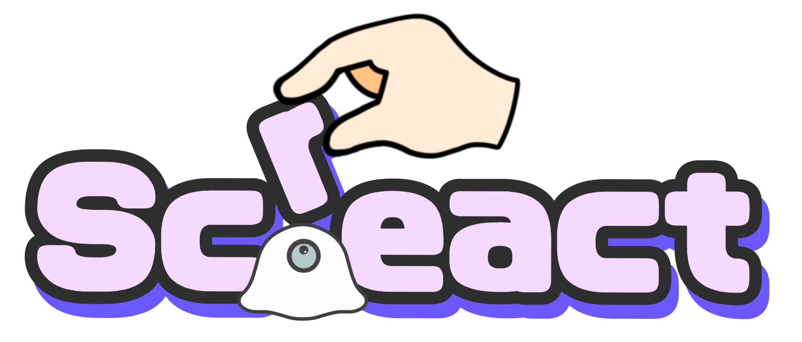

  <h1>Screact</h1>
  <h3>描いて、動かせる画面へ。</h3>
  <p><strong>普通の Screen が、人の動きに React する。</strong></p>

  <p>
    
    
    
    
  </p>

  <p>
    <a href="#画面遷移">画面遷移</a> ・
    <a href="#使い方">使い方</a> ・
    <a href="#操作ジェスチャー">操作ジェスチャー</a> ・
    <a href="#クイックスタート">クイックスタート</a> ・
    <a href="#ドキュメント">技術資料</a>
  </p>
</div>

---

## Screactとは

Screactは、手の動きでPC画面を操作できるシステムです。

Androidスマホの背面カメラをPC画面へ向けると、MediaPipeが手指の21点を認識します。PC側はその座標からジェスチャーを判定し、ポインター操作や、ブラウザ・スライド上への書き込みへ変換します。

専用センサーや電子ペンは必要ありません。手元にあるAndroidスマホとPCを同じネットワークへ接続するだけで、いつもの画面を、人の動きに反応する画面へ変えられます。

## 解決したいこと

授業や発表で使う画面は、多くの場合「表示するだけ」です。画面へ書き込む、スライドを送る、PCを操作するたびに端末の前へ戻ると、説明やコミュニケーションの流れが止まってしまいます。

Screactは、スマホを画面の「目」にすることで、この課題を解決します。

| 今まで | Screact |
|:--|:--|
| PCの前へ戻って操作 | 画面の前から手で操作 |
| 専用センサーや電子ペンを準備 | AndroidスマホとPCを利用 |
| アプリ内の専用キャンバスへ描画 | 透明オーバーレイでブラウザやスライドへ直接描画 |
| カメラ映像を処理先へ送り続ける | 端末内で認識し、座標データだけをPCへ送信 |

## 特長

### 1. 今ある機材ですぐ始められる

Androidスマホ、PC、映したい画面があれば利用できます。PCがUDPで接続情報を広告し、それを検出したAndroidからWebSocket接続するため、通常はIPアドレスを入力する必要がありません。

### 2. 画面とカメラのずれを自動補正

画面四隅のArUcoマーカーをカメラで読み取り、Homographyで斜めから撮影した座標をPC画面座標へ変換します。スマホを正面中央へ置けない環境でも、画面全体へ指位置を対応付けられます。

### 3. 動くだけでなく、操作として使える

21点の手指骨格から指先位置と指の状態を判定し、One-Euro Filterで揺れを抑えます。移動、クリック、ドラッグ、スクロール、描画を、それぞれ別の操作として扱います。

### 4. どの画面にも重ねられる

校正後は透明・クリック透過のネイティブオーバーレイへ自動移行します。旧来の白いアプリ内キャンバスではなく、ブラウザ、PDF、スライドなど、普段使っているアプリの上へそのまま描画できます。

### 5. 起動からScreactらしい体験

Android版は、Screactのロゴアニメーションを使ったスプラッシュと、片目のゴーストを描いたアダプティブ／従来形式のアプリアイコンを備えています。接続前から操作中まで、プロダクトの世界観を統一しています。

## 画面遷移

実際の通信やジェスチャー操作で画面を進めるのではなく、現行アプリが持つ各UI状態を直接表示して撮影しました。デスクトップはmacOS版Screactのアプリウィンドウ、AndroidはPixel 8 Pro上の本番Compose UIです。Androidの左側には、PC画面へ向けた背面カメラの実映像を表示しています。

<table>
  <tr>
    <th width="12%">段階</th>
    <th width="44%">デスクトップ</th>
    <th width="44%">Android</th>
  </tr>
  <tr>
    <th>1. 起動</th>
    <td>
      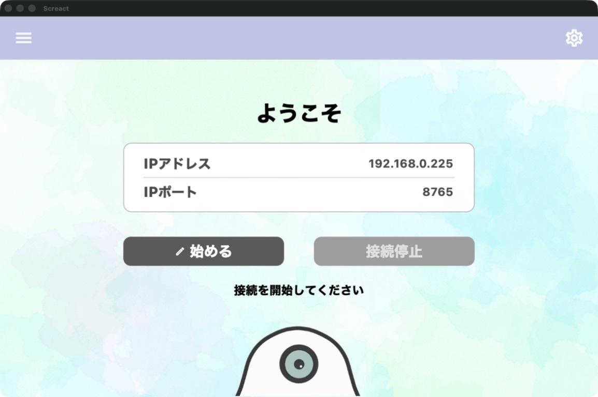
      <br><sub>接続情報を確認し、「始める」を選択</sub>
    </td>
    <td>
      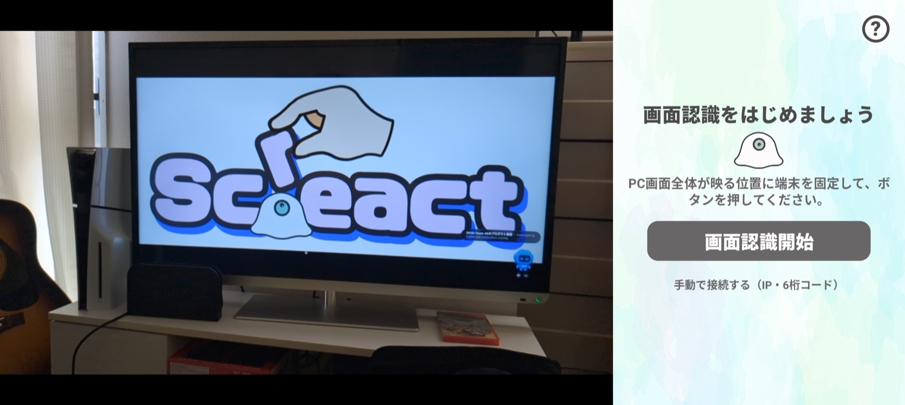
      <br><sub>スマホを固定して画面認識を開始</sub>
    </td>
  </tr>
  <tr>
    <th>2. 自動検出</th>
    <td>
      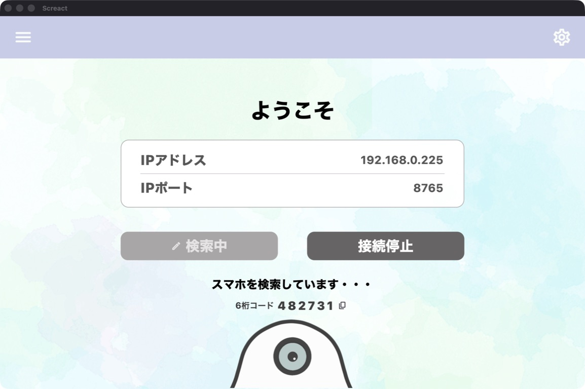
      <br><sub>UDPで接続情報と6桁コードを広告</sub>
    </td>
    <td>
      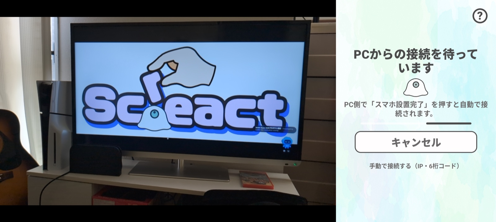
      <br><sub>PCからの接続情報を待機</sub>
    </td>
  </tr>
  <tr>
    <th>3. 設置</th>
    <td>
      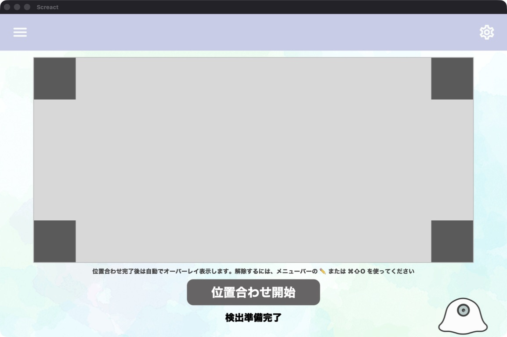
      <br><sub>接続後、位置合わせを開始</sub>
    </td>
    <td>
      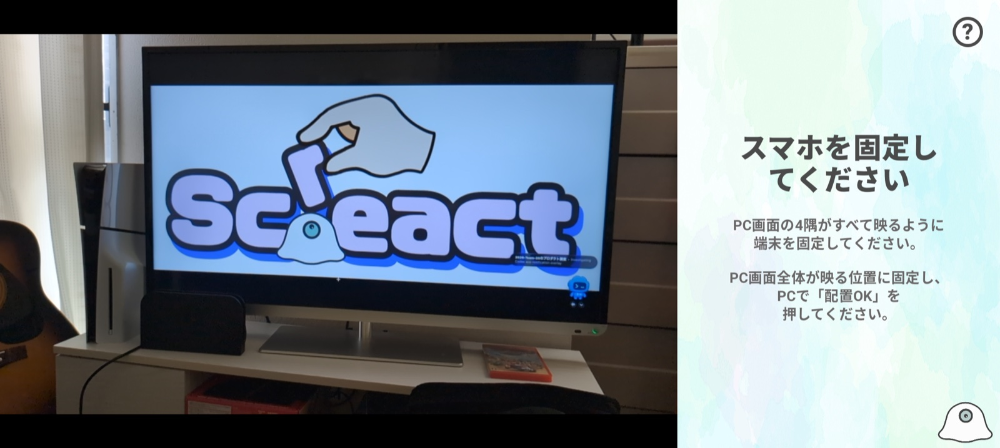
      <br><sub>PC画面の四隅が映る位置へ固定</sub>
    </td>
  </tr>
  <tr>
    <th>4. 位置合わせ</th>
    <td>
      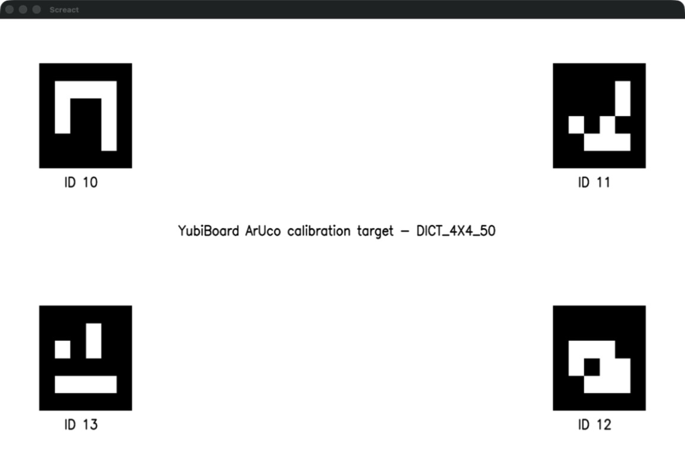
      <br><sub>画面四隅へArUcoマーカーを表示</sub>
    </td>
    <td>
      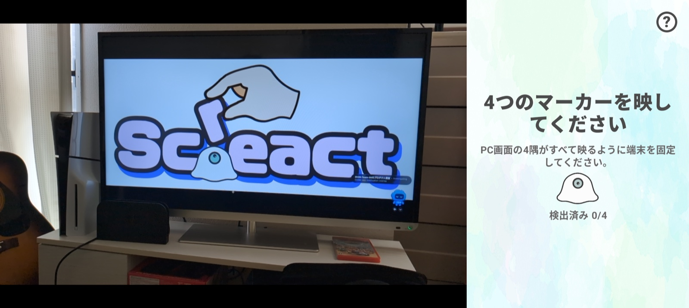
      <br><sub>4個のマーカーを検出して座標を補正</sub>
    </td>
  </tr>
  <tr>
    <th>5. 操作</th>
    <td>
      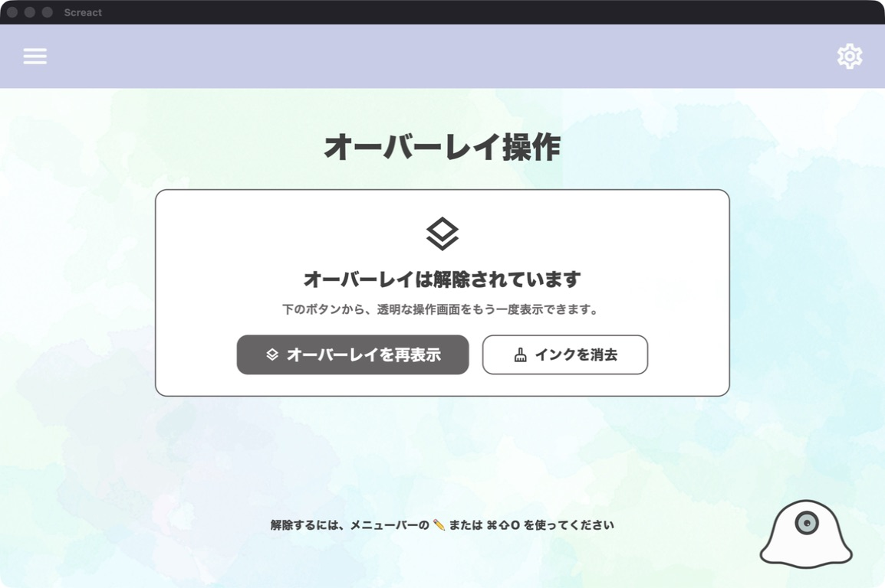
      <br><sub>透明オーバーレイの再表示・インク消去</sub>
    </td>
    <td>
      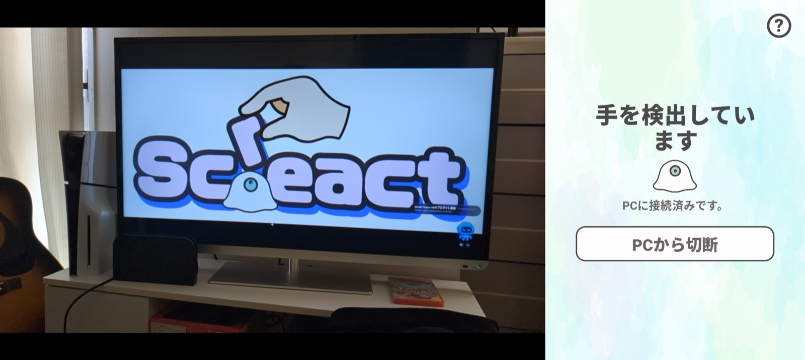
      <br><sub>手を追跡し、PCへ座標と状態を送信</sub>
    </td>
  </tr>
</table>

### 補助画面

<table>
  <tr>
    <th width="50%">Androidスプラッシュ</th>
    <th width="50%">Androidアプリアイコン</th>
  </tr>
  <tr>
    <td>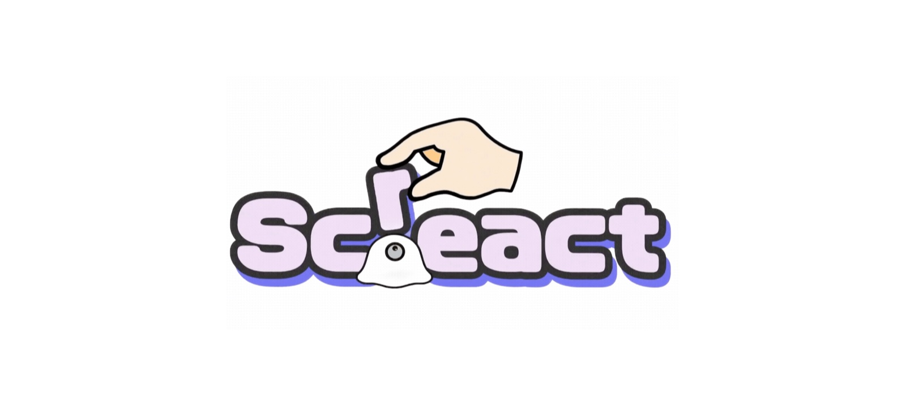</td>
    <td align="center">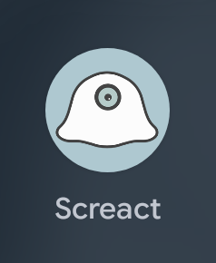</td>
  </tr>
  <tr>
    <th width="50%">デスクトップ設定</th>
    <th width="50%">Android手動接続</th>
  </tr>
  <tr>
    <td>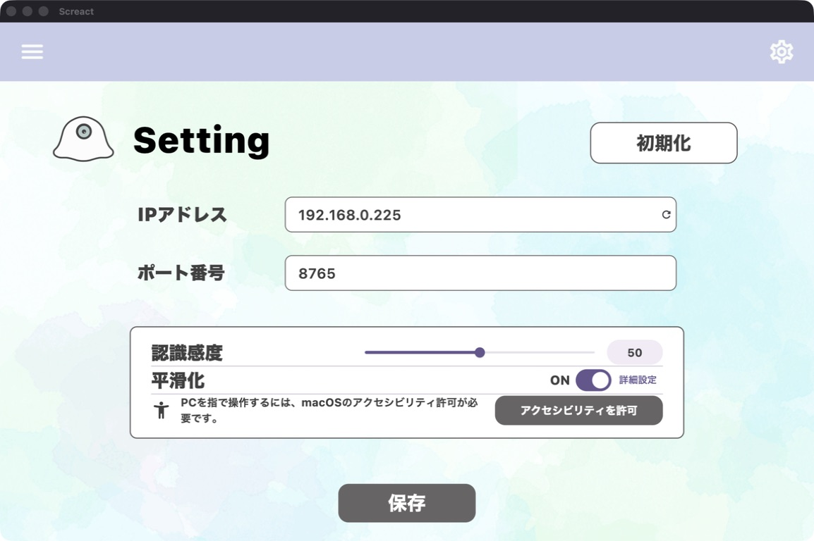</td>
    <td>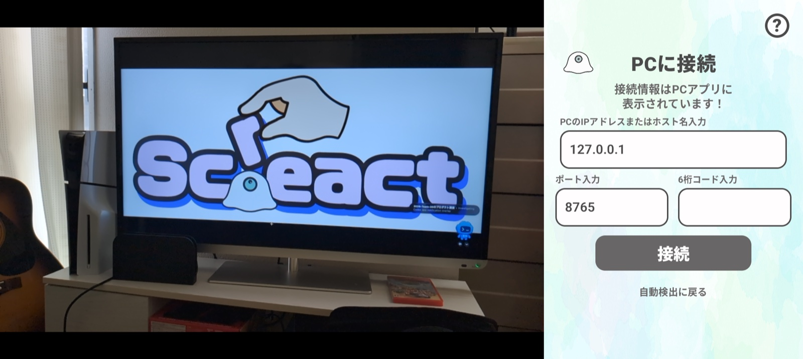</td>
  </tr>
  <tr>
    <th>Android操作待機</th>
    <th>Android再接続</th>
  </tr>
  <tr>
    <td>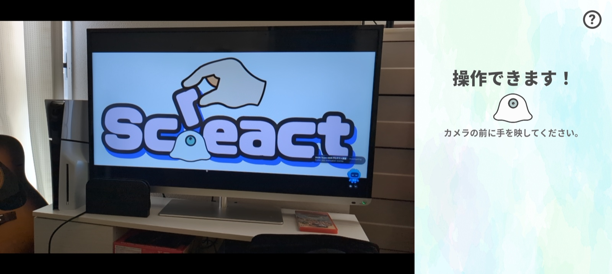</td>
    <td>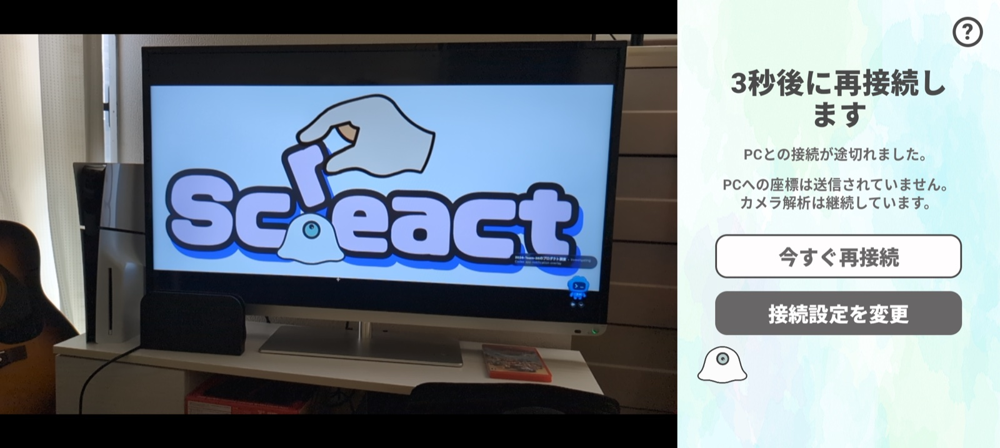</td>
  </tr>
</table>

## 使い方

<div align="center">
  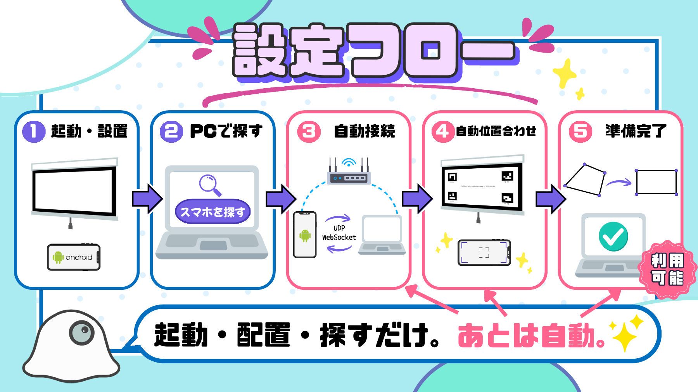
  <p><sub>発表資料「THE HACK 予選 THE WIN」の設定フローを、現行実装の説明とともに掲載しています。</sub></p>
</div>

1. PCとAndroidスマホを同じWi-Fi／LANへ接続する。
2. AndroidでScreactを起動し、「画面認識開始」を押す。
3. PCでScreactを起動し、「始める」を押す。
4. AndroidがPCのUDP offerを検出し、自動的にWebSocketへ接続する。
5. スマホにPC画面全体と手が映る位置で固定する。
6. PCの「位置合わせ開始」を押し、4個のArUcoマーカーを認識させる。
7. 位置合わせが完了すると、透明オーバーレイへ自動移行する。

自動検出できない場合は、Androidの「手動で接続する（IP・6桁コード）」を開き、PC画面に表示されたLAN内IP、ポート、6桁コードを入力してください。

### オーバーレイを解除する

- macOS: メニューバーの鉛筆アイコン、または `⌘⇧O`
- Windows: `Ctrl+Shift+O`

解除後は操作パネルから「オーバーレイを再表示」または「インクを消去」を選べます。スマホ切断時やPC側の接続停止時にも自動解除されます。

## 操作の仕組み

<div align="center">
  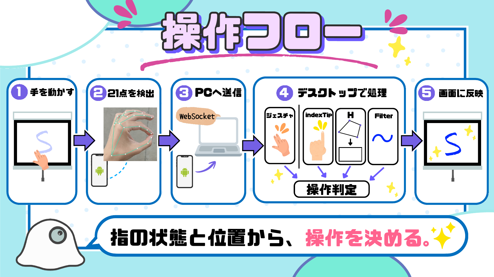
</div>

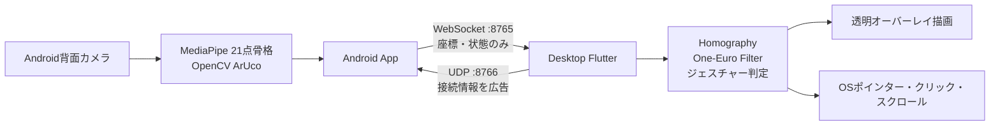

| 通信 | 既定値 | 役割 |
|---|---:|---|
| UDP | `8766` | PCの所在、WebSocketポート、6桁コードをAndroidへ知らせる自動発見専用 |
| WebSocket over TCP | `8765` / `/ws/v1/input` | 認証、位置合わせ、手指21点、状態、制御メッセージ |

UDPで手指データは送りません。接続後の実データはWebSocketだけを使用し、カメラ映像そのものはPCへ常時送信しません。

WebSocket接続後のメッセージ形式は[Android通信プロトコル v1](./docs/android/android-protocol-v1.md)を参照してください。

## 操作ジェスチャー

| 手の動き | PCでの操作 |
|---|---|
| 人差し指を動かす | ポインター移動 |
| 親指と人差し指をつまむ | クリック |
| つまんだまま動かす | ドラッグ |
| 人差し指と中指の先をくっつけて動かす | 透明オーバーレイへ描画 |
| 人差し指と中指を立てて動かす | 縦横スクロール |

手を見失った場合は、押下中・描画中の状態を安全に解除します。現在、手による拡大・縮小ジェスチャーは実装していません。

## 主な使用技術

| 領域 | 技術 | 用途 |
|:--|:--|:--|
| Android UI | Kotlin / Jetpack Compose | 状態別ガイド、接続、設定 |
| カメラ | CameraX | 背面カメラ映像の取得 |
| 手指認識 | MediaPipe Hand Landmarker | 1つの手の21点骨格検出 |
| 画面認識 | OpenCV ArUco | 画面四隅のマーカー検出 |
| Android通信 | OkHttp WebSocket / UDP | PC自動検出とリアルタイム送信 |
| Desktop UI | Flutter / Dart | 接続、位置合わせ、操作、設定 |
| 座標処理 | Homography / One-Euro Filter | 画面座標変換と揺れの低減 |
| macOS入力 | Swift / CGEvent | ポインター、クリック、ドラッグ、スクロール |
| Windows表示 | C++ / Win32 | 透明・最前面・クリック透過オーバーレイ |
| デザイン | Figma / Canva / CLIP STUDIO PAINT | UI、発表資料、グラフィック制作 |

## 動作環境

### Android

- Android 7.0（API 24）以上
- 背面カメラ
- ビルド時: Android Studio、Android SDK 36、JDK 17
- 実機導入時: Android Platform Tools（`adb`）とUSBデバッグ

アプリが使用する権限はカメラとネットワーク関連です。マイク、位置情報、ストレージ権限は要求しません。

### デスクトップ

- Flutter（Dart SDK `^3.7.2`に対応する版）
- macOS: macOS 10.15以上、フル版Xcode
- Windows: Flutter Windows toolchain、Visual Studioの「Desktop development with C++」
- PCとAndroidが相互通信できる同一LAN

macOSでは、初回接続時にローカルネットワークへのアクセスを許可してください。実ポインター・クリック・スクロールを使用するには、システム設定の「プライバシーとセキュリティ」→「アクセシビリティ」でScreactを許可します。

## クイックスタート

### デスクトップアプリ

macOS:

```bash
cd desktop
flutter pub get
flutter run -d macos
```

`xcode-select`がCommand Line Toolsを向いている場合:

```bash
DEVELOPER_DIR=/Applications/Xcode.app/Contents/Developer flutter run -d macos
```

Windows:

```powershell
cd desktop
flutter pub get
flutter run -d windows
```

### Androidアプリ

macOS／Linux:

```bash
cd android
bash ./gradlew testDebugUnitTest lintDebug assembleDebug
adb install -r app/build/outputs/apk/debug/app-debug.apk
adb shell am start -n com.nxtend.team35.yubiboard/.MainActivity
```

Windowsでは`gradlew.bat`を使用します。Android Studioでは、リポジトリ全体ではなく`android/`をプロジェクトルートとして開いてください。

## テスト

デスクトップ:

```bash
cd desktop
dart format --output=none --set-exit-if-changed lib test
flutter analyze
flutter test
DEVELOPER_DIR=/Applications/Xcode.app/Contents/Developer flutter build macos --debug
```

Android:

```bash
cd android
bash ./gradlew testDebugUnitTest lintDebug assembleDebug
bash ./gradlew connectedDebugAndroidTest
```

`connectedDebugAndroidTest`には、USBデバッグを有効にしたAndroid実機またはエミュレーターが必要です。

## ディレクトリ構成

```text
2026-Team-35/
├─ README.md
├─ docs/                  # 全体仕様、通信シーケンス、README画像
├─ android/               # Kotlin + Jetpack Compose Androidアプリ
│  ├─ app/
│  └─ gradle/
└─ desktop/               # Flutterデスクトップアプリ
   ├─ assets/
   ├─ lib/
   ├─ macos/
   ├─ windows/
   └─ test/
```

`android/`と`desktop/`は同じGitリポジトリで管理しています。各ディレクトリ内で別の`git init`を実行しないでください。

## 実装状況

- [x] Android本番UI、カメラプレビュー、手指21点追跡
- [x] Androidアニメーションスプラッシュとゴーストアプリアイコン
- [x] ArUcoマーカー検出と画面位置合わせ
- [x] UDPによるPC自動検出と手動接続フォールバック
- [x] WebSocket認証、信頼済み接続、自動再接続
- [x] Android・デスクトップアプリ間の統合
- [x] Flutterデスクトップ本番UIと実行時設定
- [x] macOS／Windowsの透明・クリック透過オーバーレイ
- [x] macOSのネイティブOS入力
- [x] 単体、Widget、接続、位置合わせ、回帰テスト
- [ ] WindowsのネイティブOS入力
- [ ] 複数Android端末の事前選択

## 既知の制約

- 自動検出はUDPブロードキャストを使用するため、VPN、ゲストWi-Fi、AP isolation、OSファイアウォール、macOSのローカルネットワーク設定によって失敗する場合があります。その場合は手動接続を使用してください。
- PCは同時に1台のAndroidだけを受け付けます。複数端末が待機している場合は、最初にWebSocket接続した端末が選ばれます。
- 位置合わせ結果はPCアプリ終了時に失われます。同じPCプロセス内の一時的な通信断では再利用できます。
- Windowsでは透明オーバーレイを利用できますが、ポインター・クリック・スクロールのネイティブOS入力はまだ接続されていません。
- 6桁コードとWebSocketは、信頼できる同一LAN内での試作利用を前提としています。
- macOS版Screact自身がネイティブフルスクリーンの場合、オーバーレイへの移行を拒否します。Screactは通常ウィンドウで起動してください。

## ドキュメント

- [文書索引](./docs/README.md)
- [位置合わせシーケンス](./docs/sequence-calibration-flow.md)
- [Android現行仕様](./docs/android/android-current-spec.md)
- [Androidプロトコル仕様](./docs/android/android-protocol-v1.md)
- [Android実機デバッグ手順](./docs/android/android-debug-tutorial.md)
- [システム要件](./docs/system/system-requirements.md)

---

<div align="center">
  <strong>Screact - 描いて、動かせる画面へ。</strong>
</div>
