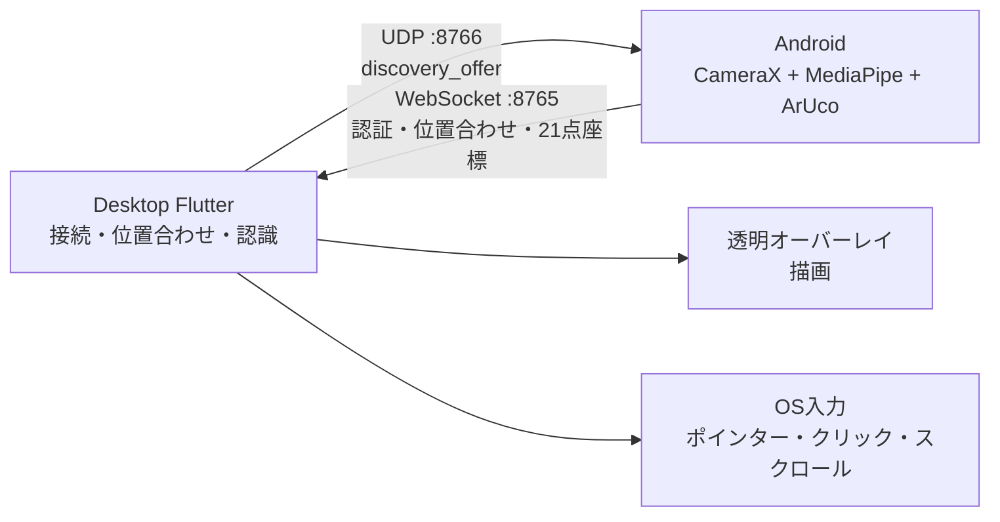

# Screact（旧称 YubiBoard）

Screactは、Android端末の背面カメラで手を認識し、PCを非接触で操作するシステムです。スマホからカメラ映像そのものは送らず、検出した手指の21点座標と位置合わせ情報だけをPCへ送信します。

PC側では座標変換・平滑化・ジェスチャー認識を行い、透明なネイティブオーバーレイへの描画や、ポインター・クリック・ドラッグ・スクロールへ変換します。

> [!NOTE]
> 正式名称は「Screact」です。開発初期の仮称は「YubiBoard」で、パッケージIDや一部の内部識別子には旧称が残っています。

## 現在のプロダクト

- Androidアプリ
  - Kotlin / Jetpack Composeによる本番UI
  - CameraXの背面カメラ映像からMediaPipeで手指21点を検出
  - OpenCV ArUcoでPC画面の四隅を認識
  - UDPによるPC自動検出と、IP・ポート・6桁コードによる手動接続
  - 水彩背景とキャラクターを使った、横画面・スクロール不要のガイドUI
- デスクトップアプリ
  - Flutterによる接続・位置合わせ・操作状態・設定の本番UI
  - ホモグラフィ変換、One-Euro平滑化、ジェスチャー認識
  - 校正完了後に透明・クリック透過のネイティブオーバーレイへ自動移行
  - 認識感度、平滑化、位置合わせ条件を実行時に調整
  - macOSでCGEventによる実ポインター・クリック・ドラッグ・スクロール入力

## システム構成



| 経路 | 既定値 | 用途 |
|---|---:|---|
| UDP | `8766` | PCのIP・WebSocketポート・6桁コードをAndroidへ知らせる自動発見専用 |
| WebSocket over TCP | `8765` / `/ws/v1/input` | 認証、セッション、位置合わせ、手指骨格、制御メッセージ |

UDPで手指データは送りません。接続成立後の実データはWebSocketだけを使用します。

詳細は[ゼロコンフィグ・ペアリング仕様](./docs/sequence-zero-config-pairing.md)を参照してください。

## 利用手順

### 1. 接続

1. PCとAndroid端末を同じWi-Fi／LANへ接続する。
2. 両方のアプリを起動し、Androidでカメラ使用を許可する。
3. Androidで「画面認識開始」を押し、PC検出待ちにする。
4. PCで「始める」を押す。
5. PCがUDPで接続情報を広告し、Androidが自動的にPCのWebSocketへ接続する。

自動検出できない場合は、Androidの「手動で接続する（IP・6桁コード）」を開き、PC画面に表示されたLAN内IP、ポート、6桁コードを入力してください。`127.0.0.1`は通常のWi-Fi接続には使用しません。

### 2. 位置合わせ

1. Androidの背面カメラにPC画面全体と手が映るよう、スマホを固定する。
2. PCで「位置合わせ開始」を押す。
3. PCが全画面表示する4個のArUcoマーカーをAndroidが検出する。
4. 有効な座標が5フレーム安定すると、PCがホモグラフィを確定する。
5. Androidが手追跡へ切り替わり、PCは透明オーバーレイへ自動移行する。

PCアプリを終了すると位置合わせ結果は失われます。同じPCプロセス内の一時的な通信断では、確認済みの位置合わせを再利用できます。

### 3. オーバーレイ

透明オーバーレイは他のアプリやスライドの上へ描画を重ねる標準の操作画面です。旧来の白いアプリ内描画キャンバスは使用しません。

オーバーレイを解除する方法:

- macOS: メニューバーの鉛筆アイコン、または `⌘⇧O`
- Windows: `Ctrl+Shift+O`

解除後はScreactの操作パネルから「オーバーレイを再表示」または「インクを消去」を選べます。スマホ切断時やPC側のサーバ停止時は、オーバーレイも自動的に解除されます。

> [!IMPORTANT]
> macOS版Screact自体をmacOSのネイティブフルスクリーンにすると、透明オーバーレイへの移行は拒否されます。Screactは通常ウィンドウで使用してください。他アプリのフルスクリーン画面上への表示には対応しています。

## ジェスチャー

ジェスチャーの判定はPC側で行います。

| 手の動き | 操作 |
|---|---|
| 人差し指を動かす | ポインター移動 |
| 親指と人差し指をつまむ | クリック |
| つまんだまま動かす | ドラッグ |
| 人差し指と中指の先をくっつけて動かす | 透明オーバーレイへ描画 |
| 人差し指と中指を立てて動かす | 縦横スクロール |

手を見失った場合は、押下中・描画中の状態を安全に解除します。現在、手による拡大・縮小ジェスチャーは実装していません。

## 必要環境

### Android

- Android 7.0（API 24）以上
- 背面カメラ
- Android Studio、Android SDK 36、JDK 17
- 実機へのインストール時はAndroid Platform Tools（`adb`）とUSBデバッグ

アプリが使用する権限はカメラとネットワーク関連です。マイク、位置情報、ストレージ権限は要求しません。画面は操作中にスリープしない設定です。

### デスクトップ

- Flutter（Dart SDK `^3.7.2`に対応する版）
- macOS: フル版Xcode
- Windows: Visual StudioのDesktop development with C++環境
- PCとAndroidが相互通信できる同一LAN

macOSでは、初回接続時にローカルネットワークへのアクセスを許可してください。実ポインター・クリック・スクロールを使用するには、システム設定の「プライバシーとセキュリティ」→「アクセシビリティ」でScreactを許可します。

## クイックスタート

### デスクトップアプリ

macOS:

```bash
cd desktop
flutter pub get
flutter run -d macos
```

`xcode-select`がCommand Line Toolsを向いている場合は、フル版Xcodeを明示できます。

```bash
DEVELOPER_DIR=/Applications/Xcode.app/Contents/Developer flutter run -d macos
```

Windows:

```powershell
cd desktop
flutter pub get
flutter run -d windows
```

### Androidアプリ

macOS／Linux:

```bash
cd android
bash ./gradlew testDebugUnitTest lintDebug assembleDebug
adb devices
adb install -r app/build/outputs/apk/debug/app-debug.apk
adb shell am start -n com.nxtend.team35.yubiboard/.MainActivity
```

Windowsでは`gradlew.bat`を使用します。Android Studioで開く場合は、リポジトリ全体ではなく`android/`をプロジェクトルートとして選択してください。

## 検証

デスクトップ:

```bash
cd desktop
dart format --output=none --set-exit-if-changed lib test
flutter analyze
flutter test
DEVELOPER_DIR=/Applications/Xcode.app/Contents/Developer flutter build macos --debug
```

Android:

```bash
cd android
bash ./gradlew testDebugUnitTest lintDebug assembleDebug
bash ./gradlew connectedDebugAndroidTest
```

`connectedDebugAndroidTest`には、USBデバッグを有効にしたAndroid実機またはエミュレーターが必要です。

## ディレクトリ構成

```text
2026-Team-35/
├─ README.md
├─ docs/                  # 全体仕様、通信シーケンス、Android／Desktop仕様
├─ android/               # Kotlin + Jetpack Compose Androidアプリ
│  ├─ app/
│  ├─ gradle/
│  └─ build.gradle.kts
└─ desktop/               # Flutterデスクトップアプリ
   ├─ assets/
   ├─ lib/
   ├─ macos/
   ├─ windows/
   └─ test/
```

`android/`と`desktop/`は同じGitリポジトリで管理しています。各ディレクトリ内で別の`git init`を実行しないでください。

## 実装状況

- [x] Android本番UI、カメラプレビュー、手指21点追跡
- [x] ArUcoマーカー検出と画面位置合わせ
- [x] UDPによるPC自動検出と手動接続フォールバック
- [x] WebSocket認証、信頼済み接続、自動再接続
- [x] Android・実デスクトップアプリ間の統合
- [x] Flutterデスクトップ本番UIと実行時設定
- [x] macOS／Windowsの透明・クリック透過オーバーレイ
- [x] macOSのネイティブOS入力
- [x] 単体、Widget、接続、位置合わせ、回帰テスト
- [ ] WindowsのネイティブOS入力
- [ ] 複数Android端末の事前選択

## 既知の制約

- 自動検出はUDPブロードキャストを使用するため、VPN、ゲストWi-Fi、AP isolation、OSファイアウォール、macOSのローカルネットワーク設定によって失敗する場合があります。その場合は手動接続を使用してください。
- PCは同時に1台のAndroidだけを受け付けます。複数端末が待機している場合は、最初にWebSocket接続した端末が選ばれます。
- Windowsでは透明オーバーレイを利用できますが、ポインター・クリック・スクロールのネイティブOS入力はまだ接続されていません。
- 6桁コードは同一LAN内での試作向けペアリングです。高機密用途の認証方式としては設計されていません。

## ドキュメント

- [文書索引](./docs/README.md)
- [ゼロコンフィグ・ペアリング仕様](./docs/sequence-zero-config-pairing.md)
- [位置合わせシーケンス](./docs/sequence-calibration-flow.md)
- [Android現行仕様](./docs/android/android-current-spec.md)
- [Androidプロトコル仕様](./docs/android/android-protocol-v1.md)
- [Android実機デバッグ手順](./docs/android/android-debug-tutorial.md)
- [システム要件](./docs/system/system-requirements.md)
