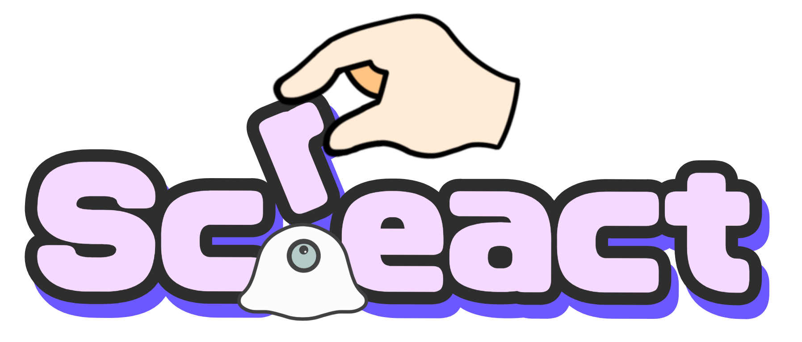
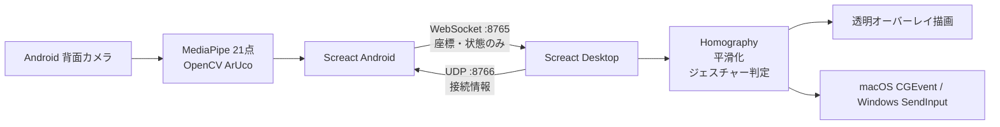

  

  # Screact - ただの画面を、描いて動かせる画面へ

  **普通の Screen が、人の動きに React する。**

  
  
  
  

  
  

---

## 🎉 THE HACK 2026 受賞結果 🎉

### 🏆 本戦

**🥇 大賞** 
**賞金 300,000円**

---

## 目次

- [🎉 THE HACK 2026 受賞結果 🎉](#-the-hack-2026-受賞結果-)
- [目次](#目次)
- [Live Demo](#live-demo)
- [製品概要](#製品概要)
- [コンテスト応募用](#コンテスト応募用)
- [技術仕様書](#技術仕様書)
- [ギャラリー](#ギャラリー)
- [開発技術](#開発技術)
- [参考文献](#参考文献)
- [開発・検証](#開発検証)
- [開発メンバー](#開発メンバー)

---

## Live Demo

Screact は、THE HACK 2026 本戦で、**発表者が画面の前に立ったまま、既存の画面へ描き、操作する**デモとして展示しました。Android スマホを画面へ向けて固定し、PC と接続した後は、スマホ画面を触らずに操作します。

  
   
  <strong><a href="https://drive.google.com/file/d/14SZvVKVLxcpKkB3tEl41TTzPK-4H_XEj/view?usp=sharing">▶ Screactのデモを見る（Google Drive）</a></strong>
   
  予選発表時に収録した、実際に手を動かして既存の画面へ描画する約33秒のデモ。

## 製品概要

### 背景（製品開発のきっかけ・課題など）

授業や発表では、説明する人はスクリーンの前、操作する人は PC の前へ戻らなければならないことがあります。スライドを送る、画面を指す、ブラウザを動かす、書き込む。そのたびに説明の流れが切れてしまいます。

Screact が解決したいのは、「画面は見せるもの、操作は PC の前でするもの」という分断です。Screact は「画面を、買い替えない」という選択肢として、手元にある Android スマホと PC で、今ある画面へ「操作できる」を後付けします。

### 製品説明（具体的な製品の説明）

> **ただの画面を、描いて動かせる画面へ**
>
> Android スマホを画面の目にして、PC 画面を手で操作する。

Screact は、Android の背面カメラで画面四隅と手を認識し、PC 側でその結果を画面座標と操作へ変換するシステムです。画面四隅の ArUco マーカーを読み取るため、カメラを画面の正面中央へ置けない環境でも、斜めから見た座標を画面全体へ対応付けられます。

位置合わせ後は、ブラウザ・PDF・スライドの上に透明でクリック透過のオーバーレイを重ね、普段使うアプリを見せたまま描画できます。カメラ映像は PC へ連続送信せず、Android 内で認識した21点の手指ランドマークと必要な状態だけを送ります。

  
  
ただの画面を、描いて動かせる画面へ

### システム構成

| コンポーネント | 技術 | 役割 |
| --- | --- | --- |
| Android アプリ | Kotlin / Jetpack Compose / CameraX | 背面カメラ、接続案内、認識結果の送信 |
| Vision | MediaPipe Hand Landmarker / OpenCV ArUco | 手指21点、画面四隅の検出 |
| Desktop アプリ | Flutter / Dart | 接続、位置合わせ、座標変換、ジェスチャー、描画 |
| 通信 | UDP / WebSocket | 自動発見、認証、座標・状態のリアルタイム送信 |
| OS 連携 | Swift / CGEvent、C++ / Win32 | 透明オーバーレイ、macOS / Windows のネイティブ入力 |

```mermaid
flowchart LR
    Camera["Android 背面カメラ"] --> Vision["MediaPipe 21点\nOpenCV ArUco"]
    Desktop["Screact Desktop"] -- "UDP :8766\n接続情報" --> Android["Screact Android"]
    Vision --> Android
    Android -- "WebSocket :8765\n座標・状態のみ" --> Desktop
    Desktop --> Transform["Homography\n平滑化\nジェスチャー判定"]
    Transform --> Overlay["透明オーバーレイ描画"]
    Transform --> Input["macOS CGEvent / Windows SendInput"]
```

### 処理の流れ

  
  
手を動かす → 21点を検出 → PCへ送信 → Desktopで処理 → 画面に反映。

### 特長

#### 1. いつもの画面を、そのまま操作対象にする

専用アプリの中だけで完結させず、透明オーバーレイで既存のブラウザ、PDF、スライドへ描画を重ねます。説明のために画面を切り替える必要がありません。

#### 2. スマホの置き方を限定しない

ArUco マーカーと Homography により、画面に対して斜めに設置したスマホからでも、カメラ座標を画面座標へ補正します。

#### 3. 「動く手」を「使える操作」にする

手のランドマークを送るだけではなく、PC 側で平滑化と状態管理を行います。ポインター、ピンチクリック、ドラッグ、描画、グー消しゴム、グッドサイン・スクロールを別の意図として扱います。

#### 4. 設定の摩擦を減らす

Desktop が接続情報を UDP で広告し、Android が検出して接続します。ネットワークによって自動発見できない場合にも、IP・ポート・6桁コードによる手動接続を用意しています。

### 解決出来ること

- 発表者が PC の前へ戻らず、画面の前で説明と操作を続けられる
- 既存ディスプレイ、プロジェクター、ブラウザ、PDF、スライドを活用できる
- 専用センサーや電子ペンを前提にしない
- カメラ映像を PC へ送り続けず、認識結果だけで操作パイプラインを構成する

### 活用シーン

- **授業・講義**: 説明者がスクリーンの前から離れず、板書・指示・画面操作を続けられる
- **プレゼンテーション**: スライド、ブラウザ、PDFを見せたまま、指差し・描画・ページ操作を切り替えられる

### 今後の展望

- **対応プラットフォームの拡張**: Windows の対象アプリ・権限を含む安定性を高め、iOS の手・マーカー検出を完成させる
- **接続の拡張**: QR フォールバック、LAN 非依存リレー、複数端末の選択を検討する
- **操作体験の改善**: 画面・照明・設置条件が変わる場面での精度と再現性を測定し、改善する

これらは将来計画であり、現行デモの実装済み範囲とは区別します。

### 注力したこと（こだわり等）

- **画面への対応付け**: 手を検出するだけで終わらず、ArUco と Homography で画面全体に使える座標へ変換した
- **操作感と安全性**: One-Euro Filter、最新フレーム優先、トラッキング喪失時の解除を、体験の本体として実装した
- **既存設備の活用**: 特殊なハードウェアではなく、Android スマホと PC の組み合わせで成立させた
- **見せる画面を守る**: 透明・クリック透過オーバーレイにより、説明対象のアプリを隠さない設計にした

## コンテスト応募用

一言紹介、作品概要、こだわり・PRポイント、技術要素、デモ、実績、チーム情報を、応募フォームへそのまま貼り付けられる形で [コンテスト応募用文面](./docs/contest-copy.md) にまとめています。

## 技術仕様書

実装済みの仕様書は `docs/` 直下に置いています。要件、設計案、レビュー、台帳は作業用資料として下層へ分離しています。

### Version 1.0.0 — THE HACK 2026 本戦版

- [システム仕様書](./docs/README.md) — 全体アーキテクチャ、主要機能、仕様書の入口
- [Android アプリ仕様書](./docs/android-specification-v1.md) — カメラ、追跡、接続、位置合わせ
- [Desktop アプリ仕様書](./docs/desktop-specification-v1.md) — 受信、座標変換、ジェスチャー、オーバーレイ
- [通信仕様書 v1](./docs/protocol-specification-v1.md) — Android/PC 間 WebSocket JSON 契約

### 作業用・履歴資料

- [作業用・履歴資料](./docs/work/README.md) — 要件、検証、設計、計画、開発記録の入口
- [要件・検証資料](./docs/work/requirements/) — 要件定義、カメラ判断、実機デバッグ
- [アーキテクチャ検討](./docs/work/architecture/) — 接続・位置合わせ・複数手の補助資料
- [レビュー・計画](./docs/work/reviews/) / [接続計画](./docs/work/planning/) — 特定時点の評価と将来案
- [開発記録](./docs/work/records/) — 作品資料の採用根拠、PR履歴、移行記録

## ギャラリー

  
  

画面・フローの一覧は [Screact ギャラリー](./docs/gallery.md) を参照してください。

## 開発技術

### 活用した技術

| カテゴリ | 技術 | 用途 |
| --- | --- | --- |
| Android |    | カメラ、状態別ガイド、接続画面 |
| 手指認識 |  | 既定1手・設定時最大2手の21点ランドマーク検出 |
| 画面認識 |  | 画面四隅のマーカー検出 |
| Desktop |  | 接続、位置合わせ、操作、設定、描画 |
| 通信 |   | 自動発見とリアルタイム送信 |
| 座標処理 |   | 座標変換と揺れの低減 |
| OS連携 |   | macOS / Windows 入力、透明・クリック透過ウィンドウ |

### 独自技術

| 技術 | 概要 | 仕様書 |
| --- | --- | --- |
| 画面座標変換 | ArUco 4点から Homography を作り、斜めから見たカメラ座標を画面へ対応付ける | [Android](./docs/android-specification-v1.md) / [Desktop](./docs/desktop-specification-v1.md) |
| 操作パイプライン | 受信、平滑化、ジェスチャー、描画・OS入力を Desktop 側へ一貫して集約する | [Desktop](./docs/desktop-specification-v1.md) |
| ゼロコンフィグ接続 | UDP 発見と WebSocket 接続を組み合わせ、手動接続も残す | [通信](./docs/protocol-specification-v1.md) |
| 透明オーバーレイ | 既存アプリを隠さず描画できる、最前面・クリック透過ウィンドウ | [Desktop](./docs/desktop-specification-v1.md) |

## 参考文献

- [MediaPipe Hand Landmarker](https://ai.google.dev/edge/mediapipe/solutions/vision/hand_landmarker) — 手指21点ランドマーク検出
- [OpenCV ArUco markers](https://docs.opencv.org/4.x/d5/dae/tutorial_aruco_detection.html) — 画面四隅のマーカー検出
- [WebSocket — RFC 6455](https://www.rfc-editor.org/rfc/rfc6455) — Android / Desktop 間の通信契約
- [Flutter Desktop](https://docs.flutter.dev/platform-integration/desktop) — Desktop アプリの共通 UI・実行基盤
- [4DX@HOME（jphacks/kz_2504）](https://github.com/jphacks/kz_2504) — README と実装済み仕様書の構成を参考
- [EnCounter（razy6174/EnCounter）](https://github.com/razy6174/EnCounter) — README と分野別ドキュメントの構成を参考

## 開発・検証

実機確認、PR、既知の制約は、[プロダクト・開発台帳](./docs/work/records/product/Screact_プロダクト・開発台帳_2026-08-30.md)に記録しています。コード上の実装、実機確認済み、設計済み・未実装、将来課題を分けて追跡しています。

| 対象 | 現在の扱い |
| --- | --- |
| Android + macOS | 本戦デモの基準経路 |
| Windows | 透明オーバーレイと `SendInput` によるネイティブ OS 入力を実装。特定環境で実機確認済み（環境依存） |
| iOS | Bonjour / WebSocket 通信コードはあるが、手・マーカー検出の依存関係が未接続。実験段階 |

## 開発メンバー

**THE WIN**

- 久米蒼輝
- マルチェンコ・ダニール
- 高岡己太朗
- 松本絆那

---

  <strong>Screact — 描いて、動かせる画面へ。</strong> 
  THE HACK 2026 Team 35 / 2026-08-30 更新

