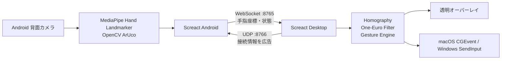

# Screact システム仕様書

> **Version:** 1.0.0 
> **基準コミット:** `4f2d1e5`（2026-08-22） 
> **対象:** THE HACK 2026 Team 35「THE WIN」 / Screact

## 📑 目次

- [はじめに](#はじめに)
- [システム概要](#システム概要)
- [仕様書構成](#仕様書構成)
- [技術的特徴](#技術的特徴)
- [作業用ドキュメント](#作業用ドキュメント)
- [まとめ](#まとめ)
- [更新履歴](#更新履歴)

## はじめに

> **ただの画面を、描いて動かせる画面へ**

Screact は、Android スマホの背面カメラを画面の「目」にして、既存の PC 画面へ手による操作を後付けするシステムです。本書は、THE HACK 2026 本戦版を基準にした実装済みシステムの入口です。

### 🆕 Version 1.0.0 の基準

- Android が画面四隅の ArUco マーカーと手の21点ランドマークを端末内で検出する。
- Desktop が UDP による発見、WebSocket 接続、Homography、平滑化、ジェスチャー、透明オーバーレイを担う。
- Android と Desktop の JSON 契約は [通信仕様書 v1](./protocol-specification-v1.md) を正本とする。
- 実装状態は [開発台帳](./work/records/product/Screact_プロダクト・開発台帳_2026-08-30.md) で確認する。設計案・PR案を実装済みとして扱わない。

### 📚 作業資料について

要件、将来の接続案、精度レビュー、実機デバッグ手順、開発履歴は [work/](./work/) 以下に置く。これらは設計判断や作業の再開に有用だが、現行機能の一覧ではない。

## システム概要

### アーキテクチャ図

### 主要機能

| 機能 | 実装内容 |
| --- | --- |
| 自動接続 | Desktop が UDP で接続情報を広告し、Android が検出する。IP・ポート・6桁コードの手動接続もある。 |
| 位置合わせ | ArUco マーカー4点から Homography を求め、カメラ座標を画面座標へ変換する。 |
| 手の追跡 | Android が MediaPipe で最大2手・各21点のランドマークを検出し、WebSocket で送信する。 |
| 操作 | ポインター、クリック、ドラッグ、描画、グー消しゴム、グッドサイン・スクロールのイベントを Desktop で生成する。 |
| 画面への重ね描き | macOS/Windows の透明・最前面・クリック透過オーバーレイを使用する。 |
| OS入力 | macOS は CGEvent、Windows は SendInput で、ポインター・クリック・スクロールをネイティブ入力へ変換する。 |

## 仕様書構成

### 🎯 最新版（THE HACK 2026 / Version 1.0.0）

- [システム仕様書](./README.md) — システム全体の構成と仕様書の入口
- [Android アプリ仕様書](./android-specification-v1.md) — カメラ、追跡、接続、位置合わせの実装基準
- [Desktop アプリ仕様書](./desktop-specification-v1.md) — 受信、変換、ジェスチャー、オーバーレイ、OS連携の実装基準
- [通信仕様書 v1](./protocol-specification-v1.md) — Android/PC 間 WebSocket JSON 契約
- [ギャラリー](./gallery.md) — リポジトリ同梱の画面・フロー素材
- [画像素材](./assets/README.md) — 採用中の作品資料と既存キャプチャの整理
- [コンテスト応募用文面](./contest-copy.md) — 一言紹介、作品概要、PRポイント、技術要素、実績、チーム情報

### 📦 作業用・履歴資料

- [作業用・履歴資料](./work/README.md) — 要件、検証、設計、計画、開発記録の入口
- [アーキテクチャ検討](./work/architecture/) — ペアリング、位置合わせ、複数手の補助資料
- [要件・検証資料](./work/requirements/) — 要件、カメラ判断、実機デバッグ、変更計画
- [レビュー・将来計画](./work/reviews/) / [接続計画](./work/planning/) — 特定時点の評価と未実装を含む案
- [開発記録](./work/records/) — プロダクト・開発台帳、情報源、移行履歴

## 技術的特徴

### 🎯 画面を「見て」座標を合わせる

画面四隅のマーカーを使うため、スマホを画面の正面中央に固定する必要はありません。カメラの斜め視点を Homography で画面座標に合わせます。

### 🔄 映像ではなく認識結果を送る

Android はカメラ映像そのものを PC へ連続送信せず、手のランドマークと必要な状態だけを WebSocket で送ります。PC は最新フレーム優先、平滑化、操作状態の管理を行います。

### 🛡️ 誤操作を残さない

手を見失った場合や接続が切れた場合は、押下・描画中の状態を解除します。描画オーバーレイはクリック透過のため、解除後は背後のアプリを通常どおり操作できます。

## 作業用ドキュメント

`work/` 以下には、未統合の案や特定の評価時点を含む文書がある。実装済みの仕様を知りたい場合は、上記の Version 1.0.0 仕様書を先に読むこと。

## まとめ

Screact は、Android を視覚センサー、Desktop を操作の処理主体として役割分担し、既存画面への手による操作を実現する。詳細は対象領域の仕様書を、変更の背景と検証事実は開発記録を参照する。

## 📚 更新履歴

### Version 1.0.0 — THE HACK 2026（2026-08-30）

- 実装済み仕様書を `docs/` 直下へ配置
- 要件、計画、レビュー、台帳を `docs/work/` へ整理
- 作品資料・基準コミット・PR履歴を照合して README と仕様書の入口を更新
