# YubiBoard Androidアプリ現行仕様書

## 1. 文書情報

| 項目 | 内容 |
| --- | --- |
| 文書種別 | 現行実装仕様（As-Built Specification） |
| 対象 | YubiBoard Androidアプリ |
| アプリバージョン | `0.1.0`（`versionCode=1`） |
| 実装基準コミット | `872aa5a` |
| 作成日 | 2026-08-04 |
| 通信スキーマ | version 1 |
| パッケージ | `com.nxtend.team35.yubiboard` |

本書は、要件上の将来像ではなく、実装基準コミット時点でAndroidアプリが実際に行う処理を記述する。目標要件は[Androidアプリ要件定義書](./android-app-requirements.md)、JSONの詳細は[Android通信プロトコル v1](./android-protocol-v1.md)を参照すること。本書と実装が矛盾する場合は、現行コードとテスト結果を優先して差異を解消する。

## 2. 目的と責任範囲

Androidアプリは背面カメラから画像を取得し、次のいずれかを検出して同一LAN上のPCへWebSocket/JSONで送信する。

- 通常撮影: 1つの手に対するMediaPipeの21点ランドマーク
- 位置合わせ撮影: 画面四隅に配置した4つのArUcoマーカー

Android側は撮影・検出・可視化・送信までを担当する。画面座標への変換、ジェスチャー判定、描画、OS入力はPC側の責任である。カメラ映像そのものはPCへ送信しない。

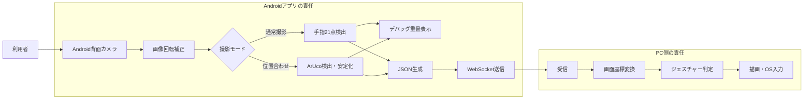

### 2.1 現行MVPの優先度

| 区分 | 内容 | 現状 |
| --- | --- | --- |
| デモ必須 | カメラ許可、背面プレビュー、手指検出、WebSocket接続、最新フレーム送信 | 実装・自動検証済み |
| デモ必須 | モックPCとの接続、接続状態表示、切断後の自動再接続 | 実装・ローカル通信確認済み |
| デモ補助 | 骨格・マーカー重畳、fps・推論時間、手動モード切替 | 実装済み |
| デモ補助 | ArUco 4点検出・安定化、検出設定変更 | 実装・単体検証済み |
| 後続確認 | Android実機での表示整合、長時間性能、実PCアプリとの統合 | 未検証 |

## 3. 動作環境と採用技術

| 項目 | 現行値 |
| --- | --- |
| 最低Android | Android 7.0 / API 24 |
| compileSdk / targetSdk | 36 / 36 |
| Java・JVMターゲット | 11 |
| UI | Android View、Material Components、ConstraintLayout |
| カメラ | CameraX 1.6.1 |
| 手指検出 | MediaPipe Tasks Vision 0.10.35 |
| マーカー検出 | OpenCV 4.12.0、`DICT_4X4_50` |
| 通信 | OkHttp 4.12.0 WebSocket |
| JSON | kotlinx.serialization 1.7.3 |
| ライフサイクル | AndroidX ViewModel 2.10.0 |

必要な端末機能はカメラであり、背面カメラを使用する。アプリは`CAMERA`、`INTERNET`、`ACCESS_NETWORK_STATE`権限を宣言する。`CAMERA`のみ実行時許可が必要である。

## 4. ソフトウェア構成

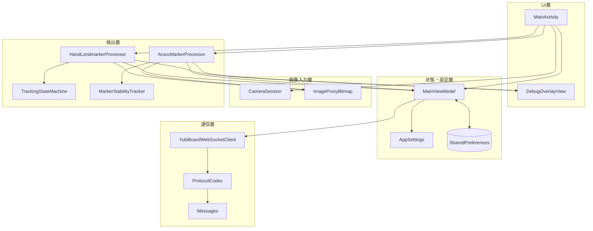

### 4.1 主要クラスの責務

| クラス | 責務 |
| --- | --- |
| `MainActivity` | Viewの初期化、権限要求、カメラ開始、撮影モードによる解析振り分け、設定適用 |
| `MainViewModel` | 画面回転をまたぐ接続・モード状態、設定永続化、WebSocketクライアントの所有 |
| `CameraSession` | CameraX PreviewとImageAnalysisを背面カメラへバインド |
| `HandLandmarkerProcessor` | 画像補正、非同期手指検出、21点・左右・信頼度・fps・推論時間の生成 |
| `TrackingStateMachine` | 手の検出候補、追跡、一時喪失、未検出の判定 |
| `ArucoMarkerProcessor` | OpenCV初期化、対象IDの検出、座標正規化 |
| `MarkerStabilityTracker` | 4マーカーの配置・面積・連続安定性の検証 |
| `DebugOverlayView` | Previewと同じ`fitCenter`基準で骨格またはマーカーを描画 |
| `YubiBoardWebSocketClient` | 接続、認証開始、再接続、送信間引き、heartbeat、制御受信 |
| `ProtocolCodec` | version 1メッセージのJSONエンコード・デコード |

## 5. 画面仕様

画面は単一Activityで構成する。カメラ映像を全画面表示し、その上へ検出結果と状態、下部へ接続操作を重ねる。

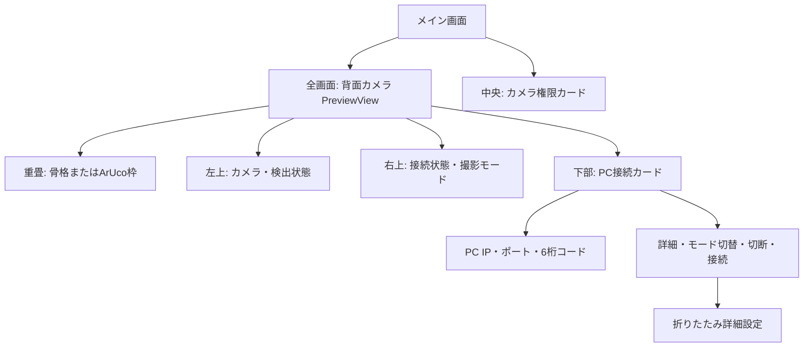

### 5.1 表示項目

| 領域 | 表示・操作 |
| --- | --- |
| カメラ状態 | 起動中、準備完了、手の検出状態、検出fps、推論時間、マーカー数・安定状態、エラー |
| 接続状態 | 未接続、接続中、PC応答待ち、接続済み、再接続までの秒数、エラー詳細 |
| 撮影モード | 通常撮影または位置合わせ撮影 |
| 接続入力 | PCのホスト、1〜65535のポート、6桁数字のペアリングコード |
| 接続操作 | 接続、切断、通常撮影／位置合わせの手動切替 |
| 詳細設定 | 解像度、検出信頼度、存在信頼度、追跡信頼度、最大送信fps |

接続処理中から再接続中までは接続ボタンを無効化し、切断ボタンを有効化する。未接続またはエラー表示時は接続ボタンを有効化する。

## 6. 起動と権限

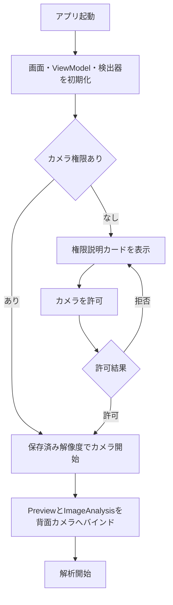

- 権限拒否時は権限カードを残し、利用者が再度要求できる。
- カメラ開始失敗時はエラー表示と権限カードを表示する。
- `MainActivity`破棄時はカメラ解析ExecutorとMediaPipe検出器を閉じる。

## 7. 撮影モード

撮影モードは`TRACKING`と`CALIBRATION`の2種類であり、1フレームを両方の検出器へ同時には渡さない。

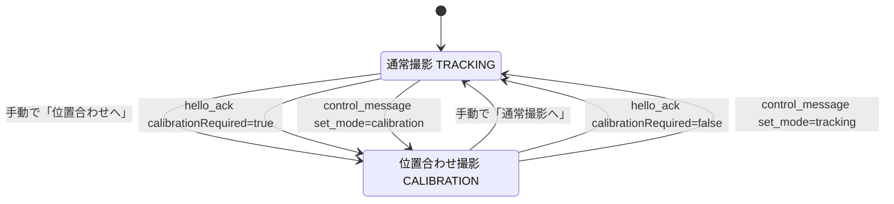

- 初期値は通常撮影である。
- `hello_ack`と同一セッションの`control_message`はPCからモードを変更できる。
- 画面回転ではViewModel内のモードを維持するが、プロセス終了後は通常撮影へ戻る。
- モード変更自体はPCへ通知しない。Androidは変更後のモードに応じた検出結果を送る。

## 8. カメラ・画像処理

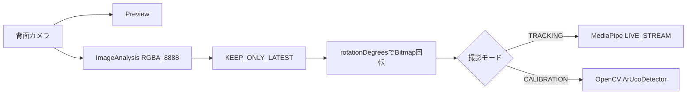

| 項目 | 現行仕様 |
| --- | --- |
| カメラ | `DEFAULT_BACK_CAMERA` |
| 解析出力 | `RGBA_8888` |
| バックプレッシャー | `STRATEGY_KEEP_ONLY_LATEST` |
| 解析スレッド | 単一Executor |
| Preview表示 | `compatible`、`fitCenter` |
| 回転 | `ImageInfo.rotationDegrees`をBitmapへ適用 |
| 左右反転 | 背面カメラのため追加反転なし |
| 解析解像度 | 640×480または960×540 |

ImageProxyはBitmapへコピー後、成功・失敗にかかわらず閉じる。補正後画像の左上を原点、右方向をx正、下方向をy正とする。

## 9. 手指ランドマーク検出

MediaPipe Hand Landmarkerを`LIVE_STREAM`モードで使用し、最大1手を検出する。モデル`hand_landmarker.task`はAPKのassetsへ同梱する。

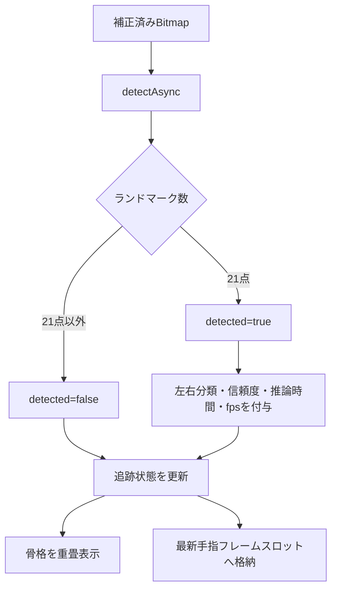

### 9.1 出力データ

| 項目 | 内容 |
| --- | --- |
| `capturedAtMonotonicMs` | MediaPipeへ渡した`SystemClock.uptimeMillis()` |
| `sourceWidth` / `sourceHeight` | 補正済み入力画像サイズ |
| `detected` | ランドマークが正確に21点なら`true` |
| `landmarks` | ID 0〜20順の`x, y, z`正規化座標 |
| `handedness` | MediaPipe分類名を大文字化した値 |
| `handednessScore` | 左右分類の信頼度 |
| `inferenceTimeMs` | 結果受領時刻と入力timestampの差 |
| `framesPerSecond` | 直近1秒に受領した結果数から算出 |

### 9.2 追跡状態

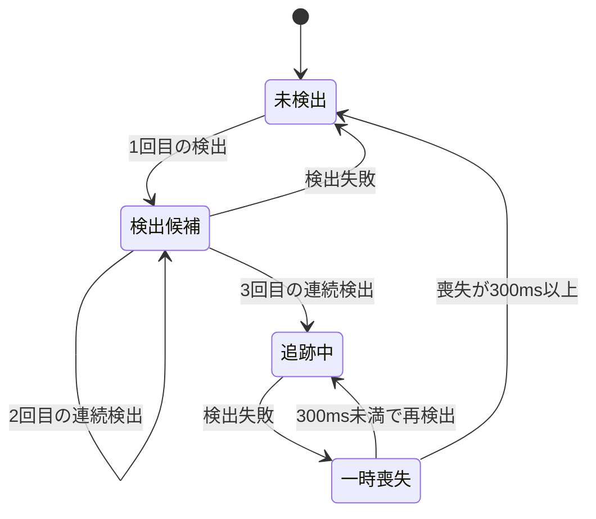

追跡状態が`TEMPORARILY_LOST`でも、そのフレームの通信データは`hand.detected=false`となる。これによりPC側は押下やドラッグを継続せず、安全側へ解除できる。

## 10. ArUcoマーカー検出

位置合わせ撮影ではOpenCVの`ArucoDetector`と`DICT_4X4_50`を使用する。対象外IDは破棄する。

| 位置 | ID |
| --- | ---: |
| 左上 | 10 |
| 右上 | 11 |
| 右下 | 12 |
| 左下 | 13 |

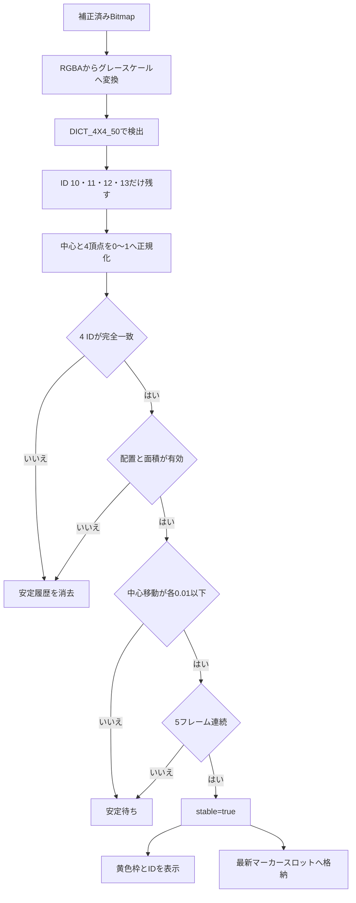

配置検証は、左右・上下関係が期待どおりであり、4中心から作る四角形の正規化面積が`0.05`以上であることを要求する。安定性は各IDの中心が履歴先頭からユークリッド距離`0.01`以内にある状態が5フレーム続くことで成立する。

## 11. 接続仕様

### 11.1 接続先と入力検証

接続URLは次の形式である。

```text
ws://<host>:<port>/ws/v1/input
```

| 入力 | 検証 |
| --- | --- |
| host | 空文字不可。IPv4形式への限定検証は行わない |
| port | 数値かつ1〜65535 |
| pairingToken | 6桁の数字 |

同一LANでのデモを目的として、アプリは平文WebSocket通信を許可している。

### 11.2 接続状態

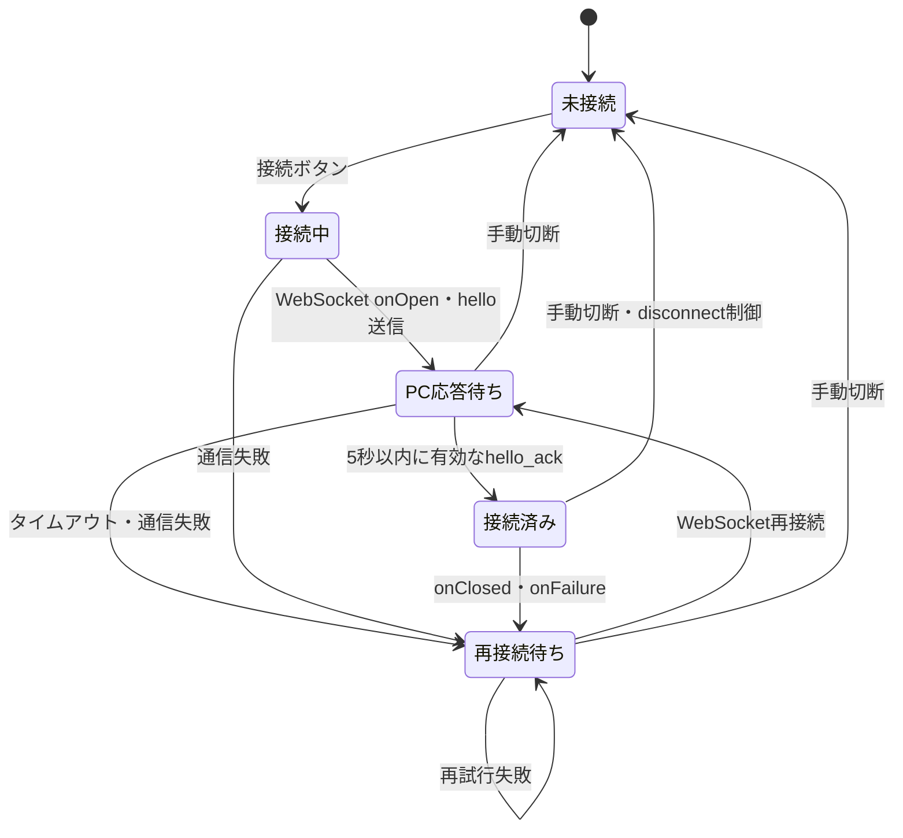

`ERROR`状態はモデル上定義されているが、現行WebSocketクライアントの通常遷移では発行しない。入力不備は接続開始前に画面上のメッセージとして表示する。

### 11.3 再接続

- 自動再試行間隔は1秒、2秒、4秒、8秒、以後10秒である。
- 有効な`hello_ack`を受信すると試行回数を0へ戻す。
- 手動切断では自動再接続を停止し、未送信スロットとsessionIdを消去する。
- 新しい接続操作では既存ソケットと再接続タスクを破棄する。

## 12. WebSocketセッション

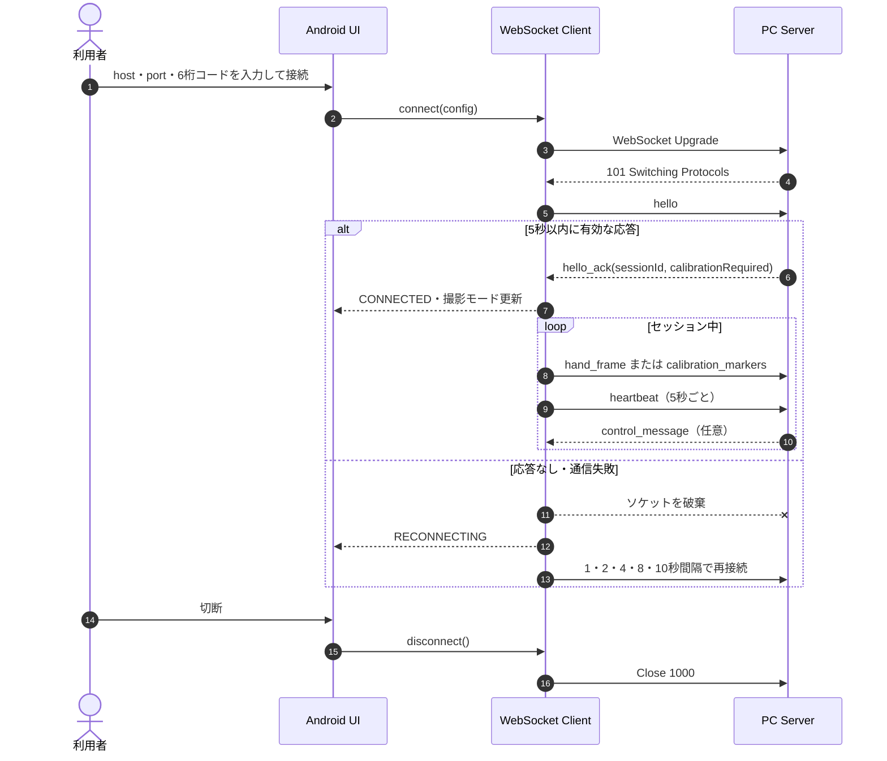

- `hello_ack.schemaVersion`が1以外なら接続済みにしない。
- `hello_ack`で受領したsessionIdを以後の送信へ付与する。
- `control_message`は現在のsessionIdと一致する場合だけ処理する。
- 未知メッセージ、未知コマンド、不正JSONは状態変更せず無視またはログ表示する。
- JSON heartbeatは5秒間隔、WebSocket pingは10秒間隔である。

## 13. メッセージ仕様概要

| 方向 | `messageType` | 用途 | 送信条件 |
| --- | --- | --- | --- |
| Android → PC | `hello` | 端末・バージョン・能力・ペアリング情報 | WebSocket接続直後 |
| PC → Android | `hello_ack` | sessionIdと初期モードの確定 | PCがhelloを受理したとき |
| Android → PC | `hand_frame` | 21点または未検出通知 | 接続済み・通常撮影結果あり |
| Android → PC | `calibration_markers` | 安定した4マーカー | 接続済み・安定結果あり |
| Android → PC | `heartbeat` | セッション生存確認 | 接続済みで5秒ごと |
| PC → Android | `control_message` | モード切替または切断 | 同一sessionIdの制御時 |

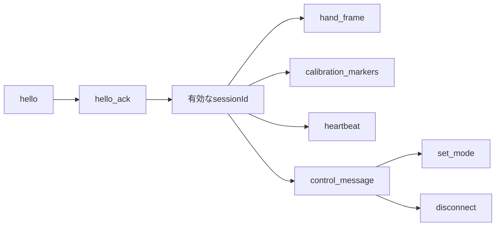

すべてのメッセージは`schemaVersion=1`である。詳細なフィールド、型、例は[Android通信プロトコル v1](./android-protocol-v1.md)を参照すること。

## 14. 低遅延送信制御

手指結果と安定マーカー結果は、それぞれ1件だけ保持する最新値スロットを使用する。未送信結果を蓄積しない。

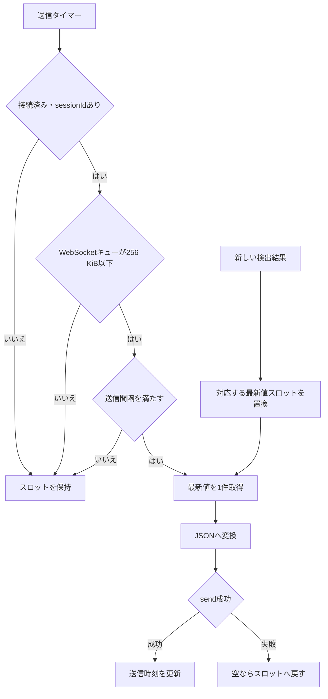

| 項目 | 現行値 |
| --- | ---: |
| 手指送信上限 | 設定可能な5〜20 fps、既定20 fps |
| 手指送信タイマー確認間隔 | 20 ms |
| マーカー送信確認間隔 | 200 ms（最大5 fps） |
| OkHttp送信キュー上限判定 | 256 KiB |
| `hello_ack`前の検出結果 | 最新値のみ保持し、送信しない |
| `frameId` | 実際にJSON化する手指フレームごとに1増加 |

## 15. 設定と永続化

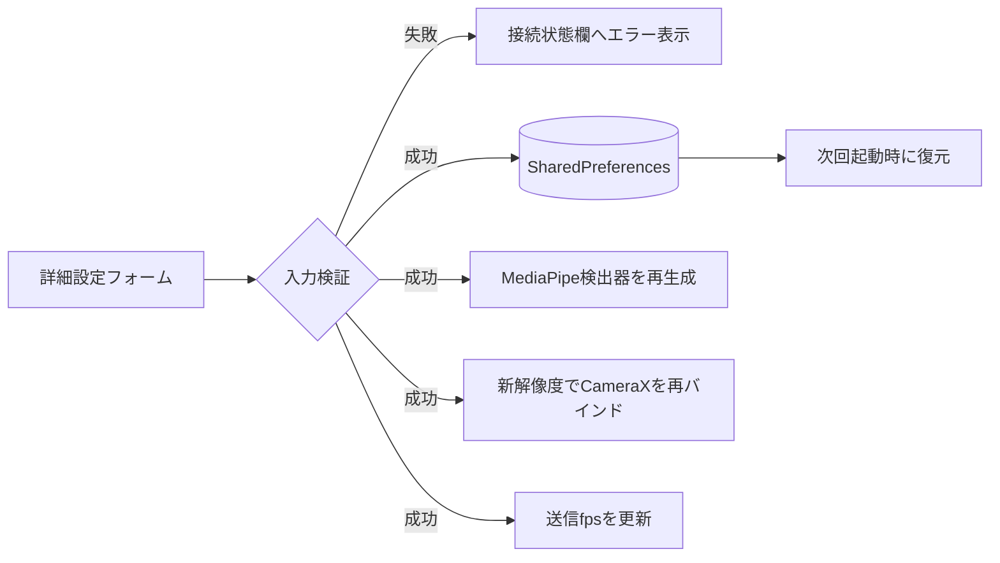

| 設定 | 既定値 | 許容値 | 永続化 |
| --- | ---: | --- | --- |
| 解析解像度 | 640×480 | 640×480、960×540 | する |
| 検出信頼度 | 0.5 | 0.0〜1.0 | する |
| 存在信頼度 | 0.5 | 0.0〜1.0 | する |
| 追跡信頼度 | 0.5 | 0.0〜1.0 | する |
| 最大送信fps | 20 | 5〜20 | する |
| PC host | 空 | 空でない文字列 | 接続成功前の検証通過時に保存 |
| PC port | 8080 | 1〜65535 | 接続成功前の検証通過時に保存 |
| deviceId | 初回に`android-`＋UUID先頭8文字 | アプリ生成 | する |
| ペアリングコード | 空 | 6桁数字 | しない |
| 撮影モード | 通常撮影 | 通常／位置合わせ | プロセスをまたいで保存しない |

設定適用時、旧MediaPipe検出器は新しい検出器への差し替えから1秒後に閉じる。値が不正な場合は設定もカメラも変更しない。

## 16. 可視化とデバッグ

通常撮影では21点を白い点、骨格接続を緑色の線で表示する。位置合わせ撮影では各マーカーを黄色の四角形で囲み、中心付近へIDを表示する。両者は同時表示せず、新しいモードの結果で以前の結果を置き換える。

PreviewとOverlayはともに`fitCenter`相当で、次の座標変換を行う。

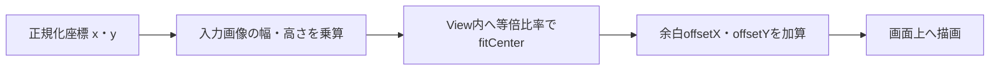

debug APKには「診断」パネルがあり、端末・カメラ・検出・ArUco・通信の最新値、カウンター、直近500イベントを確認できる。イベントは`YubiBoardDiag`タグへJSONLとして出力し、Storage Access Frameworkを使って利用者が選んだ場所へ保存できる。疑似21点、疑似未検出、疑似4マーカーにより、カメラ入力と切り離して通信経路を検証できる。これらは`BuildConfig.DEBUG`で保護され、releaseでは表示・収集・実行されない。

PC側のPowerShellテストハーネスは正常接続、モード切替、切断、ackタイムアウト、不正JSON、session/schema不一致、低速受信を再現し、イベントJSONL、接続CSV、Markdown要約を`android/debug-results/`へ保存する。ADBランナーはUSB reverse、ビルド・導入、instrumentation test、5秒間隔の温度・メモリとLogcatを収集する。

## 17. データ保持・セキュリティ

- 通信は同一LAN向けの平文`ws://`であり、TLSは使用しない。
- ペアリングコードはメモリ上の接続設定にのみ保持し、SharedPreferencesへ保存しない。
- deviceId、host、port、検出設定はSharedPreferencesへ保存する。
- カメラ画像は端末内で解析し、ファイル保存もネットワーク送信も行わない。
- ランドマークとマーカー座標は接続中のPCへ送信する。
- アプリはAndroidバックアップを許可している。端末・OSのバックアップ規則により、保存設定がバックアップ対象となる可能性がある。
- 現行のペアリングはPCが6桁コードを照合する前提であり、暗号学的な認証ではない。

## 18. 異常時の動作

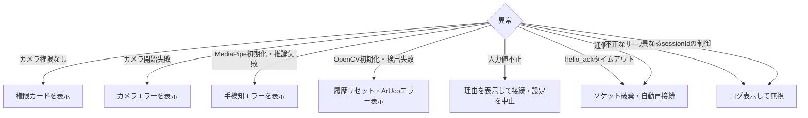

手を1フレームでも検出できない場合は`detected=false`を送信対象とする。通信切断時はsessionIdを無効化するため、再認証が完了するまで新しい検出結果を送信しない。

## 19. ビルド・テスト・デモ

### 19.1 ビルド

Android Studioでは`android/`をプロジェクトルートとして開く。コマンドライン検証は`android/`で次を実行する。

```powershell
.\gradlew.bat testDebugUnitTest lintDebug assembleDebug assembleDebugAndroidTest --no-daemon
```

### 19.2 テスト範囲

| 種別 | 対象 | 現行結果 |
| --- | --- | --- |
| JVM単体テスト | JSON、未知フィールド、未検出形式 | 成功 |
| JVM単体テスト | WebSocketのhello_ack前後とsessionId | 成功 |
| JVM単体テスト | 追跡状態3回検出・300 ms喪失 | 成功 |
| JVM単体テスト | ArUco 4 ID、5フレーム、移動・配置拒否 | 成功 |
| JVM単体テスト | debug診断イベント、カウンター、500件上限 | 成功 |
| AndroidTestビルド | OpenCVとモデルassetのパッケージ確認テスト | APK生成成功 |
| AndroidTest実行 | 実端末上でOpenCV初期化とasset読込 | ADBランナーから実行可能 |
| モックWebSocket | `hello`から`hello_ack`までの実通信 | 成功 |

### 19.3 デモ経路

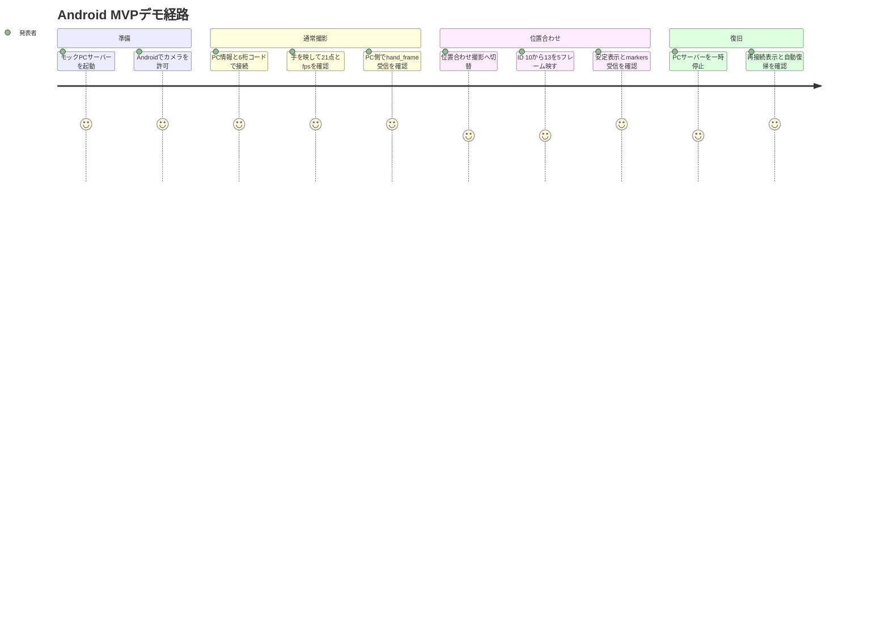

モックサーバーの起動方法と具体的な操作は[`android/README.md`](../android/README.md)を参照すること。

## 20. 未検証事項と既知の制約

### 20.1 未検証

- Android実機でのカメラプレビューとOverlay座標の一致
- 実端末でのMediaPipe・OpenCVネイティブライブラリ初期化
- 実際の手、照明、端末角度に対する検出精度
- 実マーカー4枚を使った安定判定と頂点順序
- 15〜20 fps、100〜150 ms目標の実測
- 10分連続動作、発熱、メモリ、バッテリー消費
- 実PCアプリとのペアリング、制御、再接続、座標受け渡し
- Androidの画面回転・バックグラウンド復帰を含む実機操作

上記を再現可能に測定する環境は実装済みだが、端末・照明・設置条件を伴う受入結果そのものは実機セッションごとに`android/debug-results/`へ記録する。

### 20.2 既知の制約

- 1人・1アクティブハンドのみを対象とする。
- 通常撮影と位置合わせ撮影は排他的である。
- hostは空文字だけを検査し、IPアドレスやホスト名の厳密な形式検証はしない。
- 平文WebSocketのため、信頼できる同一LAN以外で使用しない。
- 自動再接続は上限回数を設けず、10秒間隔で継続する。
- マーカー安定後も安定結果が到着するたび最大5 fpsで送信する。PCからの受領確認はない。
- デバッグAPKはMediaPipeモデルとOpenCVネイティブライブラリを含むユニバーサルAPKであり、サイズが大きい。
- `ERROR`接続状態は定義済みだが、現行の通信処理からは発行されない。
- release APKには診断履歴・疑似入力・エクスポートを含めない。

## 21. 変更時の同期対象

次の変更を行った場合は、本書と関連文書を同じコミットで更新する。

| 変更 | 同期する文書 |
| --- | --- |
| JSONフィールド・メッセージ・タイムアウト | 本書、`android-protocol-v1.md` |
| マーカーID・配置・安定条件 | 本書、`android/README.md` |
| 設定値・許容範囲 | 本書、`android/README.md` |
| 実装範囲・責任境界 | 本書、`android-app-requirements.md` |
| ビルド・デモ手順 | 本書、`android/README.md` |
