# YubiBoard（仮称）Androidアプリ要件定義書


> [!NOTE]
> 「YubiBoard」は仮称であり、正式名称は未定です。  
> 本文書は、元の要件定義書 Version 0.2 をMarkdown向けに再構成したものです。要件IDと通信メッセージ例は元文書の表記を維持しています。


## 関連文書

- [全体要件定義書](../system/system-requirements.md)
- [デスクトップアプリ（PCアプリ）要件定義書](../desktop/desktop-app-requirements.md)
- [Android UI要件定義書](./android-ui-requirements.md)
- [Androidカメラ解像度・プレビューサイズ判断書](./android-camera-resolution-decision.md)
- [Android本番UI・処理変更計画](./android-production-ui-change-plan.md)


## 1. 文書の対象

本書は、YubiBoard（仮称）のAndroidアプリに関する要件を定義する。

Android端末は、背面カメラから画像を取得し、画面位置合わせモードではArUcoマーカーを、通常操作モードでは1つの手に対する21点の手指骨格を検出する。検出結果はJSON形式へ変換し、WebSocketを通じてPCへ送信する。

Android側では、ジェスチャー認識、ホモグラフィによる画面座標変換、ポインター軌跡の補間、クリック・ドラッグ・スクロール・ズーム判定、PC OSへの入力反映を行わない。


**図38　最終的な処理責任**

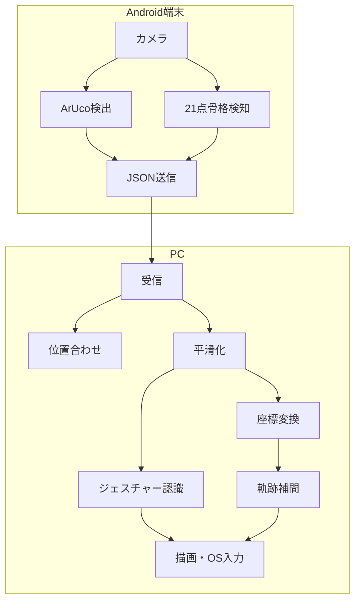

## 2. 前提条件と対象範囲

### 2.1 利用条件

- 利用者は1人とする。
- 操作対象とするアクティブハンドは1つとする。
- Android端末とPCが通信可能であること。
- 初期実装では同一LAN内での利用を想定する。
- 背面カメラから対象画面と利用者の手を撮影できること。
- Android端末または対象画面を移動した場合、再度画面位置合わせを行うこと。
- 暗すぎる環境や強い逆光を避けること。

### 2.2 Androidアプリが実現する範囲

- Android端末とPCの接続
- 4つのArUco IDの検出
- ArUco座標のPCへの送信
- 1つの手に対する21点手指骨格検知
- 21点骨格座標のPCへの連続送信
- 手を見失った場合の未検出通知
- 骨格および検出状態のデバッグ表示

### 2.3 Androidアプリの対象外

- 複数人による同時操作
- 両手を同時に使用するジェスチャー
- 3本指以上を利用するジェスチャー
- 物理的な画面接触の検出
- 指の圧力検出
- 触覚フィードバック
- Android以外のスマートフォン対応
- インターネット経由での遠隔操作
- カメラ映像そのものの常時送信
- 対象画面の移動を検出した自動再キャリブレーション


**図2　1人・1アクティブハンドの前提**

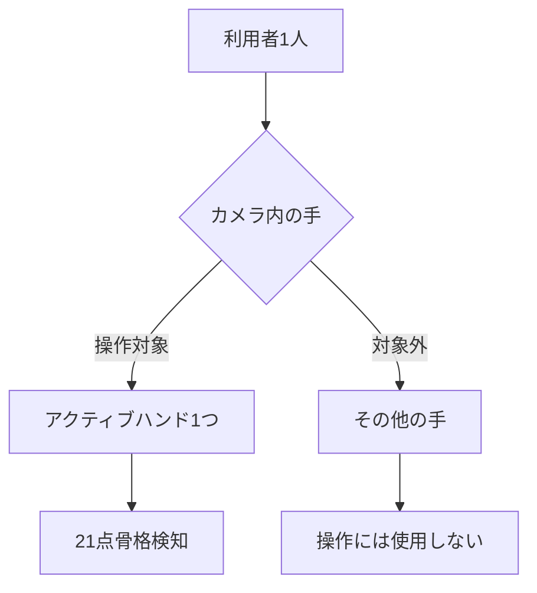

## 3. Android側の責任

- 背面カメラ画像の取得
- カメラ画像の回転補正
- 必要に応じた左右反転補正
- 画面位置合わせモードでのArUco検出
- 4つのArUco IDと座標の取得
- 通常操作モードでの21点手指骨格検知
- 検出結果へのフレーム番号付与
- 検出結果への取得時刻付与
- JSON形式への変換
- WebSocketによるPCへの送信
- 処理遅延時の古いフレーム破棄
- 接続状態の表示
- 未検出状態の通知

### 3.1 Android側で行わない処理

- ジェスチャー認識
- ホモグラフィによる画面座標変換
- ポインター軌跡の補間
- クリック判定
- ドラッグ判定
- スクロール判定
- ズーム判定
- PC OSへの入力反映

**図9　Android側とPC側の責任境界**

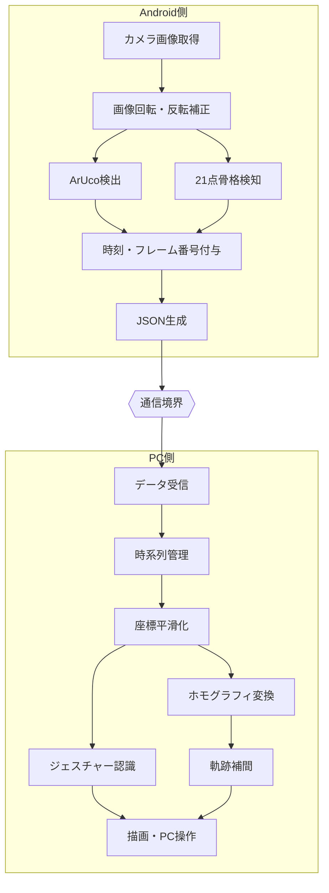

## 4. 採用技術と技術的前提

### 4.1 カメラ入力

Androidのカメラ画像取得には、CameraXのImageAnalysisを使用する。解像度選択と画面表示の詳細は[Androidカメラ解像度・プレビューサイズ判断書](./android-camera-resolution-decision.md)を正本とし、初期値は以下とする。


| 項目 | 初期値 |
| --- | --- |
| 使用カメラ | 背面カメラ |
| カメラフレームレート | 30 fpsを目標 |
| 骨格検知レート | 15～20 fps以上を目標 |
| 解析解像度 | 1280×720を第一候補、960×540、640×480へ起動時フォールバック |
| バックプレッシャー | 最新フレーム優先 |
| 古いフレーム | 処理待ちとして蓄積しない |

### 4.2 手指骨格検知

手指骨格検知には、MediaPipe Tasks Vision Hand Landmarkerを使用する。検出対象は、1つの手に対する21点のランドマークとする。


**図7　手指骨格検知フロー**

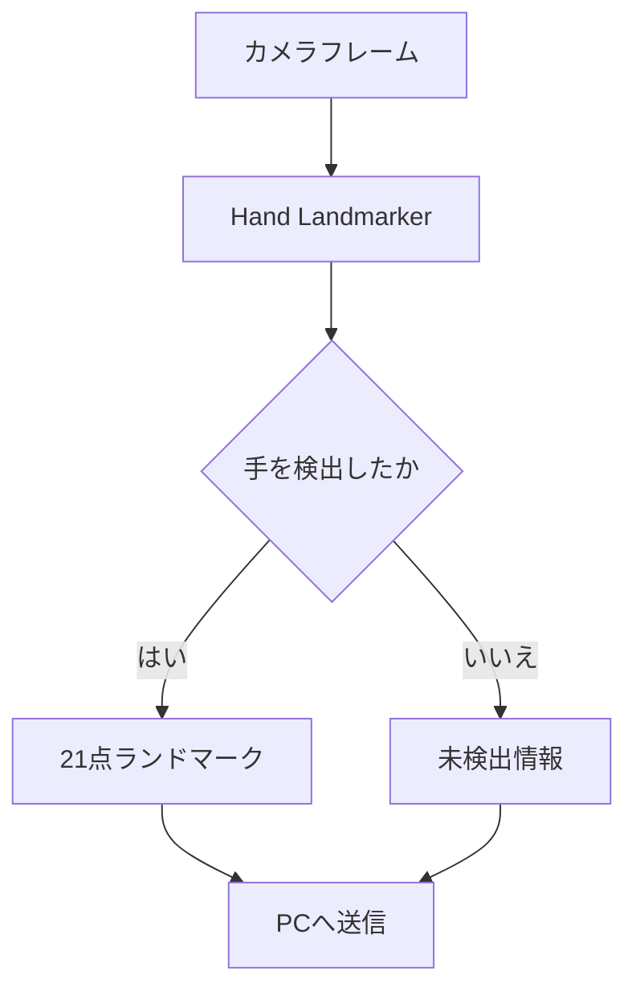

主要なランドマークは以下のとおりである。

| ID | 部位 | 主な用途 |
| --- | --- | --- |
| 0 | 手首 | 手の基準位置、手の大きさ |
| 4 | 親指先端 | ピンチ・押下判定 |
| 5 | 人差し指MCP | 人差し指の伸展判定 |
| 8 | 人差し指先端 | ポインター・描画位置 |
| 9 | 中指MCP | 手の大きさの基準 |
| 12 | 中指先端 | 二本指スクロール・ズーム |
| 16 | 薬指先端 | 手形状判定 |
| 20 | 小指先端 | 手形状判定 |

### 4.3 ArUcoマーカー

画面位置合わせには`DICT_4X4_50`の4つのArUcoマーカーを使用する。対象画面上のIDは左上10、右上11、右下12、左下13とする。Android端末の縦横・90度単位の回転に依存せず、このID順が凸四角形を構成することを確認する。


**図8　ArUcoマーカー配置**

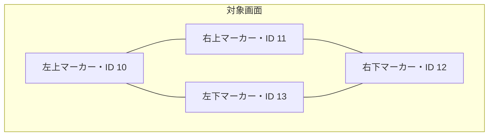

## 5. アプリ状態とトラッキング状態

### 5.1 Androidアプリ状態


**図11　Androidアプリ状態遷移**

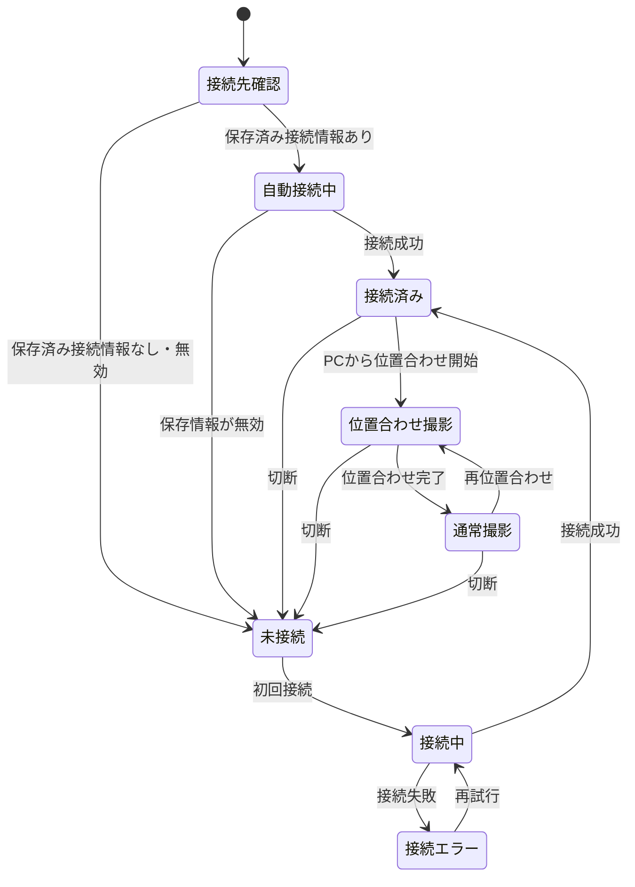

### 5.2 手指トラッキング状態

**図12　手指トラッキング状態遷移**

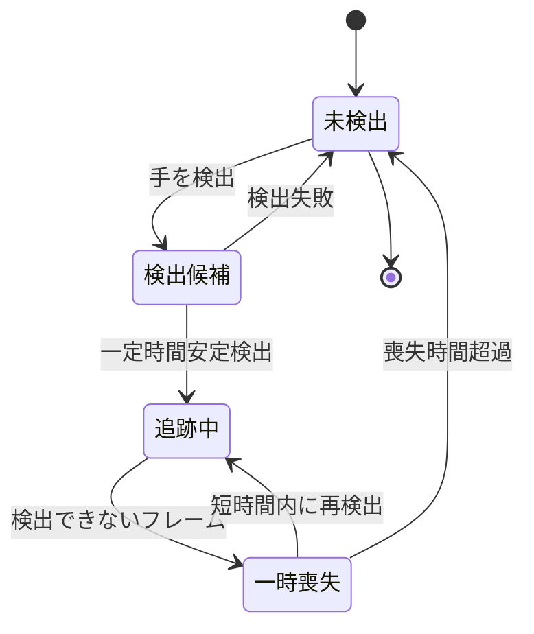

## 6. カメラ座標要件

Androidアプリは、回転と必要な左右反転を補正したうえで、次のカメラ正規化座標を使用する。


| 項目 | 内容 |
| --- | --- |
| 座標原点 | カメラ画像左上 |
| x方向 | 右方向に増加 |
| y方向 | 下方向に増加 |
| x範囲 | 原則0.0～1.0 |
| y範囲 | 原則0.0～1.0 |
| 回転 | 補正済み |
| 左右反転 | 補正済み |
| 座標系名称 | normalized_camera |

**図19　カメラ正規化座標**

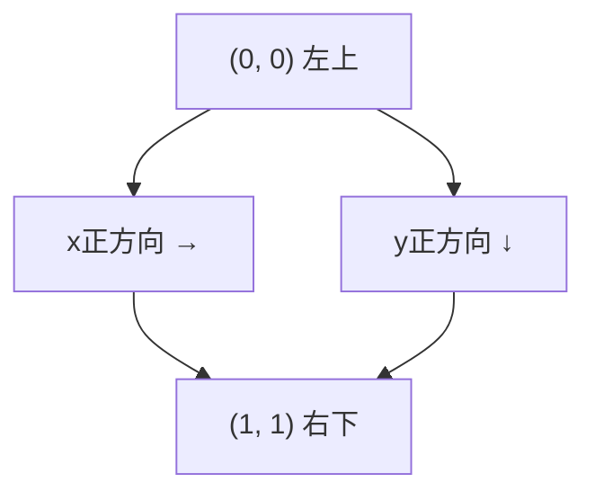

## 7. 画面位置合わせ用ArUco検出

位置合わせはPC主導とする。Android接続後、利用者はスマホを配置・固定し、PC画面上の「配置OK」を押す。PCがその後に四隅のマーカーを表示し、AndroidはPCから位置合わせモードを指示されている間だけArUco検出を行う。Android側の本番UIには位置合わせ開始ボタンを置かない。

### 7.1 検出データ

- ArUco ID
- 中心座標
- 4つの頂点座標
- 撮影画像の幅
- 撮影画像の高さ
- 検出時刻

### 7.2 安定検出

1フレームのみの検出結果では位置合わせを確定しない。Androidアプリで次を確認し、条件を満たす有効な5フレームを蓄積したときに安定とする。

- ID 10、11、12、13がすべて検出されている
- IDの重複がない
- ID順の中心が凸四角形を構成し、正規化面積が`0.01`以上である
- 各中心が基準フレームから正規化距離`0.02`以内である

検出・配置条件を満たさない状態が1〜2フレームだけ発生した場合は有効履歴を保持し、3フレーム連続した場合は履歴を消去する。安定判定後にPCが変換行列を計算し、その有効性を別途確認する。

### 7.3 再検出が必要となる条件

Android端末の移動または角度変更、対象画面の移動などによって再位置合わせが開始された場合、Androidアプリは再び位置合わせ撮影状態へ移行する。


**図18　画面位置合わせフロー**

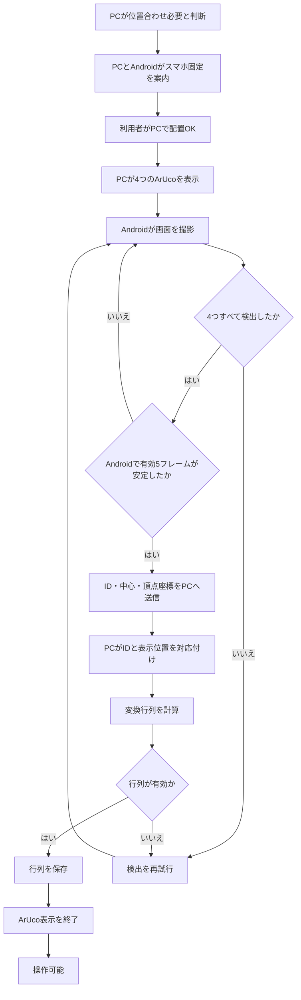

## 8. 通信要件

### 8.1 通信方式

Android端末とPCの継続的なデータ通信には、WebSocketを使用する。初期実装では同一LAN内での平文WebSocketを許容する。

```text
ws://192.168.1.20:8080/ws/v1/input
```

AndroidアプリはWebSocketクライアントとして、利用者が指定したPCのIPアドレスおよびポートへ接続する。

初回はIPまたはホスト名、ポート、6桁コードを入力する。初回認証成功後は、PCが発行した再接続用トークンを保存し、次回起動時に利用者の入力なしで同じPCへ接続する。保存済みトークンが無効な場合は自動再接続を停止してトークンを破棄し、初回接続画面へ戻る。


**図23　WebSocket通信構成**

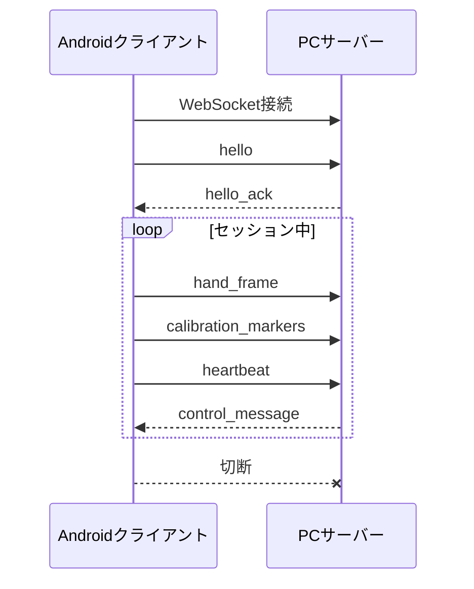

### 8.2 データ形式

初期実装ではJSONを使用する。JSONにはスキーマバージョン、メッセージ種別、セッション、フレーム番号、取得時刻、座標系、検出結果などを含める。

### 8.3 フレーム送信方針

過去のフレームをすべて送信することよりも、現在の指位置を低遅延で反映することを優先する。処理遅延時は未送信の古いフレームを破棄し、最新フレームを送信する。


**図24　最新フレーム優先**

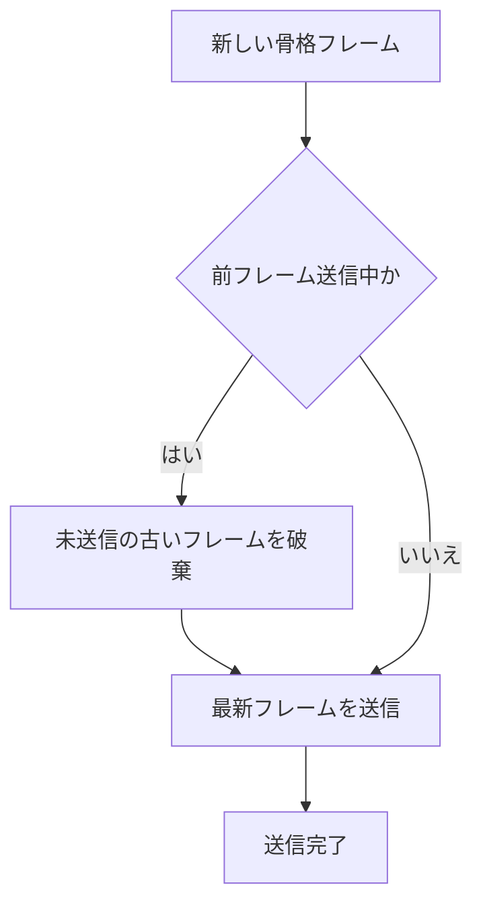

接続開始、位置合わせ結果、切断通知、エラー通知などの制御データは破棄しない。

## 9. Androidから送信する通信メッセージ

### 9.1 接続開始メッセージ


```json
{
"schemaVersion": 1,
"messageType": "hello",
"deviceId": "android-01",
"client": "yubiboard-android",
"clientVersion": "0.1.0",
"pairingToken": "482731",
"interactionProfile": "single_user_single_active_hand",
"coordinateSpace": "normalized_camera",
"capabilities": ["aruco_calibration", "hand_landmarks_21"]
}
```

初回ペアリング後の`hello`では、`pairingToken`の代わりにPCから発行された`resumeToken`を送る。両フィールドは同時に送らず、いずれか一方を必須とする。詳細は[Android通信プロトコル v1](./android-protocol-v1.md)を正本とする。

### 9.2 骨格フレーム

```json
{
"schemaVersion": 1,
"messageType": "hand_frame",
"sessionId": "session-fc30f9a1",
"frameId": 1842,
"capturedAtMonotonicMs": 19384521,
"source": {
"width": 960,
"height": 540,
"rotationDegrees": 0,
"rotationCorrected": true,
"mirrorCorrected": true
},
"hand": {
"detected": true,
"handedness": "RIGHT",
"handednessScore": 0.982,
"coordinateSpace": "normalized_camera",
"landmarkFormat": "mediapipe_hand_21",
"landmarks": [
[0.5124, 0.7312, -0.0213],
[0.4761, 0.6824, -0.0182],
[0.4512, 0.6115, -0.0251]
]
}
}
```

`landmarks`には、ID 0から20までの21要素を格納する。配列番号をMediaPipeのランドマークIDとして扱い、各要素は`[x, y, z]`の順序とする。


### 9.3 手を検出できなかった場合

```json
{
"schemaVersion": 1,
"messageType": "hand_frame",
"sessionId": "session-fc30f9a1",
"frameId": 1843,
"capturedAtMonotonicMs": 19384554,
"hand": { "detected": false }
}
```

### 9.4 ArUco検出結果

```json
{
"schemaVersion": 1,
"messageType": "calibration_markers",
"sessionId": "session-fc30f9a1",
"capturedAtMonotonicMs": 19380000,
"source": {
"width": 960,
"height": 540,
"rotationDegrees": 0,
"rotationCorrected": true,
"mirrorCorrected": true
},
"markers": [
{
"id": 10,
"center": [0.103, 0.114],
"corners": [[0.081,0.091],[0.126,0.092],[0.127,0.137],[0.082,0.136]]
}
]
}
```

`markers`には、実際には4つのマーカーを格納する。

## 10. PCから受信する通信メッセージ

### 10.1 接続応答


```json
{
"schemaVersion": 1,
"messageType": "hello_ack",
"sessionId": "session-fc30f9a1",
"surface": {
"surfaceId": "primary-display",
"widthPx": 1920,
"heightPx": 1080
},
"calibrationRequired": true
}
```

## 11. 機能要件

### 11.1 接続機能


| ID | 要件名 | 内容 |
| --- | --- | --- |
| FR-002 | Android接続 | Androidアプリは、指定されたPCのIPアドレスおよびポートへ接続できること。 |
| FR-003 | 接続状態表示 | PCおよびAndroidアプリは、未接続、接続中、接続済み、再接続中、切断、エラーを表示できること。 |
| FR-004 | ペアリング | ペアリングコードまたは同等の認証方法を使用できること。 |
| FR-005 | 再接続 | 通信切断時、AndroidアプリはPCへの再接続を試行できること。 |
| FR-007 | 信頼済み接続 | 初回成功時にPCから`resumeToken`を受信し、端末内で保護して保存できること。 |
| FR-008 | 起動時自動接続 | host、port、`resumeToken`が保存済みなら、起動時に入力なしで接続を開始できること。 |
| FR-009 | 保存情報の破棄 | 接続先変更または「このPCを忘れる」でhost、port、`resumeToken`を削除できること。 |

### 11.2 画面位置合わせ機能

| ID | 要件名 | 内容 |
| --- | --- | --- |
| FR-012 | ArUco検出 | Androidはカメラ画像から4つのArUcoマーカーを検出できること。 |
| FR-013 | マーカー情報取得 | ID、中心座標、4頂点座標を取得できること。 |
| FR-014 | 安定検出 | Androidは回転に依存しない配置検証と中心移動許容値を用い、有効な5フレームの蓄積で安定性を確認できること。連続2フレームまでの一時的な検出欠落を許容する。 |
| FR-015 | 座標送信 | 4つのマーカー情報をPCへ送信できること。 |

### 11.3 手指骨格検知機能

| ID | 要件名 | 内容 |
| --- | --- | --- |
| FR-030 | 背面カメラ使用 | Androidアプリは端末の背面カメラを利用すること。 |
| FR-031 | 1アクティブハンド | 操作対象として1つの手を検出すること。 |
| FR-032 | 21点骨格取得 | 検出した手について21点の骨格座標を取得すること。 |
| FR-033 | 左右分類 | 検出した手の左右分類と信頼度を取得すること。 |
| FR-034 | 座標方向統一 | 回転や左右反転を補正し、一定の座標系で送信すること。 |
| FR-035 | 未検出通知 | 手を検出できない場合、未検出状態を送信すること。 |
| FR-036 | 最新フレーム優先 | 処理遅延時に古いフレームを蓄積しないこと。 |

## 12. ログ・デバッグ要件

AndroidアプリまたはPC側ログへ渡す情報として、少なくとも以下を確認可能とする。

- Android端末情報
- 生の21点骨格座標
- フレームID
- 取得時刻
- ArUco検出結果
- 手の左右分類
- 人差し指先端位置
- 送信fps
- 未検出状態
- 接続状態
- 通信エラー


## 13. 非機能要件

### 13.1 性能要件


| ID | 要件 |
| --- | --- |
| NFR-001 | Android側の骨格検知は最低15 fps、20 fps以上の安定動作を目標とする。 |
| NFR-002 | 送信レートはPC側の補間で文字や線の形状を維持できる最低値以上とする。 |
| NFR-003 | カメラ画像取得からPC反映まで100 ms未満を目標とし、初期試作では150 ms未満を暫定許容とする。 |
| NFR-004 | 遅延時は全フレームの順次処理より最新状態を優先する。 |
| NFR-005 | 10分以上の連続動作で著しい性能低下や操作不能が発生しないこと。 |
| NFR-006 | Android端末の温度上昇による継続的な大幅性能低下を避けること。 |
| NFR-007 | CameraXへの要求解像度と実解析解像度を区別し、受入判定には実解析解像度を使用すること。 |
| NFR-008 | Preview、ImageAnalysis、Overlayが同じ画角とCropRectを使用すること。 |

**図31　全体遅延の内訳**

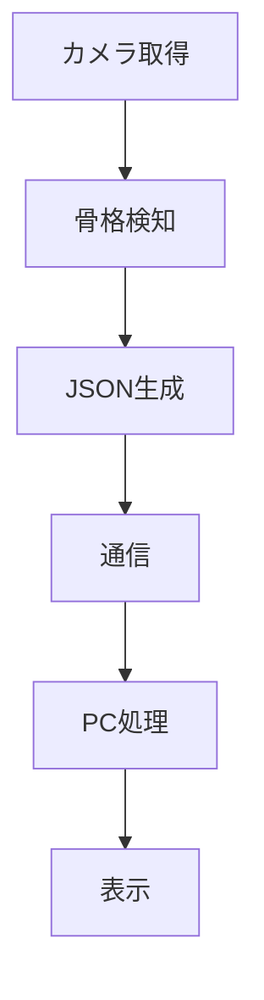

### 13.2 操作性要件

| ID | 要件 |
| --- | --- |
| NFR-010 | 利用者は案内に従い接続と位置合わせを完了できること。 |
| NFR-011 | 接続、位置合わせ、手の検出、操作可否、エラー状態を明示すること。 |
| NFR-012 | 手を見失った場合、押下やドラッグが継続しないこと。 |
| NFR-013 | アプリを再起動せず位置合わせをやり直せること。 |
| NFR-014 | 保存済み接続情報が有効な場合、起動後に入力操作なしでPCへの接続を開始すること。 |

### 13.3 保守性要件

| ID | 要件 |
| --- | --- |
| NFR-020 | Android側の骨格検知処理とPC側のジェスチャー認識処理を分離すること。 |
| NFR-021 | PC側のアルゴリズムを変更してもAndroid側を変更せず動作できること。 |
| NFR-022 | 検知信頼度、解析解像度、送信レート、平滑化、各しきい値、喪失時間、補間、スクロール方向、ズーム方式を外部設定可能とすること。 |
| NFR-023 | 通信メッセージにスキーマバージョンを含めること。 |

### 13.4 信頼性要件

| ID | 要件 |
| --- | --- |
| NFR-030 | 異常な座標や不完全なJSONを受信してもアプリ全体が停止しないこと。 |
| NFR-031 | 通信切断、長時間未検出、アプリ終了、例外、セッション変更、位置合わせ移行時に実行中操作を解除すること。 |
| NFR-032 | 利用者が対応可能な形式でエラー内容を表示すること。 |

### 13.5 セキュリティ要件

| ID | 要件 |
| --- | --- |
| NFR-040 | Androidアプリは利用者が指定したPCへ接続すること。 |
| NFR-041 | ペアリングコードなどにより意図しない端末の接続を防止できること。 |
| NFR-042 | WebSocketサーバーを必要のない外部ネットワークへ公開しないこと。 |
| NFR-043 | 再接続用トークンは十分なエントロピーを持ち、Android Keystoreで保護して保存すること。 |
| NFR-044 | 接続先変更または「このPCを忘れる」でホスト、ポート、再接続用トークンを削除できること。 |

## 14. エラー処理


| エラー | 対応 |
| --- | --- |
| PCへ接続できない | IPアドレス、ポート、ネットワークを確認し再接続 |
| カメラを起動できない | 権限確認、カメラ再初期化 |
| 4つのArUcoを検出できない | カメラ位置、画面全体、照明を確認 |
| 手を検出できない | 未検出通知を送り、PC操作を解除 |
| 通信が切断された | 全入力を解除し再接続を試行 |
| PCアプリが終了した | Android側を接続待機状態へ戻す |
| 保存済みトークンが無効 | トークンを破棄し、自動接続を停止して初回接続画面へ戻す |

通信切断またはPCアプリ終了時は、Androidアプリを未接続または接続待機状態へ戻し、再接続を試行できること。


## 15. 受入条件


| ID | 受入条件 |
| --- | --- |
| AC-002 | AndroidアプリとPCアプリが接続され、双方で接続済み状態を確認できること。 |
| AC-004 | Android端末が4つのArUco IDを同時に検出できること。 |
| AC-007 | Android端末が操作対象の手について21点の骨格座標を取得できること。 |
| AC-009 | Android側で手を見失った場合、PCが未検出状態を認識できること。 |
| AC-020 | 10分以上連続して利用してもシステムが停止しないこと。 |
| AC-021 | 1280×720を第一候補として起動し、端末非対応時は定義済みプロファイルへフォールバックできること。 |
| AC-022 | 実解析解像度で10分連続動作し、PC側の平均受信レートが15 fps以上であること。 |
| AC-023 | 初回ペアリング成功後にAndroidアプリを再起動し、IP、ポート、6桁コードを再入力せず同じPCへ接続できること。 |
| AC-024 | PCで「配置OK」を押す前はArUcoマーカーが表示されず、押した後に4マーカー検出へ進むこと。 |
| AC-025 | PCアプリ再起動後は位置合わせを必須とし、同一PCプロセス内の一時通信断では確認済み位置合わせを再利用できること。 |

## 16. 未確定事項

Android MVPで確定したArUco ID・表示位置・安定フレーム数・中心移動許容値は本文へ反映し、未確定事項から除外した。解析解像度は[Androidカメラ解像度・プレビューサイズ判断書](./android-camera-resolution-decision.md)で確定した。


| ID | 未確定事項 |
| --- | --- |
| TBD-001 | システムの正式名称 |
| TBD-002 | 対応するAndroidの最低バージョン |
| TBD-003 | 対応するAndroid端末の最低性能 |
| TBD-005 | 骨格検知フレームレート |
| TBD-006 | PCへの最低送信フレームレート |
| TBD-007 | 許容可能な全体遅延 |
| TBD-017 | ArUcoマーカーのサイズ |
| TBD-021 | カメラと対象画面の推奨距離 |
| TBD-022 | Android端末の推奨設置角度 |
| TBD-027 | JSONからバイナリ通信へ変更する判断基準 |

## 17. 実機検証項目

### 17.1 性能検証

- 骨格検知1フレーム当たりの処理時間
- Android側の検知fps
- Android側の送信fps
- PC側の受信fps
- カメラ撮影からPC表示までの遅延
- フレーム欠落率
- 10分間継続動作時のAndroid端末温度
- 継続動作による性能低下
- JSONシリアライズ時間
- 通信帯域

### 17.2 精度検証

- 対象画面四隅の座標誤差
- 画面中央の座標誤差
- カメラに近い位置と遠い位置での誤差
- 人差し指先端の揺れ
- ピンチ判定の成功率
- クリック誤認識率
- スクロール誤認識率
- ズーム誤認識率
- 手を見失った場合の解除時間


## 18. Androidアプリの開発単位

Androidアプリの開発単位は、CameraX、ArUco検出、Hand Landmarker、JSON生成、WebSocketクライアントで構成する。


**図35　開発単位**

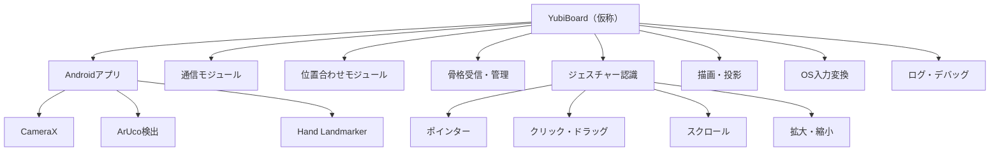

## 19. 推奨実装順序

Android側は、全体の推奨実装順序のうち、次の順で実装を進める。

1. Androidで21点検出
2. JSONでPCへ送信
3. PCで骨格表示できることを確認
4. ArUco位置合わせ用データを送信
5. ログ・デバッグ情報を整備
6. 統合テスト
