# YubiBoard Android本番・デバッグ検証チュートリアル

この資料は、デスクトップアプリが未実装でも、Windows PCのモックサーバーとAndroid実機を使い、本番仕様の全状態を確認する手順書である。

確認方法は2種類ある。

1. **本番状態ラボ**: 通信やカメラ状態を変えず、全画面状態と操作を即時確認する。
2. **実通信シナリオ**: 実際のWebSocket、カメラ、MediaPipe、OpenCVを通して本番フローを確認する。

最初に状態ラボでUIを確認し、その後`production-happy`で実通信の一本道を完走する。

> [!IMPORTANT]
> モックの信頼済み接続情報はデバッグ専用として`android/debug-results/mock-trusted-devices.json`へ保存される。モック再起動後もresume認証を試すための永続化であり、本番PCの保存形式ではない。初回からやり直す場合は`-ResetTrustStore`を指定する。

## 1. 用意するもの

- Windows PC、PowerShell 7
- Android 7.0（API 24）以上の実機
- Android Studio、Android SDK、データ通信対応USBケーブル
- PC画面全体を映せる明るい場所
- ArUcoターゲット[`android/tools/calibration-target-1920x1080.png`](../../android/tools/calibration-target-1920x1080.png)

Android Studioでは`android/`をプロジェクトとして開く。コマンドはリポジトリルートから実行する。

## 2. 実機とビルドを確認する

端末で開発者向けオプション、USBデバッグ、必要なら「USB経由のインストール」を有効にする。

```powershell
.\android\tools\android-debug.ps1 doctor
.\android\tools\android-debug.ps1 build
```

`doctor`でserial、メーカー、機種、Android、画面解像度が表示され、ビルドが`BUILD SUCCESSFUL`になることを確認する。

初回状態から確認する場合は、アプリデータを消してdebug APKを導入する。

```powershell
.\android\tools\android-debug.ps1 install -ResetAppData
```

`-ResetAppData`は保存済みhost、port、`resumeToken`、Experience Modeを消す。通常の更新では指定しない。`pm clear`を制限する端末では、スクリプトが対象debugアプリの再導入へ自動でフォールバックする。`-GrantCamera`を端末が拒否した場合は警告が出るため、起動後の権限ダイアログで許可する。

UDP自動発見をユーザー操作なしで実機確認する場合は、カメラ権限を許可済みのdebug APKを
次のextra付きで起動する。debug APKは保存済みの接続・信頼情報を破棄してUDP待受を開始する。
release APKではextraを無視する。

```powershell
adb shell am force-stop com.nxtend.team35.yubiboard.debug
adb shell am start `
  -n com.nxtend.team35.yubiboard.debug/com.nxtend.team35.yubiboard.MainActivity `
  --ez debugAutoDiscovery true
```

Desktopも`flutter run -d windows --dart-define=YUBI_AUTOFLOW=true`で起動すると、
画面操作なしでWebSocket待受とUDP offer送信を開始できる。Androidの`YubiBoardDiag`ログで
`listen_started`、`offer_received`、`connect_from_offer`、`hello_ack`の順を確認する。

## 3. debug APKの画面構成

debug APKは初回にデバッグ画面を開く。release APKは常に本番画面で、デバッグ切替を表示しない。
debug APKのapplicationIdは`com.nxtend.team35.yubiboard.debug`であり、releaseの
`com.nxtend.team35.yubiboard`とは別アプリとして導入される。デバッグスクリプトは
debug IDだけを起動・初期化・計測し、releaseアプリの保存データには触れない。

デバッグ画面には次がある。

- 詳細な21点骨格・ArUco ID Overlay
- 手動の追跡／位置合わせモード切替
- 解析解像度、送信fps、検出しきい値
- 疑似21点、疑似未検出、疑似4マーカー
- 診断値、カウンター、直近イベント、JSONL保存
- 本番仕様の全状態を表示する本番状態ラボ

設定でデバッグモードをオフにすると本番画面へ移る。debug APKの本番画面では「設定・ヘルプ」からデバッグへ戻れる。切替時に接続とカメラは破棄しない。

## 4. 本番状態ラボで全UIを確認する

1. デバッグ画面で`診断`を開く。
2. `本番状態ラボ`を押す。
3. 上部の状態チップを順番に選ぶ。
4. ボタンを押し、ラボ上部の操作ログが更新されることを確認する。

確認対象は次のとおり。

| 状態 | 主な表示・操作 |
| --- | --- |
| 権限 | 利用理由、映像を送らない説明、カメラ許可 |
| カメラ異常 | カメラを再起動 |
| 接続 | host、port、6桁コード、接続する |
| 接続中 | 接続先、キャンセル |
| 自動接続中 | 前回のPC、キャンセル、接続先変更 |
| コード不一致 | コードを入力し直す具体的な案内 |
| 再接続 | 残り秒数、今すぐ再接続、接続設定変更 |
| 配置待ち | スマホを固定し、PCで配置OKを押す案内 |
| マーカー探索／2/4 | マーカー探索中または検出済み数と4隅を映す案内 |
| 安定3/5 | 数字と5段階インジケーター |
| PC確認中 | 端末を動かさず待つ案内 |
| 再試行 | 配置不正に対応する復旧案内 |
| 追跡開始 | `set_mode=tracking`後に手を映す案内 |
| 取得中 | 手を確認中の非警告表示 |
| 追跡中 | PC接続済みの表示 |
| 一時喪失 | 手を画角へ戻す案内 |
| 長時間喪失 | 照明、距離、画角の確認 |

状態ラボは表示確認専用であり、実際のWebSocket、カメラ設定、PC入力を変更しない。

## 5. 本番フローの実通信環境を開始する

次のコマンドはAPK導入、USB reverse、アプリ起動、次に実行するモックコマンドの表示をまとめて行う。

```powershell
.\android\tools\android-debug.ps1 production -Port 8080
```

別のPowerShellで本番成功シナリオを起動する。

```powershell
.\android\tools\mock-websocket-server.ps1 `
  -Port 8080 `
  -PairingToken 123456 `
  -Scenario production-happy `
  -ResetTrustStore
```

Androidのデバッグ画面で設定を開き、デバッグモードをオフにして本番画面へ移る。接続欄へ次を入力する。

| 項目 | 値 |
| --- | --- |
| host | `127.0.0.1` |
| port | `8080` |
| 6桁コード | `123456` |

## 6. カメラ権限と復旧を確認する

初回は本番画面の説明を読んで`カメラを許可`を押す。

- 許可時: カメラが起動し、プレビューが全画角表示になる。
- 一時拒否: 再度許可する操作が残る。
- 恒久拒否: `設定を開く`からAndroidのアプリ設定へ移動する。
- 設定から許可して戻る: アプリ再起動なしでカメラを開始する。

映像は縦横比を維持し、中央切り抜きや引き伸ばしを行わない。現在はクラッシュ回避のため一方向の横画面に固定し、横画面ですべての状態文と主要操作へ到達できることを確認する。

## 7. 初回接続と位置合わせを完走する

1. `接続する`を押し、`PCに接続しています`を確認する。
2. `スマホを固定してください`へ自動遷移する。この時点の`0/4`はエラーではない。
3. 端末を固定し、モック側PowerShellでEnterを押してPCの`配置OK`を実行する。
4. ArUcoターゲットをPCで全画面表示する。
5. ID 10、11、12、13の4隅をカメラへ入れる。
6. `検出済み n/4`、`安定度 n/5`が進むことを確認する。
7. 安定後に`PCで位置を確認しています`となる。
8. モックが`processing`、`complete`、`set_mode=tracking`を返し、`操作できます`へ移る。

Androidの安定判定だけでは操作可能にならず、PCから`set_mode=tracking`を受信した後だけ操作可能になることを確認する。

### 7.1 信頼済み再接続の受入手順

`production-happy`を次の順で完走する。

1. アプリデータを消し、IP、ポート、6桁コードで初回接続する。
2. 接続成功後に発行された`resumeToken`がログへ値を出さず保存されることを確認する。
3. Androidアプリだけを終了・再起動し、接続フォームを経由せず`前回のPCに接続しています`から接続済みへ進む。
4. `スマホを固定してください`を表示し、この時点ではPCにArUcoマーカーが表示されず、Androidの`0/4`もエラーにならないことを確認する。
5. スマホを固定してモックPC側でEnterを押し、その後にターゲットを全画面表示する。
6. ID 10、11、12、13を有効5フレーム安定させ、`processing`、`complete`、`set_mode=tracking`の順で`操作できます`へ進む。
7. 疑似21点または実際の手で`hand_frame`送信を確認する。
8. Wi-Fiを一時切断・復帰し、同じモックプロセスでは位置合わせを省略して追跡へ戻る。
9. モックPCを再起動し、信頼済み接続は成功するが配置確認と位置合わせは必須になることを確認する。
10. 次の`resume-token-invalid`シナリオで保存トークンが削除され、自動接続を繰り返さず初回接続画面へ戻ることを確認する。

```powershell
.\android\tools\mock-websocket-server.ps1 `
  -Port 8080 `
  -Scenario resume-token-invalid
```

無人の自動確認では`-AutoPlacementOk`を指定する。500ms後に同じ`placement_ok`イベントを発火し、イベント順序は省略しない。

```powershell
.\android\tools\mock-websocket-server.ps1 `
  -Scenario production-happy `
  -AutoPlacementOk
```

## 8. 手追跡を確認する

1. 背面カメラへ片手全体を映す。
2. `手を確認しています`から`手を検出しています`へ変わる。
3. 本番Overlayには人差し指先端のリングだけが表示される。
4. 手を短時間外すと`手を見失いました`になる。
5. 外したままにすると`手が見つかりません`になる。
6. 手を戻すと追跡へ復帰する。

PCターミナルでは`hand_frame`が増える。全21点は`android/debug-results/server-日時/hand-frames.jsonl`へ保存される。MediaPipeのx/yが範囲外の場合、debug診断にはraw値を残し、通信値は0〜1へ収めるため、モックの座標検証エラーは発生しない。

## 9. 位置合わせ再試行を確認する

モックを次のシナリオへ変更する。

```powershell
.\android\tools\mock-websocket-server.ps1 -Scenario calibration-retry
```

最初の安定マーカー送信後に`位置合わせをやり直します`と配置確認の案内が出る。Androidの安定履歴がリセットされ、再度安定マーカーを送るとPC確認中を経て追跡へ移ることを確認する。

## 10. 接続エラーを確認する

シナリオごとにモックを再起動し、本番画面の文言と復旧操作を確認する。

| シナリオ | 期待結果 |
| --- | --- |
| `pairing-rejected` | `6桁コードが一致しません`。自動再接続せず入力へ戻る |
| `unsupported-version` | `PCアプリを更新してください`。自動再接続しない |
| `server-busy` | PC処理中を表示して段階的に再接続する |
| `ack-timeout` | 5秒後にPC応答なしとなり再接続する |
| `drop` | 1、2、4、8、以後10秒で再接続する |
| `remote-disconnect` | PC要求で切断し、接続フォームへ戻る |
| `invalid-json` | 不正JSONを無視して接続を継続する |
| `wrong-session` | 別sessionの制御を無視する |
| `schema-mismatch` | 未対応schemaを接続済みにしない |
| `slow-reader` | 未送信フレームを蓄積せず最新値を優先する |

再接続画面では秒数が毎秒減ること、`今すぐ再接続`、`接続設定を変更`が動作することも確認する。

### 10.1 Wi-Fi復帰と位置合わせ再利用

1. `production-happy`で位置合わせを完了し、手追跡へ移る。
2. モックサーバーは停止せず、Android端末のWi-Fiを切る。
3. `再接続しています`またはネットワーク待機表示になることを確認する。
4. Wi-Fiを再び有効にする。
5. 10秒の再試行待ちを待たず接続が復帰し、`操作できます`へ戻ることを確認する。
6. ArUcoターゲットを映していなくても位置合わせ画面へ戻らず、`hand_frame`送信が再開することを確認する。

モックは一度完了した位置合わせ状態をプロセス内で保持し、2回目以降の`hello_ack`では`calibrationRequired=false`を返す。保守的なPCが再要求した場合にも、Androidは確認済みの4点を再送してArUco再撮影を省略する。

## 11. デバッグ画面で経路を切り分ける

本番画面の`設定・ヘルプ`からデバッグへ戻り、`診断`を開く。

- `疑似21点`: カメラなしで`detected=true`の21点を送る。
- `疑似未検出`: `detected=false`を送る。
- `疑似4マーカー`: 実マーカーなしで安定済み4点を送る。
- `JSONL保存`: 端末、カメラ、検出、通信イベントを保存する。
- `1280×720`、`960×540`、`640×480`: 本番候補を比較する。
- `1920×1080（比較用）`: debugだけの上限試験。release既定にはしない。

疑似入力が届けば通信経路、実入力だけ失敗すればカメラまたは検出経路の問題と切り分けられる。

## 12. 実解像度を確認する

設定画面の値は要求値であり、診断ログの次の値を実値として確認する。

- `camera.requested_resolution`
- `camera.actual_resolution`
- `camera/first_frame`のrotationとcropRect

本番は1280×720を最初に要求し、端末が対応しない場合だけ960×540、640×480へ下げる。Preview、ImageAnalysis、Overlayの画角が一致し、4隅のマーカーが切れないことを確認する。

## 13. 自動テストを実行する

PC上の検証:

```powershell
cd android
.\gradlew.bat testDebugUnitTest lintDebug assembleDebug assembleRelease assembleDebugAndroidTest --no-daemon
cd ..
python -m unittest android/tools/tests/test_render_hand_video.py
```

実機テスト:

```powershell
.\android\tools\android-debug.ps1 test
```

最後に`OK`とテスト件数が表示されることを確認する。

## 14. 10分連続動作試験

本番成功シナリオへ接続し、手追跡中に実行する。

```powershell
.\android\tools\android-debug.ps1 soak -DurationMinutes 10
```

試験中に手の出し入れ、位置合わせ、モック停止・再起動を混ぜる。現在はMediaPipe解析中のActivity再生成を避けるため横画面固定なので、端末を回転させる試験は行わない。`android/debug-results/device-日時/summary.md`で次を確認する。

- Crash／ANR 0件
- PC平均受信15 fps以上
- 撮影から送信までp95 180 ms以下
- メモリが継続的に増えない
- 重大な継続サーマルスロットリングがない
- 通信断から自動復帰する

## 15. 問題報告に残すもの

- 再現手順、期待結果、実際の結果
- 端末名、Androidバージョン、画面向き
- 要求解像度と実解像度
- USBまたはLANの接続方式
- Android診断JSONL
- モックの`events.jsonl`、`connections.csv`、`summary.md`、`hand-frames.jsonl`
- 長時間試験の場合は`device-日時/`一式

## 16. デモ直前チェックリスト

- [ ] `doctor`で実機を認識する
- [ ] build、単体テスト、Lint、debug／release APK生成が成功する
- [ ] 本番状態ラボの全状態を開ける
- [ ] カメラ許可と設定からの復旧ができる
- [ ] `production-happy`で接続から追跡まで完走する
- [ ] `calibration-retry`で位置合わせをやり直せる
- [ ] 手追跡と一時／長時間喪失が表示される
- [ ] コード不一致と通信断の復旧ができる
- [ ] 要求解像度と実解像度を確認できる
- [ ] 既存疑似入力、詳細Overlay、JSONL保存が利用できる

ハッカソンデモでは、状態ラボ → `production-happy` → 手追跡 → モック停止と自動復帰の順に見せる。これで本番UI、実検出、通信、位置合わせ、障害復旧を最短経路で確認できる。

## 17. 現行デバッグ環境の全体シーケンス

次の図は、debug APK、`android-debug.ps1`、`mock-websocket-server.ps1`を使う現在の検証経路を、端末準備から認証、位置合わせ、手追跡、障害復旧、ログ出力まで通して示す。実線の矢印はプロセス間または主要コンポーネント間の通信、点線の矢印は応答または状態通知である。

AndroidからPCへ送るアプリデータは`hello`、`calibration_markers`、`hand_frame`、`heartbeat`だけであり、カメラ映像そのものは送らない。PCの`配置OK`はモックプロセス内のローカル操作なので、Androidへの専用通信は発生しない。

```mermaid
sequenceDiagram
    autonumber
    actor User as 利用者
    participant CLI as PC PowerShell<br/>デバッグツール
    participant ADB as ADB・USB reverse
    participant App as Android UI・ViewModel
    participant Store as SharedPreferences<br/>Android Keystore
    participant Camera as CameraX<br/>ImageAnalysis
    participant Vision as ArUco・MediaPipe<br/>状態機械
    participant WS as OkHttp<br/>WebSocketクライアント
    participant Mock as mock-websocket-server.ps1
    participant Trust as デバッグ信頼ストア<br/>mock-trusted-devices.json
    participant Logs as 診断・検証ログ

    rect rgb(235, 245, 255)
        Note over User,Logs: 1. PC・実機・モックの準備
        User->>CLI: android-debug.ps1 production -Port 8080
        CLI->>CLI: 実機解決・assembleDebug・APK位置確認
        CLI->>ADB: adb install -r app-debug.apk
        CLI->>ADB: adb reverse tcp:8080 tcp:8080
        ADB-->>CLI: USB経路準備完了
        CLI->>ADB: am start Androidアプリ
        ADB->>App: MainActivity起動
        User->>CLI: mock-websocket-server.ps1<br/>-Scenario production-happy
        CLI->>Mock: TCP listener開始<br/>0.0.0.0:8080/ws/v1/input
        Mock->>Trust: デバッグ用deviceId・resumeTokenを読込
        Mock->>Logs: events.jsonl・hand-frames.jsonl・<br/>connections.csvの出力先を初期化
    end

    rect rgb(245, 245, 245)
        Note over App,Vision: 2. Android起動・カメラ準備
        App->>Store: deviceId・設定・信頼済みPCを読込
        Note over App,WS: ViewModel初期化時のautoConnectは<br/>カメラ準備と独立して開始し得る<br/>図では読みやすさのため接続詳細を次段へ展開
        Store->>Store: 暗号化resumeTokenを<br/>Keystore非エクスポートAES/GCM鍵で復号
        alt カメラ権限がない
            App-->>User: 利用理由と権限許可UI
            User->>App: カメラを許可
        else カメラ権限済み
            App->>App: 権限画面を省略
        end
        App->>Camera: 背面カメラを1280x720で要求
        Camera->>Camera: 利用不可なら960x540・640x480へフォールバック
        Camera->>Camera: PreviewとImageAnalysisを同じViewPortへbind
        Camera->>Camera: RGBA_8888・KEEP_ONLY_LATESTを設定
        Camera-->>App: onReady・実解像度・rotation・cropRect
        App->>Logs: camera requested/actual resolution・first frameを診断記録
    end

    rect rgb(255, 248, 230)
        Note over User,Trust: 3. 初回ペアリングまたは信頼済み自動接続
        alt 保存済みhost・port・resumeTokenがある
            App-->>User: 前回のPCに接続しています
            App->>WS: connect(host, port, resumeToken, automatic=true)
        else 信頼済みPCがない
            App-->>User: host・port・6桁コード入力画面
            User->>App: 接続する
            App->>App: host・port・6桁pairingTokenを検証
            App->>WS: connect(host, port, pairingToken)
        end
        WS->>Mock: TCP接続・HTTP WebSocket Upgrade<br/>GET /ws/v1/input
        Mock-->>WS: 101 Switching Protocols
        WS-->>App: CONNECTING → AWAITING_ACK
        WS->>Mock: hello schemaVersion=1・deviceId・capabilities<br/>pairingToken XOR resumeToken
        Mock->>Mock: JSON・schemaVersion・deviceId・<br/>coordinateSpace・認証フィールド排他を検証

        alt pairingTokenによる初回認証
            Mock->>Mock: 6桁コードを比較
            Mock->>Mock: CSPRNG 32 byteから<br/>Base64URL resumeTokenを生成
            Mock->>Trust: deviceIdと発行トークンをデバッグ永続化
            Mock->>Logs: trusted_device_issued<br/>トークン値はイベントへ出さない
        else resumeTokenによる信頼済み認証
            Mock->>Trust: deviceIdに対応するトークンを取得
            Mock->>Mock: 保存値と受信値を照合
            Mock->>Logs: trusted_device_resumed<br/>トークン値はイベントへ出さない
        end

        alt pairing-rejected
            Mock-->>WS: hello_error pairing_code_mismatch<br/>retryable=false
            WS-->>App: ERROR・自動再試行停止
            App-->>User: 6桁コードを入力し直す案内
        else resume-token-invalid
            Mock-->>WS: hello_error resume_token_invalid<br/>retryable=false
            WS->>App: 信頼済み情報無効通知
            App->>Store: host・port・暗号化resumeTokenを削除
            App-->>User: 初回接続画面へ戻す<br/>自動再試行しない
        else unsupported-version
            Mock-->>WS: hello_error unsupported_version<br/>retryable=false
            WS-->>App: ERROR・自動再試行停止
        else server-busy
            Mock-->>WS: hello_error server_busy<br/>retryable=true
            WS->>WS: ソケット破棄・段階的再接続へ
        else ack-timeout
            Mock->>Mock: hello_ackを意図的に送信しない
            WS->>WS: 5秒でACK timeout・ソケット破棄
            WS-->>App: RECONNECTING
        else schema-mismatch
            Mock-->>WS: hello_ack schemaVersion=99
            WS->>WS: 未対応schemaのACKを無視
            WS->>WS: 5秒でACK timeout・再接続へ
        else 認証成功
            Mock->>Mock: 新しいsessionIdを生成
            Mock->>Mock: プロセス内calibrationCompleteから<br/>calibrationRequiredを決定
            Mock-->>WS: hello_ack schemaVersion=1・sessionId・surface・<br/>calibrationRequired・初回のみresumeToken
            WS->>WS: sessionIdを確定・再接続回数をリセット
            opt hello_ackにresumeTokenがある
                WS->>App: 発行トークン保存要求
                App->>Store: AES/GCMで暗号化し<br/>host・portとSharedPreferencesへ保存
            end
            WS-->>App: CONNECTED
            WS->>WS: 5秒heartbeatと10秒pingを開始
        end
    end

    rect rgb(240, 255, 240)
        Note over User,Mock: 4. calibrationRequired=trueの配置確認・ArUco位置合わせ
        alt calibrationRequired=true
            WS->>App: CaptureMode.CALIBRATION
            App->>Vision: 安定履歴をreset
            App-->>User: スマホを固定してください<br/>0/4はエラーにしない
            loop 配置OK前もCameraX解析は継続
                Camera->>Vision: 最新ImageProxy<br/>古い未解析フレームは破棄
                Vision->>Vision: DICT_4X4_50から<br/>ID 10・11・12・13を探索
                Vision-->>App: 0 markerならPlacementWaitingを維持
            end
            User->>CLI: スマホ固定後にEnter<br/>または-AutoPlacementOk
            CLI->>Mock: PCローカルの配置OK
            Note over CLI,App: 配置OK専用のWebSocketメッセージは存在しない
            Mock->>Logs: placement_ok
            Mock-->>User: ArUcoターゲット全画面表示を案内
            User->>CLI: 4隅のArUcoターゲットを表示

            loop 各CameraXフレーム
                Camera->>Vision: RGBAフレーム・rotation/crop情報
                Vision->>Vision: Bitmap変換・OpenCV ArUco検出・<br/>中心と4頂点を0..1正規化
                Vision->>Vision: ID集合10,11,12,13・凸形状・<br/>面積0.01以上・同一回転方向を検証
                alt 4マーカー未満または配置不正
                    Vision->>Vision: invalid countを加算<br/>2フレームまでは有効履歴を保持
                    Vision->>Vision: 3連続invalidで安定履歴を消去
                    Vision-->>App: FindingMarkers(found)または再試行表示
                else 有効な4マーカー
                    Vision->>Vision: 基準中心から移動0.02以内か検証
                    Vision->>Vision: 有効フレームを最大5件蓄積
                    Vision-->>App: Stabilizing current/5・Overlay更新
                end
            end

            Vision->>Vision: 有効5フレームでstable=true
            Vision-->>App: WaitingForPc・端末を動かさない案内
            App->>WS: stable結果を最新calibration単一スロットへ格納
            WS->>WS: 200ms周期・queue 256KiB以下でJSON化
            WS->>Mock: calibration_markers sessionId・source・<br/>4 IDのcenter/corners
            Mock->>Mock: schema・sessionId・ID集合・<br/>centerと4 cornersを検証
            Mock->>Logs: message_received・validation結果

            alt production-happy
                Mock-->>WS: calibration_status processing
                WS-->>App: PC確認中
                Mock->>Mock: 500msのPC処理を模擬
                Mock-->>WS: calibration_status complete
                WS->>WS: 位置合わせ確定結果をメモリ保持
                Mock-->>WS: control_message set_mode tracking
            else calibration-retryの初回
                Mock-->>WS: calibration_status processing
                Mock->>Mock: 300ms待機
                Mock-->>WS: calibration_status retry_required<br/>reason=invalid_geometry
                WS->>App: RetryRequired
                App->>Vision: 安定履歴をreset
                Note over User,Mock: 再検出・2回目のcalibration_markers後は<br/>processing → complete → set_mode tracking
            else 後方互換PC
                Mock-->>WS: calibration_statusを省略し<br/>control_message set_mode tracking
            end
            WS->>App: set_mode=trackingを最終成功条件として反映
            App-->>User: 操作できます
        else calibrationRequired=false
            WS->>App: CaptureMode.TRACKING
            App-->>User: 位置合わせを省略して操作できます
        end
    end

    rect rgb(250, 240, 255)
        Note over User,Logs: 5. 手追跡・21点送信・常時制御通信
        loop CameraXの最新フレーム
            Camera->>Vision: trackingモードのImageProxy
            Vision->>Vision: MediaPipe Hand Landmarker<br/>1アクティブハンド・21点・左右分類
            Vision->>Vision: 3連続検出でCANDIDATE→TRACKING
            alt 手を検出
                Vision-->>App: detected=true・21点・handedness
                App-->>User: 取得中／追跡中・人差し指リング
            else 手を検出しない
                Vision->>Vision: TRACKING直後はTEMPORARILY_LOST<br/>300ms継続でUNDETECTED
                Vision-->>App: detected=false
                App-->>User: 一時喪失／長時間喪失
            end
            App->>WS: 結果を最新hand単一スロットへ格納<br/>未送信の古い結果は置換
            WS->>WS: 20ms sender tick・設定fps 5..20を制限
            alt OkHttp queueが256KiB超
                WS->>WS: 今回の送信を見送り・蓄積しない
            else 送信可能
                WS->>WS: x/yを0..1へclamp・zを維持<br/>frameId加算・captureToSend計測
                WS->>Mock: hand_frame sessionId・frameId・source・<br/>detected・最大21 landmarks
                Mock->>Mock: sessionId・detected・21点・<br/>x/y正規化範囲を検証
                Mock->>Logs: 全hand_frameをhand-frames.jsonlへ保存<br/>受信数・欠落・frameId gap・fpsを集計
            end
        end

        par 5秒ごとのアプリheartbeat
            WS->>Mock: heartbeat sessionId・monotonic time
            Mock->>Logs: heartbeat countを更新
        and 10秒ごとのWebSocket ping
            WS->>Mock: WebSocket Ping frame
            Mock-->>WS: WebSocket Pong frame
        end

        opt slow-reader
            Mock->>Mock: 各受信後に既定500ms遅延
            Note over WS,Mock: Androidは最新単一スロットとqueue上限により<br/>古いhand frameを無制限に蓄積しない
        end
    end

    rect rgb(255, 245, 245)
        Note over User,Logs: 6. debug APK固有の切り分け経路
        alt 疑似21点
            User->>App: 診断 → 疑似21点
            App->>App: detected=trueの正規化21点を生成
            App->>WS: 実カメラ結果と同じhand単一スロットへ投入
        else 疑似未検出
            User->>App: 診断 → 疑似未検出
            App->>WS: hand detected=falseを投入
        else 疑似4マーカー
            User->>App: 診断 → 疑似4マーカー
            App->>App: ID 10..13・stable=trueを生成
            App->>WS: 実検出と同じcalibration単一スロットへ投入
        else 本番状態ラボ
            User->>App: 診断 → 本番状態ラボ
            App->>App: 自動接続・配置待ち・探索・安定化・<br/>PC確認・追跡等のProductionUiStateを差し替え
            Note over App,Mock: 状態ラボは表示確認専用<br/>カメラ・WebSocket・PC状態を変更しない
        end
        App->>Logs: 端末・カメラ・検出・通信イベントと<br/>counter・gaugeをAppDiagnosticsへ記録
        opt JSONL保存
            User->>App: 診断ログを書き出す
            App-->>User: Storage Access FrameworkでJSONLを保存
        end
    end

    rect rgb(240, 248, 255)
        Note over User,Trust: 7. 通信断・再接続・切断操作
        alt drop・Wi-Fi切断・onClosed・onFailure
            Mock--xWS: ソケット切断または到達不能
            WS->>WS: sessionId破棄・heartbeat停止<br/>位置合わせ確定値はメモリ保持
            WS-->>App: RECONNECTING・残り秒数
            loop 接続が戻るまで
                WS->>WS: 1秒・2秒・4秒・8秒・以後10秒待機
                WS->>Mock: WebSocket Upgradeとhelloを再実行
            end
            opt Android default networkが復帰
                App->>WS: onNetworkAvailable
                WS->>Mock: 待機を打ち切って即時再接続
            end
            Note over App,WS: 同一アプリプロセスでは現在のdesiredConfigを再利用<br/>アプリ再生成後はKeystore復号済みresumeTokenを使用
            alt 同じモックプロセスで位置合わせ完了済み
                Mock-->>WS: hello_ack calibrationRequired=false
                WS->>App: trackingへ復帰
            else PCが再度calibrationRequired=trueを返す<br/>かつ確認済み4点をメモリ保持
                WS->>WS: 新sessionIdでcached calibrationを再キュー
                WS->>Mock: calibration_markersを再送
                WS->>App: PC確認中
                Mock-->>WS: complete・set_mode tracking
            else モック再起動
                Mock->>Trust: 永続化済み信頼情報を読込
                Mock-->>WS: 認証成功・calibrationRequired=true
                Note over User,Mock: 位置合わせ完了状態はプロセス内だけなので<br/>配置OKと位置合わせを再実行
            end
        else 今すぐ再接続
            User->>App: 今すぐ再接続
            App->>WS: retryNow
            WS->>Mock: 待機中タスクを破棄して即時接続
        else 接続設定を変更・このPCを忘れる・手動切断
            User->>App: 明示的な切断操作
            App->>WS: disconnect
            WS->>Mock: WebSocket Close 1000 user disconnect
            Mock-->>WS: Close frame
            WS->>WS: 再接続停止・session・送信slot・<br/>cached calibrationを破棄
            App->>Store: 信頼済みhost・port・resumeTokenを削除
            App-->>User: 初回接続画面
        else remote-disconnect
            Mock-->>WS: control_message command=disconnect
            WS->>Mock: WebSocket Close 1000
            WS->>WS: 再接続停止・sessionと位置合わせを破棄
            Note over App,Store: PC要求の切断はWebSocketクライアント内で処理し<br/>保存済み信頼情報は維持する
        else invalid-json・未知messageType
            Mock-->>WS: 不正JSONまたは未知メッセージ
            WS->>Logs: invalid messageを記録
            WS->>WS: 接続と現在状態を維持
        else wrong-session
            Mock-->>WS: 異なるsessionIdのcontrol/status
            WS->>Logs: ignored control/statusを記録
            WS->>WS: 状態を変更しない
        else mode-switch
            Mock-->>WS: 3秒後にcontrol_message<br/>set_mode calibrationまたはtracking
            WS->>App: CaptureModeを切替
            App->>Vision: calibrationなら安定履歴reset<br/>trackingならHand Landmarkerへ切替
        end
    end

    rect rgb(245, 245, 245)
        Note over CLI,Logs: 8. モック停止・検証成果物
        User->>CLI: Ctrl+CまたはDurationSeconds満了
        CLI->>Mock: サーバー停止
        Mock->>Logs: 接続ごとのduration・hand/missing/marker/<br/>heartbeat/error/gap/bytes/fpsをCSVへ確定
        Mock->>Logs: summary.mdを生成
        opt RenderVideo
            Mock->>CLI: render_hand_video.pyを起動
            CLI->>Logs: hand-frames.jsonlからhand-tracking.mp4を生成
        end
        Note over Trust,Logs: 信頼ストアは次回モックへ引き継ぐ<br/>calibrationCompleteは引き継がない
    end
```



### 17.1 図を読むときの注意

- `calibration_status`は任意だが、`set_mode=tracking`はAndroidが操作可能になる最終条件である。
- `invalid-json`、未知メッセージ、異なる`sessionId`はログへ残すだけで、正常なセッションを切断しない。
- `hand_frame`は検出結果ごとのキューではなく単一スロットであり、ネットワークが遅い場合は未送信の古い結果を新しい結果で置き換える。
- 初回ペアリング直後の同一プロセス再接続では、その接続に使った`desiredConfig`を再利用する。アプリを再生成した後はKeystoreで復号した`resumeToken`による自動接続になる。
- モックの信頼情報はデバッグ用にファイルへ残るが、位置合わせ完了状態はプロセス内だけに残る。この差により、Wi-Fi一時切断とPC再起動を別々に検証できる。
