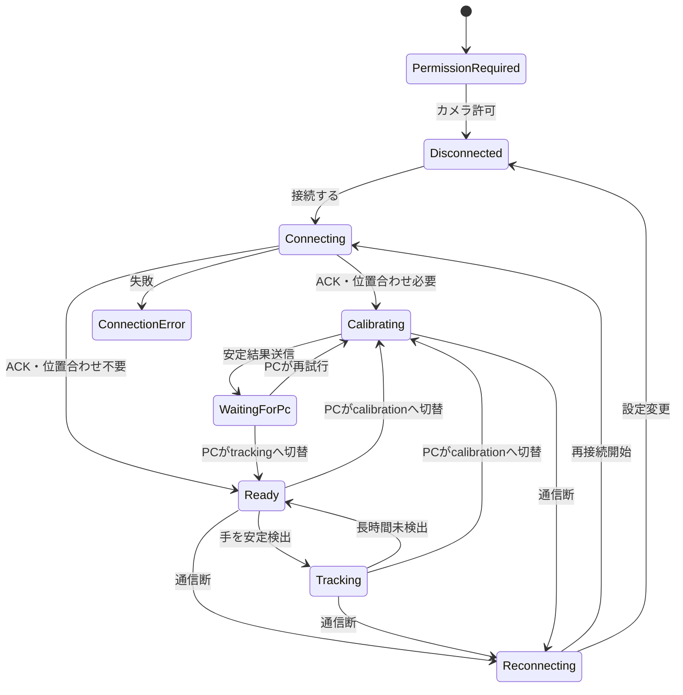

# YubiBoard Android本番UI・処理変更計画

## 1. 文書情報

| 項目 | 内容 |
| --- | --- |
| 文書種別 | Android変更計画 |
| 対象 | 現行Androidアプリから本来の操作フローへの移行 |
| 入力要件 | [Android UI要件定義書](./android-ui-requirements.md) |
| カメラ判断 | [Androidカメラ解像度・プレビューサイズ判断書](./android-camera-resolution-decision.md) |
| 現行仕様 | [Androidアプリ現行仕様書](./android-current-spec.md) |
| 基準コミット | `495b575` |
| 基準日 | 2026-08-05 |
| ステータス | Proposed |

本計画ではコードをまだ変更しない。実装時の責任分割、作業順、完了条件を定義する。

## 2. 目標

現在のデバッグ中心画面を残したまま、通常利用者向けに次の主要経路を追加する。

> カメラ許可 → PC接続 → PC主導の位置合わせ → 操作可能 → 手の追跡 → 切断からの復旧

Androidの責任は撮影、検出、状態表示、送信までとする。画面座標変換、ジェスチャー認識、描画、OS入力はPC側に残す。

## 3. 現状との差分

| 項目 | 現在 | 変更後 |
| --- | --- | --- |
| 画面構成 | 本番・デバッグが1つの`YubiBoardScreen`に混在 | `ProductionScreen`と`DebugScreen`を分離 |
| 最優先状態 | カメラ、接続、撮影モードを複数チップで表示 | 利用者が次に行うことを1つ表示 |
| 位置合わせ | Androidのボタンで手動切替可能 | 本番UIはPCの要求で自動切替 |
| 位置合わせ完了 | Androidのマーカー安定表示まで | PC側の利用可能判定後に操作可能表示 |
| 手の状態 | 検出有無、fps、推論時間を文字列表示 | 取得中、追跡中、一時喪失、長時間喪失を利用者向け表示 |
| Overlay | 詳細骨格とマーカーを常時描画 | 本番は簡略表示、詳細Overlayはデバッグのみ |
| エラー | 生のログ文字列を一時表示する場合がある | エラー種別と復旧操作を型付き状態から表示 |
| 設定 | 解像度、fps、しきい値を同一画面に表示 | 一般設定と開発者設定を分離 |
| 再接続 | 状態チップに秒数を表示 | 専用ガイドと設定変更導線を表示 |
| デバッグ | 設定スイッチで一部機能を出し分け | 既存画面を独立したデバッグ体験として維持 |
| 解析解像度 | 640×480または960×540を要求するが、実機ログでは1080×1080 | 本番は1280×720を第一候補とし、実サイズを記録して段階フォールバック |
| プレビュー | 全画面`fitCenter`だが、Previewと解析の共通画角を明示していない | 利用可能領域で全画角を最大表示し、Preview・解析・Overlayを同じViewPortへ統一 |

## 4. 実装方針

### 4.1 既存デバッグ機能を先に隔離する

既存Composableを削除・全面改修せず、名前と配置を整理してデバッグ画面として保存する。

```text
ui/
├─ production/
│  ├─ ProductionRoute.kt
│  ├─ ProductionScreen.kt
│  ├─ ProductionUiState.kt
│  ├─ ConnectionContent.kt
│  ├─ CalibrationContent.kt
│  ├─ TrackingContent.kt
│  └─ RecoveryContent.kt
├─ debug/
│  ├─ DebugScreen.kt
│  ├─ DebugConnectionPanel.kt
│  ├─ DebugSettingsDialog.kt
│  └─ DiagnosticsDialog.kt
└─ theme/
   └─ Theme.kt
```

最初の抽出では見た目と挙動を変更しない。抽出前後で既存デバッグ手順がすべて通ることを確認してから本番UIを追加する。

### 4.2 文字列ではなく型付き状態をUIへ渡す

現在の`cameraStatus`と`transientMessage`は表示文字列として状態を保持している。これをUIが安全に組み合わせられる状態へ変更する。

```kotlin
data class ProductionUiState(
    val camera: CameraUiState,
    val connection: ConnectionUiState,
    val captureMode: CaptureMode,
    val calibration: CalibrationUiState,
    val tracking: TrackingUiState,
    val experience: ExperienceMode,
    val notice: UserNotice?,
)
```

想定する状態は次のとおり。

- `CameraUiState`: PermissionRequired、Starting、Ready、Error
- `ConnectionUiState`: Disconnected、Connecting、Connected、Reconnecting、Error
- `CalibrationUiState`: Inactive、FindingMarkers、Stabilizing、WaitingForPc、RetryRequired、Complete
- `TrackingUiState`: Inactive、Candidate、Tracking、TemporarilyLost、Undetected
- `ExperienceMode`: Production、Debug
- `UserNotice`: 利用者向けコード、補助情報、再試行操作

UI文言はComposable側またはリソースで状態から決定し、ネットワーク例外文をそのまま表示しない。

### 4.3 PC主導の撮影モードを正本にする

本番UIでは次の順で状態を決める。

1. `hello_ack.calibrationRequired=true`なら位置合わせへ移行する。
2. `hello_ack.calibrationRequired=false`なら追跡待機へ移行する。
3. PCの`control_message set_mode=calibration`で位置合わせへ移行する。
4. PCの`control_message set_mode=tracking`で追跡へ移行する。
5. Androidの手動モード切替はデバッグ画面だけで使用する。

`setModeManually`は削除せず、デバッグ専用メソッドであることをコード上でも明示する。本番画面から呼べない構造にする。

### 4.4 位置合わせ結果の扱い

現行プロトコルでは、PCの`set_mode=tracking`を位置合わせ成功の合図として扱える。最初の縦切り実装はこの既存契約で完成させる。

ただし、位置合わせ失敗理由やPC計算中を正確に表示するには契約が不足している。次の追加はAndroid単独で決めず、PC担当と通信仕様変更として合意する。

- PCが計算中、成功、再試行を返すメッセージ
- 再試行理由コード
- Androidから再位置合わせを要求するメッセージ

追加する場合は[Android通信プロトコル v1](./android-protocol-v1.md)を先に更新し、AndroidとPC双方のテストデータを同じ変更で用意する。

### 4.5 デバッグOverlayと本番Overlayを分ける

`DebugOverlayView`は変更せずデバッグ画面へ残す。本番UIでは次のどちらかを選ぶ。

- デモ必須: Overlayなしで状態文言だけ表示
- 有用: 人差し指位置または手の検出範囲だけを示す簡略Overlayを新設

本番Overlayから21点番号、座標値、fps、推論時間、ArUco IDの詳細を除外する。

### 4.6 解析解像度と表示サイズを分離する

- `CameraSession`は[カメラ解像度判断書](./android-camera-resolution-decision.md)のプロファイル順で起動する。
- `setTargetResolution`を`ResolutionSelector`へ置き換え、要求値を実解像度として扱わない。
- PreviewとImageAnalysisを共通の`UseCaseGroup`と`ViewPort`へまとめる。
- 最初の`ImageProxy`から実解像度、回転、CropRectを取得し、診断ログと`source`へ反映する。
- 本番画面は解像度に依存する固定dpを持たず、回転後の縦横比で利用可能領域へ最大表示する。

## 5. スコープ

### 5.1 デモ必須

- 本番UIとデバッグUIの分離
- カメラ権限の案内と拒否後の復旧
- PC接続フォーム、接続中、接続エラー
- `hello_ack`とPC制御に従う位置合わせ画面
- 4マーカー検出数と安定進捗
- 操作可能、手の取得中、追跡中、一時喪失、長時間喪失
- 自動再接続と接続設定変更
- 本番UIから疑似入力、詳細座標、手動モード切替を除外
- 既存デバッグ経路の回帰確認

### 5.2 有用

- Android設定アプリを開く権限復旧導線
- セットアップ・設置ヘルプ
- 簡略トラッキングOverlay
- 縦横の専用レイアウト
- 画面状態のアクセシビリティ読み上げ
- PCからの位置合わせ失敗理由表示

### 5.3 後続

- QRコードによる接続情報入力
- PCの自動検出
- Androidからの再位置合わせ要求
- 初回チュートリアルの複数ページ化
- ブランドアニメーション
- バックグラウンド動作と通知からの復帰

## 6. 実装フェーズ

### Phase 0: UI契約確定

作業:

- デザイナーが[Android UI要件定義書](./android-ui-requirements.md)を基に主要画面と状態コンポーネントを作る。
- Android・PC担当で「位置合わせ完了」の判定主体がPCであることを確認する。
- 初期実装で`set_mode=tracking`を成功通知として利用することを合意する。
- UIの未確定事項に優先順位を付ける。

完了条件:

- 初回接続、位置合わせ、追跡、通信断のプロトタイプがレビュー済み。
- Android・PC間で状態遷移に解釈差がない。

### Phase 1: デバッグ画面の回帰可能な分離

作業:

- `YubiBoardScreen`、`ConnectionPanel`、`SettingsDialog`、`DiagnosticsDialog`を`ui/debug`へ抽出する。
- `DebugOverlayView`と疑似入力をデバッグ画面だけへ接続する。
- `BuildConfig.DEBUG`と保存設定から`ExperienceMode`を決定する。
- releaseの既定をProduction、debugの既定をDebugとする現行挙動を維持する。
- CameraXの解像度選択を第一候補1280×720、960×540、640×480の起動時フォールバックへ変更する。
- PreviewとImageAnalysisを共通のViewPortでバインドし、要求値と実値を診断ログへ記録する。

完了条件:

- 既存のAndroid実機デバッグ・チュートリアルを変更せず実行できる。
- 疑似21点、疑似未検出、疑似4マーカー、JSONL保存が動作する。
- 第一候補と各フォールバックで実解析サイズを確認でき、PreviewとOverlayが一致する。

### Phase 2: 本番の権限・接続フロー

作業:

- `ProductionUiState`と状態集約ロジックを追加する。
- カメラ権限案内、恒久拒否時の設定導線を実装する。
- 接続フォーム、接続中、キャンセル、接続エラーを実装する。
- 6桁コードは保存せず、ホストとポートだけを復元する。
- `ConnectionSnapshot.detail`を利用者向けエラーコードへ変換する。

完了条件:

- 初回起動からモックPC接続まで本番画面だけで完了できる。
- 不正入力、コード不一致、応答タイムアウトから復旧できる。

### Phase 3: PC主導の位置合わせフロー

作業:

- `hello_ack.calibrationRequired`と`control_message`を本番UI状態へ反映する。
- マーカー数、配置不正、安定進捗、送信済み待機を表示する。
- 本番UIの手動モード切替を削除する。
- `set_mode=tracking`受信まで操作可能表示を出さない。
- 再接続・session変更時に位置合わせ状態を初期化する。

完了条件:

- PCから位置合わせ開始、Android安定検出、PCから追跡開始まで一本道で進む。
- Androidだけの安定判定では成功画面へ進まない。

### Phase 4: 操作可能・トラッキング・復旧

作業:

- `HandDetectionResult.trackingState`を本番UIへ渡す。
- Candidate、Tracking、TemporarilyLost、Undetectedを利用者向け状態へ変換する。
- 切断時に追跡表示を解除し、再接続画面へ移る。
- 再接続成功後はPCの`calibrationRequired`に従って遷移する。
- カメラ・MediaPipe・OpenCVのエラーを復旧操作付きで表示する。

完了条件:

- 手を入れる、短時間外す、長時間外す操作で表示が適切に変わる。
- 通信断中に「操作できます」や「手を検出しています」を表示しない。

### Phase 5: デザイン適用・アクセシビリティ・仕上げ

作業:

- デザイントークンと全状態コンポーネントを適用する。
- 縦向き、横向き、360 dp幅、文字200%を確認する。
- TalkBackの読み上げ順と状態通知頻度を調整する。
- 本番設定とヘルプを実装する。
- UI文言を`strings.xml`へ集約する。
- スクリーンショットテストまたはCompose UIテストを追加する。

完了条件:

- [Android UI要件定義書](./android-ui-requirements.md)の受入条件をすべて確認できる。
- デバッグ経路と本番経路の両方を実機で完走できる。

## 7. 想定変更ファイル

| 対象 | 主な変更 |
| --- | --- |
| `MainActivity.kt` | カメラとActivity Resultのホストへ縮小し、画面実装を分離 |
| `MainViewModel.kt` | 本番UI状態、エラー変換、PC主導モード、追跡状態を公開 |
| `CameraSession.kt` | `ResolutionSelector`、プロファイルフォールバック、共通ViewPort、実解像度ログ |
| `AppSettings.kt` | 本番の自動プロファイルとデバッグ用選択肢を分離 |
| `ConnectionModels.kt` | 必要に応じて利用者向けエラー分類を追加 |
| `Messages.kt` / `ProtocolCodec.kt` | PCと合意した場合のみ位置合わせ結果メッセージを追加 |
| `DebugOverlayView.kt` | 原則変更せずデバッグ専用として配置を明示 |
| `ui/production/*` | 新しい本番画面と状態別コンポーネント |
| `ui/debug/*` | 現行デバッグ画面の移設 |
| `res/values/strings.xml` | 本番文言とアクセシビリティ文言 |
| JVMテスト | 状態集約、エラー変換、モード遷移 |
| AndroidTest | 権限、接続、位置合わせ、再接続のUI経路 |

ファイル分割名は実装時に既存パッケージ規約と相談して確定する。新しい本番依存関係は原則追加しない。

## 8. 状態遷移の実装ルール



画面側で独自に状態を進めず、ViewModelが一貫した`ProductionUiState`を生成する。

## 9. テスト計画

### 9.1 JVM単体テスト

- カメラ、接続、撮影モード、追跡状態から最優先UI状態を選べる。
- `calibrationRequired`の真偽で遷移先が変わる。
- Androidの安定検出だけではReadyにならない。
- 異なるsessionの制御ではUI状態が変わらない。
- 通信断、カメラエラーが正常状態より優先される。
- 一時喪失300 ms以内と長時間喪失を区別する。
- debugとproductionで許可される操作が分かれる。

### 9.2 Compose UIテスト

- 権限案内から接続画面へ進める。
- 入力エラーが該当項目に表示される。
- 本番UIに疑似入力・手動撮影モード切替が存在しない。
- デバッグUIに既存の診断操作が存在する。
- 接続中、位置合わせ、追跡、再接続、主要エラーを個別に描画できる。
- 文字拡大時も主要操作へ到達できる。
- 縦向きと横向きでプレビューが全画角を維持して最大表示される。

### 9.3 統合・実機テスト

1. USB reverseでモックPCへ接続する。
2. `calibrationRequired=true`で位置合わせへ自動遷移する。
3. 実マーカーを5フレーム安定検出し、PCのtracking指示後に操作可能となる。
4. 実際の手でCandidate、Tracking、一時喪失、長時間喪失を確認する。
5. モックを停止し、再接続表示と自動復帰を確認する。
6. 縦向きと横向きで入力値と現在状態が維持されることを確認する。
7. デバッグ画面へ切り替え、既存の全疑似入力とログ保存を確認する。
8. 1280×720、960×540、640×480を順に要求し、実解像度、平均受信fps、遅延、温度、Overlay対応を記録する。
9. 少なくとも別メーカー1機種で第一候補とバインド失敗時のフォールバックを確認する。

## 10. リスクと対策

| リスク | 影響 | 対策 |
| --- | --- | --- |
| 本番UI改修でデバッグ経路が壊れる | 実機検証が困難になる | Phase 1で画面を先に分離し回帰テストする |
| PC側と位置合わせ完了の解釈が違う | Androidが早くReadyを表示する | `set_mode=tracking`を初期契約として明記する |
| 状態をActivityとViewModelの両方が管理する | 矛盾した表示が出る | `ProductionUiState`をViewModelの正本にする |
| フレームごとの状態更新で再描画・読み上げが過剰になる | 性能と操作性が低下する | 意味のある状態変化だけをUIへ通知する |
| エラー文言が通信実装に依存する | 翻訳・デザインが不安定になる | 原因コードと利用者向け文言を分離する |
| デザイナーと実装者が同じ大規模要件書を編集する | コンフリクトが増える | UI要件、変更計画、現行仕様を別ファイルで管理する |
| 要求解像度と実解析サイズが異なる | 性能比較とOverlay座標が誤る | 最初の実フレームを記録し、共通ViewPortと実サイズを正本にする |
| 720pが端末の同時Use Case構成で選べない | カメラが起動しない | 960×540、640×480へ起動時にフォールバックする |

## 11. 実装着手前の決定事項

次の4点だけはPhase 0で合意する。

1. 初期版では`set_mode=tracking`を位置合わせ成功通知として扱うか。
2. 操作中のAndroid画面にカメラプレビューを常時表示するか。
3. releaseビルドからデバッグ画面へ切り替え可能にするか。
4. Androidから再位置合わせ要求を送る機能を初期版へ含めるか。

それ以外は、デモ必須経路を止めない範囲で実装中に調整できる。

## 12. 完了の定義

- デザイナー成果物と本番UIが[Android UI要件定義書](./android-ui-requirements.md)を満たす。
- 接続からPC主導の位置合わせ、操作可能、手追跡まで本番画面だけで完走する。
- 通信断、カメラ権限拒否、位置合わせ再試行から利用者が復旧できる。
- 本番UIに開発者向け情報と手動撮影モード切替が混在しない。
- 現在のデバッグ画面、疑似入力、診断ログ、骨格Overlayが引き続き利用できる。
- Androidの責任境界を越えるジェスチャー認識やPC操作処理を追加していない。
- 自動テストとAndroid実機デバッグ・チュートリアルが成功する。
