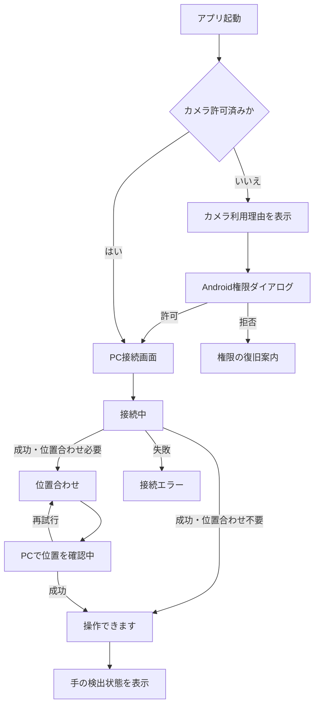

# YubiBoard Android UI要件定義書

## 1. 文書情報

| 項目 | 内容 |
| --- | --- |
| 文書種別 | デザイナー向けUI要件定義書 |
| 対象 | YubiBoard Androidアプリの本番UI |
| 対象バージョン | 初期製品版 |
| 想定利用者 | 1人でAndroid端末とPCを接続し、手でPCを操作する利用者 |
| 基準日 | 2026-08-05 |
| ステータス | Implemented |

本書は、デザイナーが画面設計、コンポーネント設計、プロトタイプ、文言設計を行うための正本とする。検出アルゴリズムや通信JSONの詳細は定義しない。

## 2. 関連文書と優先順位

1. [システム全体要件定義書](../system/system-requirements.md): 製品の目的とAndroid・PC間の責任境界
2. [Androidアプリ要件定義書](./android-app-requirements.md): Android側の機能・非機能要件
3. [Androidカメラ解像度・プレビューサイズ判断書](./android-camera-resolution-decision.md): 解析解像度、プレビュー縦横比、最大表示方法
4. 本書: Android本番UIの画面、状態、操作、文言
5. [Androidアプリ現行仕様書](./android-current-spec.md): 現在実装されているデバッグ中心UI
6. [Android本番UI・処理変更計画](./android-production-ui-change-plan.md): 本書を実装へ反映する手順

要件が矛盾する場合は、上位文書の責任境界を優先する。本書ではAndroidにジェスチャー認識、画面座標変換、PC入力処理を追加しない。

## 3. UIの目的

Androidアプリの本番UIは、利用者が次の一本道を迷わず完了できることを目的とする。

> カメラを許可する → PCへ接続する → PCの案内に従って位置合わせする → 操作可能になったことを確認する → 手を使ってPCを操作する

Android画面はPC操作の主画面ではなく、カメラ入力装置の準備状況と復旧方法を伝える補助画面である。PC操作中にAndroid画面を継続して触ることを前提にしない。

## 4. デザイン原則

1. **次に行うことを1つだけ強調する。** 同じ画面に同等の主要ボタンを複数置かない。
2. **技術状態を利用者の言葉へ翻訳する。** `hello_ack`、fps、sessionなどの用語を本番UIへ表示しない。
3. **PC主導の状態と矛盾しない。** Androidだけで「操作可能」と判断せず、PCの位置合わせ完了後に表示する。
4. **色だけに頼らない。** アイコン、見出し、説明文を組み合わせて状態を示す。
5. **復旧可能性を常に示す。** エラー時は原因の説明と、利用者が実行できる操作を提示する。
6. **カメラ映像より状態を優先する。** プレビュー上でも主要メッセージと操作が読めるコントラストを確保する。
7. **デバッグUIを本番導線へ混ぜない。** 診断値と疑似入力はデバッグ画面だけに配置する。

## 5. UIモード

### 5.1 本番UI

通常利用者が使用する画面。次の項目だけを表示する。

- カメラ権限とカメラ状態
- PC接続設定と接続状態
- 位置合わせの案内と進捗
- 手の検出状態と操作可否
- 切断、再接続、エラーからの復旧操作
- 一般利用者向け設定とヘルプ

### 5.2 デバッグUI

現在の実装を開発・検証用途として残す。

- 21点骨格・ArUcoの詳細Overlay
- カメラ、接続、撮影モードの個別ステータス
- 解析解像度、送信fps、検出しきい値
- 診断ログ、カウンター、JSONL保存
- 疑似21点、疑似未検出、疑似4マーカー
- 手動での追跡・位置合わせモード切替

デバッグUIはdebugビルドで既定、本番UIはreleaseビルドで既定とする。debugビルドでは両者を切り替え可能とし、現在の接続や撮影を破棄しない。releaseビルドは本番UIに固定する。

## 6. 情報設計

本番UIは、単一のカメラ画面上で状態に応じて内容が切り替わる構成を基本とする。

```text
本番UI
├─ カメラプレビュー
├─ 最優先ステータス
├─ 状態別ガイド
│  ├─ カメラ許可
│  ├─ PC接続
│  ├─ 位置合わせ
│  ├─ 操作可能・手検出
│  └─ 再接続・エラー
└─ 補助導線
   ├─ 設定
   ├─ ヘルプ
   └─ 切断
```

常に複数の開発者向けステータスチップを並べるのではなく、その時点で最も重要な状態を1つの見出しとして表示する。

## 7. 主要操作フロー

### 7.1 初回起動から操作開始



### 7.2 再接続

1. 通信切断を検出したら、即座に「接続が切れました」を表示する。
2. 自動再接続中は次の試行までの秒数を表示する。
3. 利用者は自動再接続を待つか、「接続設定を変更」を選べる。
4. 再接続後、PCが位置合わせを要求した場合は自動的に位置合わせ画面へ移る。
5. PCが位置合わせ不要と判断した場合だけ操作可能画面へ戻る。

### 7.3 再位置合わせ

本番フローの開始主体はPCとする。PCから位置合わせ開始を受信したら、Androidは確認ダイアログを挟まず位置合わせ画面へ移る。

Android側の「位置合わせを開始」「手の追跡へ戻る」という手動切替は本番UIへ表示せず、デバッグUIへ残す。AndroidからPCへ再位置合わせを要求する機能は、通信契約が定義されるまで本番UIへ置かない。

## 8. 画面要件

### UI-01 カメラ権限案内

| 項目 | 要件 |
| --- | --- |
| 目的 | カメラが必要な理由を理解し、権限を許可できる |
| 見出し | `手の動きを読み取るためにカメラを使います` |
| 説明 | 背面カメラで手と位置合わせマーカーを検出すること、映像自体はPCへ送信しないことを示す |
| 主要操作 | `カメラを許可` |
| 補助操作 | `あとで`。選択時は接続操作を無効化し、権限が必要な理由を残す |
| 拒否後 | 再要求可能なら`もう一度許可する`、恒久拒否なら`設定を開く`を表示する |

Androidのシステム権限ダイアログが出る前に、アプリ内で短い理由を提示する。

### UI-02 PC接続

| 項目 | 要件 |
| --- | --- |
| 目的 | PCアプリに表示された接続情報を入力して接続する |
| 見出し | `PCに接続` |
| 入力 | PCのIPまたはホスト名、ポート、6桁コード |
| 初期値 | 前回のホストとポートを復元。6桁コードは毎回空欄 |
| 主要操作 | `接続する` |
| 入力補助 | 数値キーボード、桁数表示、項目単位のエラー、貼り付け対応 |
| ヘルプ | `接続情報はPCアプリに表示されています` |

入力値が不正な間は主要操作を無効化するか、押下時に該当欄へ具体的なエラーを表示する。生の例外メッセージは表示しない。

### UI-03 接続中

| 項目 | 要件 |
| --- | --- |
| 見出し | `PCに接続しています` |
| 表示 | 進行中インジケーター、接続先、通常5秒以内で応答する旨 |
| 主要操作 | なし |
| 補助操作 | `キャンセル` |

WebSocket接続中とPC応答待ちを別画面にせず、利用者には1つの接続中状態として見せる。

### UI-04 位置合わせ

| 状態 | 見出し | 表示内容 |
| --- | --- | --- |
| 準備 | `PC画面全体をカメラに入れてください` | PCに4つのマーカーが表示されていること、端末を固定すること |
| 検出不足 | `4つのマーカーを映してください` | 検出済み数、見つからない方向、カメラプレビュー |
| 安定待ち | `そのまま動かさないでください` | 5段階の進捗。`3/5`のような数値だけに依存しない |
| 送信済み | `PCで位置を確認しています` | 端末を動かさず待つ案内 |
| 再試行 | `位置合わせをやり直します` | PC画面全体、照明、端末位置の確認事項 |

マーカーOverlayはID番号を主情報にせず、検出成功・不足・配置不正を視覚的に区別する。成功表示はAndroidの安定判定だけで出さず、PCが変換行列を利用可能と判断してから出す。

### UI-05 操作可能・トラッキング

| 状態 | 見出し | 補助表示 |
| --- | --- | --- |
| 操作可能・手なし | `操作できます` | `カメラの前に手を映してください` |
| 検出開始 | `手を確認しています` | 短い取得中表示。警告扱いにしない |
| 追跡中 | `手を検出しています` | 接続済みであることを簡潔に表示 |
| 一時喪失 | `手を見失いました` | `カメラの範囲に手を戻してください` |
| 長時間喪失 | `手が見つかりません` | 照明、距離、画角を確認するヘルプ |

本番UIでは21点番号、fps、推論時間、座標値を表示しない。手の追跡を示す簡略Overlayを採用する場合、詳細骨格ではなく輪郭・手アイコン・人差し指位置など最小限にする。

### UI-06 切断・再接続

| 状態 | 見出し | 操作 |
| --- | --- | --- |
| 切断検出 | `PCとの接続が切れました` | 自動再接続を開始 |
| 再接続待ち | `3秒後に再接続します` | `今すぐ再接続`、`接続設定を変更` |
| 再接続成功 | `PCに再接続しました` | 自動的に必要な次状態へ移行 |
| 手動切断 | `PCから切断しました` | `もう一度接続する` |

再接続中もカメラを継続するかは実装判断とするが、PCへ送信されていないことを明示する。

### UI-07 エラー

エラーは次の構造で表示する。

1. 何が起きたか
2. 現在できないこと
3. 利用者が次に行うこと
4. 再試行または設定変更の操作

| エラー | 利用者向け表示 | 主要操作 |
| --- | --- | --- |
| 接続先へ到達できない | `PCが見つかりません` | `もう一度試す` |
| コード不一致 | `6桁コードが一致しません` | `コードを入力し直す` |
| PC応答タイムアウト | `PCから応答がありません` | `もう一度試す` |
| カメラ開始失敗 | `カメラを起動できません` | `カメラを再起動` |
| マーカー不足 | `4つのマーカーを確認できません` | `確認方法を見る` |
| 位置合わせ失敗 | `位置合わせを完了できませんでした` | `やり直す` |
| 未対応バージョン | `PCアプリを更新してください` | `詳細を見る` |

デバッグ用のエラー詳細は折りたたみまたはデバッグUIに置き、本番画面の主要文言へ混ぜない。

### UI-08 本番設定・ヘルプ

本番設定に含める項目は次に限定する。

- 接続先の変更
- カメラ権限の状態
- セットアップ・設置方法
- プライバシー説明
- アプリバージョン
- デバッグUIへの切替導線（debugビルド、または明示的に許可した場合のみ）

解析解像度、送信fps、検出しきい値は本番設定の主要階層に置かない。

## 9. 状態と表示の優先順位

複数の状態が同時に発生した場合は、次の順で1つを最優先表示する。

1. カメラ権限なし・カメラ利用不能
2. PC接続エラー・通信切断
3. 位置合わせ中・位置合わせエラー
4. 操作可能だが手を検出できない
5. 正常追跡中

例えばカメラ権限がない状態では、接続フォームより権限復旧を優先する。位置合わせ中は手の未検出警告を表示しない。

## 10. コンポーネント要件

デザイナーは最低限、次の再利用コンポーネントを定義する。

- 最優先ステータスバー
- 状態アイコン付きガイドカード
- 主要ボタン、補助ボタン、危険操作ボタン
- 接続情報入力欄
- 6桁コード入力欄
- 位置合わせ4点インジケーター
- 5段階安定進捗
- カメラプレビューOverlay
- 再接続カウントダウン
- エラーと復旧操作のパネル
- 一時的な完了通知

読み込み状態で主要ボタンのラベルだけを消さず、何を処理しているかテキストで伝える。

## 11. レイアウトとレスポンシブ要件

- 縦向き・横向きの両方で、最優先メッセージと主要操作が画面内に収まること。
- 幅360 dpを最小設計幅とする。
- システムバー、ノッチ、ジェスチャーナビゲーション領域を避けること。
- カメラプレビューは、状態・主要操作に必要な領域を除いた矩形内で最大化すること。
- 16:9入力は縦向きで9:16、横向きで16:9として扱い、`FIT_CENTER`相当で全画角を表示すること。
- 縦向き・幅360 dpで十分な高さがある場合、プレビューの基本例を360×640 dpとする。
- 画面が短い場合も画像を切り抜かず、ガイド本文をスクロールまたは折りたたみ可能にすること。
- カメラプレビューのアスペクト比がフォールバックで変わっても、Preview、解析、Overlayの画角とCropRectの対応を維持すること。
- 状態表示を映像へ重ねる場合はPC画面4隅と主要な手検出領域を隠さないこと。
- 画面回転時に入力途中のホスト、ポート、6桁コードを失わないこと。
- 小さい横画面では、カメラとガイドを左右に分けてもよい。

## 12. アクセシビリティ要件

- 通常テキストと背景はWCAG AA相当のコントラストを確保する。
- タップ領域は48 dp以上とする。
- 文字サイズを200%にしても主要操作が欠けないこと。
- スクリーンリーダーで状態変化を読み上げる。ただし検出フレームごとの連続読み上げは行わない。
- 成功、注意、エラーを色だけで区別しない。
- カメラOverlayの情報は同じ内容をテキストでも提供する。
- 6桁コードは読み上げ時に数字を一桁ずつ確認できること。
- 動きのある進捗表現は、端末のアニメーション無効設定を尊重すること。

## 13. 文言・トーン

- 短く、具体的な動詞を使う。
- 利用者の責任を責める表現を避ける。
- `失敗しました`だけで終わらず、復旧操作を続けて示す。
- `キャリブレーション`ではなく原則`位置合わせ`を使う。
- `トラッキング`ではなく原則`手を検出`または`手を追跡`を使う。
- IP、ポートなど避けられない技術語には、PC画面のどこを見るか補足する。

## 14. デザイナー成果物

最低限、次を作成する。

1. 縦向きの主要8画面
2. 横向きの接続、位置合わせ、追跡画面
3. 接続・位置合わせ・再接続のクリック可能なプロトタイプ
4. 状態別コンポーネント一覧
5. 色、文字、余白、角丸、アイコンのトークン
6. エラー文言一覧
7. 360 dp幅、文字200%、ダークテーマの確認例
8. 本番UIとデバッグUIの切替位置

画面だけでなく、初回接続、位置合わせ再試行、通信断からの復帰をプロトタイプで確認できるようにする。

## 15. 受入条件

- UI-AC-001: 初回利用者が画面の案内だけでカメラ許可からPC接続まで進める。
- UI-AC-002: PCが位置合わせを要求したとき、自動的に位置合わせ案内へ移る。
- UI-AC-003: Androidの安定検出だけで操作可能表示を出さず、PC側の完了後に表示する。
- UI-AC-004: 追跡中、手の一時喪失、長時間喪失を区別して表示する。
- UI-AC-005: 通信断時に自動再接続中であることと次の試行時刻が分かる。
- UI-AC-006: 本番UIに疑似入力、座標、fps、しきい値、手動撮影モード切替を表示しない。
- UI-AC-007: デバッグUIから既存の診断・疑似入力・JSONL保存を利用できる。
- UI-AC-008: 縦向き、横向き、360 dp幅、文字200%で主要操作が可能である。
- UI-AC-009: 主要エラーに利用者が実行できる復旧操作がある。
- UI-AC-010: 映像自体をPCへ送信しないことを権限説明またはプライバシー説明で確認できる。
- UI-AC-011: 縦向き・横向きともカメラ全画角を切り抜かず、利用可能領域内で最大表示する。
- UI-AC-012: 4隅のArUcoマーカーと主要操作が同時に確認でき、Overlayが映像と一致する。

## 16. 未確定事項

2026-08-06の本番実装で、操作中はカメラを常時表示し、releaseからデバッグUIへ切り替えず、位置合わせ結果は後方互換の`calibration_status`と既存`set_mode=tracking`で扱うことを確定した。QR、PC自動検出、Androidからの再位置合わせ要求、正式ブランドは後続とする。

| ID | 論点 | UIへの影響 |
| --- | --- | --- |
| UI-TBD-005 | アプリ正式名称、ロゴ、ブランドカラー | ビジュアルデザイン全般 |
