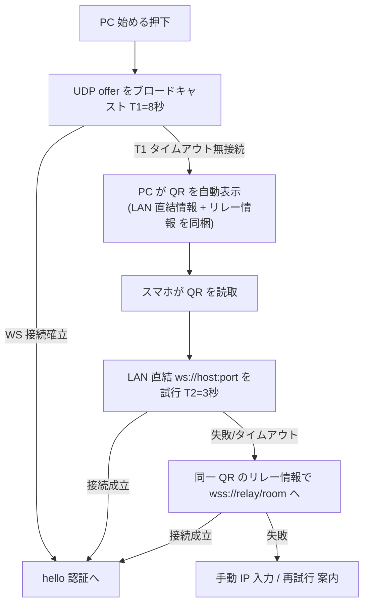
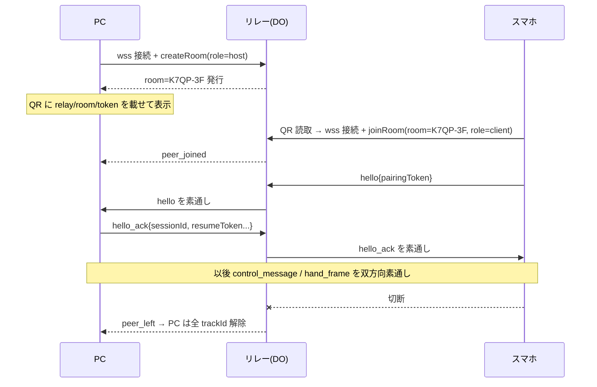

# 接続/認証 確定仕様 v1（本戦向けゲート）

> Screact（Android/iOS カメラ → WebSocket → PC 操作）の接続・認証方式の**確定仕様**。
> QR フォールバック / LAN 非依存の代替接続 / iOS 実装は、すべて本仕様を前提に実装する。
> 目的：以後の実装で「接続の入口」と「認証の一本化」がブレないよう、着手前に固定する。

## 目次
- [1. 結論（確定事項）](#1-結論確定事項)
- [2. 現行アーキテクチャの整理](#2-現行アーキテクチャの整理)
- [3. 3つのトランスポートと自動フォールバック](#3-3つのトランスポートと自動フォールバック)
- [4. QR コード・フォールバック](#4-qr-コードフォールバック)
- [5. LAN 非依存の代替接続（リレー）](#5-lan-非依存の代替接続リレー)
- [6. 認証の一本化（pairingToken / resumeToken）](#6-認証の一本化pairingtoken--resumetoken)
- [7. iOS/Android 共通化ポイント](#7-iosandroid-共通化ポイント)
- [8. 実装チェックリスト（後続フェーズへの引き渡し）](#8-実装チェックリスト後続フェーズへの引き渡し)

## 1. 結論（確定事項）

- **認証は 1 本**：`hello` に載る `pairingToken`（初回）/ `resumeToken`（再接続）だけで認証する。**トランスポートが増えても認証は変えない**。QR やリレーは「認証情報の運び方・WebSocket への到達手段」を足すだけで、新しい秘密の種類を増やさない。
- **接続の入口は 3 つ**、フォールバックは自動で一方向に進む：`UDP 自動発見` → `QR（LAN 直結）` → `QR（リレー経由）`。手動 IP 入力は全段で併存。
- **QR の中身は 1 種類の URI**（`screact://pair?...`）。LAN 直結情報とリレー情報の**両方**を載せられ、スマホは LAN 直結を先に試し、ダメならリレーへ落ちる。
- **リレーは E2E の土管**：`ws/v1/input` の JSON をそのまま中継するだけ。認証・キャリブレーション・骨格処理はすべて PC ↔ スマホ間の既存プロトコルで完結する。リレーはメッセージ内容を解釈しない。
- iOS は Android と**同一の `hello`/`hello_ack` と同一の QR/リレー仕様**を使う。差分は資格情報の保管先（Keystore↔Keychain）だけ。

## 2. 現行アーキテクチャの整理

### 2.1 UDP 自動発見（ゼロコンフィグ）
- ポート `8766`、UTF-8 JSON、`app:"screact"`・`schemaVersion:1` を必須マーカーとする（`desktop/lib/net/discovery.dart` / `android/.../network/DiscoveryProtocol.kt`）。
- PC が「始める」押下で `discovery_offer{ ip?, wsPort, token(6桁) }` をブロードキャスト。
- 待受中の Android が `offer.wsPort/token` で `ws://<PCのIP>:<wsPort>/ws/v1/input` へ自動接続し、確認用に `discovery_response` を返す。
- `discovery_select / discovery_select_ack` は旧フロー互換で残置（現行の接続成立には不要）。
- 制約：**UDP ブロードキャストが通る同一 L2 セグメント**が前提。AP isolation・ゲスト Wi-Fi・有線/無線分離・別ネットワークでは届かない。

### 2.2 WebSocket（制御＋データ）
- エンドポイント `ws://<PCのIP>:<port>/ws/v1/input`、既定ポート `8765`（`desktop/lib/net/input_server.dart` / `android/.../network/YubiBoardWebSocketClient.kt`）。
- 接続直後に Android が `hello`（`pairingToken` か `resumeToken` の排他）を送り、PC が 5 秒以内に `hello_ack`（`sessionId` / `surface` / `calibrationRequired` / 初回は `resumeToken` 発行）を返す。
- 以後：`control_message`（`set_mode`）でキャリブレーション/トラッキングを切替、`calibration_markers`・`hand_frame` を流す（protocol v1、詳細は `docs/android/android-protocol-v1.md`）。

### 2.3 認証（現行）
- `pairingToken`：PC 画面表示の 6 桁。UDP offer にも同値が載る。保存しない。PC 側でチェック ON/OFF 可。不一致は `hello_error(pairing_code_mismatch, retryable=false)`。
- `resumeToken`：初回認証成功時に PC が 32 byte CSPRNG → Base64URL で発行。Android は Keystore 非エクスポート鍵で暗号化保存。PC は `SHA-256(resumeToken)` を `deviceId` に紐付け永続化し、定数時間比較。自動ローテーションなし（再ペアリング時のみ失効）。

## 3. 3つのトランスポートと自動フォールバック

トランスポートは「スマホが `ws/v1/input` に到達する経路」の違いにすぎず、上位の `hello` 以降のプロトコルは 3 経路で完全に同一。

| 段 | トランスポート | スマホが接続先を知る方法 | 到達経路 | 使う場面 |
| --- | --- | --- | --- | --- |
| 1 | UDP 自動発見 | UDP `discovery_offer` | LAN 直結 `ws://host:8765` | 同一 L2・ブロードキャスト可 |
| 2 | QR（LAN 直結） | QR の `host/port/token` | LAN 直結 `ws://host:8765` | UDP は不達だがユニキャストは通る（ブロードキャスト遮断のみ） |
| 3 | QR（リレー経由） | QR の `relay/room/token` | `wss://relay/ws` 経由の中継 | AP isolation・別ネットワーク・キャリア回線 |

### 3.1 自動フォールバックの流れ



- 手動 IP 入力欄は全段で常時併存（既存仕様を維持）。
- **単一 QR にリレー情報も載せる**設計にするため、UDP 失敗時に出す QR がそのまま AP isolation 環境にも効く（QR を出し分けない）。
- しきい値 T1/T2 は設定可能（既定：UDP 8 秒、LAN 直結試行 3 秒）。

## 4. QR コード・フォールバック

### 4.1 トリガ（PC 側）
- 「始める」押下後、UDP offer を送り続けても `T1` 秒（既定 8 秒）以内に `ws/v1/input` の接続が確立しないとき、接続画面に**自動で QR を表示**（UDP offer は継続、手動入力欄も残す）。
- 再ペアリング/「接続先を変更」時も、UDP を待たず即 QR を出せる手動ボタンを用意する。

### 4.2 QR ペイロード（確定フォーマット）
1 個の URI に全経路情報を載せる。ASCII のみ・QR 版数を小さく保つため短いキー名を使う。

```
screact://pair?v=1&host=192.168.1.23&port=8765&t=123456&relay=wss%3A%2F%2Frelay.example%2Fws&room=K7QP-3F&exp=1723550400
```

| キー | 必須 | 意味 |
| --- | --- | --- |
| `v` | 必須 | ペイロード版数（現行 `1`） |
| `t` | 必須 | `pairingToken`（6 桁）。`hello.pairingToken` にそのまま使う |
| `host` | LAN 直結時 | PC の LAN IP。`ws://host:port/ws/v1/input` を組み立てる |
| `port` | LAN 直結時 | WebSocket ポート（既定 8765） |
| `relay` | リレー可時 | リレーの `wss://` エンドポイント |
| `room` | リレー可時 | リレーのルーム ID（下記 5 章）。短い衝突しにくい文字列 |
| `exp` | 任意 | QR の有効期限（UNIX 秒）。過ぎたら PC は再生成、スマホは失効表示 |

- PC は `host/port`（LAN）と `relay/room`（リレー）を可能な範囲で**両方載せる**。リレー未構成なら `relay/room` を省略（QR は LAN 直結のみ）。
- スマホは読取後：`host/port` があれば LAN 直結を先に試行（T2 秒）→ 失敗なら `relay/room` でリレーへ。
- **QR は `pairingToken` の配達手段**であり、ユーザーが 6 桁を打つ/UDP が運ぶのと等価。認証ロジックは不変。

### 4.3 セキュリティ
- QR は画面表示のみ（画像として保存/共有しない）。`exp` で短命化。
- `pairingToken` は初回のみ有効・保存しない現行規則を踏襲。QR を撮られても、認証成功で `resumeToken` が発行されるまでの一度きり。
- リレー利用時も PC は `hello.pairingToken` を必ず検証する（リレーは認証しない）。

## 5. LAN 非依存の代替接続（リレー）

### 5.1 方針
- **PC もスマホも「外向き」に WebSocket を張る**ので、AP isolation・ゲスト Wi-Fi・別ネットワーク（一方がキャリア回線）でも繋がる。
- リレーは 2 本のソケットを**ルーム**でペアリングして**バイト列を素通し**する土管。protocol v1 を解釈しない（E2E は PC↔スマホ）。
- 実装は Cloudflare Workers + Durable Object を第一候補とする（1 ルーム = 1 DO、両ソケットを保持し相互転送。既存の DevHub 系 CF アカウント基盤を流用可）。同等の常設 WebSocket サーバでも可。

### 5.2 ルームのライフサイクル



- `room` はルーティング用アドレスであって**秘密ではない**。認証は `hello` の `pairingToken` で行う。
- ルーム乗っ取り（room 総当り）対策として、`joinRoom` に PC 発行の短命 `roomSecret` を必須化してよい（QR に相乗せ、任意強化）。MVP は room + pairingToken の二段で可。
- リレーは 1 ルーム=2 接続（host/client）に制限し、満室ルームへの join を拒否（`first-client-wins` の既存方針を踏襲）。

### 5.3 性能・運用
- `hand_frame` は最大 20fps・最新値優先。リレーは追加 RTT が入るため、**LAN 直結を常に優先**しリレーは最終フォールバックにする（3 章の順序）。
- エッジ（Cloudflare）経由で近接 PoP に張れば実用範囲。輻輳時は最新フレーム優先で自然に間引かれる（プロトコル既定）。
- 課金：常設サーバは無料枠内（DO/Workers）で回す方針。有料キュー等は使わない。

## 6. 認証の一本化（pairingToken / resumeToken）

トランスポート 3 種すべてで、認証は `hello` の 2 資格情報だけ。**新しい秘密は作らない**。

| 資格情報 | 役割 | 配達手段（トランスポート別） | 保管 |
| --- | --- | --- | --- |
| `pairingToken`（6 桁） | 初回ペアリング認証 | UDP offer / QR の `t` / 手入力、いずれも同値 | 保存しない（PC は毎回生成・表示） |
| `resumeToken`（不透明・高エントロピー） | 信頼済み再接続 | PC が `hello_ack` で発行 | 端末=Keystore/Keychain、PC=`SHA-256` を deviceId に紐付け |

- **QR の `t` == `pairingToken`**。QR/UDP/手入力は配達経路が違うだけで、PC の検証は同一コード経路（`hello` 検証）。
- **リレー経由でも認証は E2E**：PC が `hello.pairingToken` を検証、成功時に `resumeToken` を発行。リレーは認証に一切関与しない。
- 再接続は経路に依らず `resumeToken` で成立（LAN でも リレーでも同じ）。`pairingToken` と `resumeToken` は排他（現行規則を維持）。
- 失効：再ペアリング時のみ旧 `resumeToken` を失効し新規発行。「このPCを忘れる」で端末側の保存（host/port/relay/room/resumeToken）を全削除。

### 6.1 変更が不要なこと（確定）
- `hello`/`hello_ack` のフィールド・意味は変えない（`resumeToken`/`acceptedInteractionProfile` 追加済みの現行 v1 を踏襲）。
- キャリブレーション、heartbeat、`calibration_markers`、`control_message`、`hand_frame`（最大2手）の形式は不変。

## 7. iOS/Android 共通化ポイント

| 項目 | Android | iOS | 共通仕様 |
| --- | --- | --- | --- |
| `hello`/`hello_ack` | 実装済 | 新規実装 | 完全同一（protocol v1） |
| QR 読取 | CameraX + MLKit/ZXing | AVCaptureMetadataOutput | 同一 `screact://pair?...` を解釈 |
| 資格情報保管 | Android Keystore | iOS Keychain | `resumeToken` を非エクスポートで保管 |
| UDP 自動発見 | 実装済 | 実装（`NWConnectionGroup`/マルチキャスト権限）または QR/リレーで代替 | offer 形式は同一。iOS はローカルネットワーク権限が要るため QR/リレーを優先経路にしてよい |
| リレー接続 | `wss` クライアント | `URLSessionWebSocketTask` | 同一ルーム/room 仕様 |
| deviceId | インストール毎の安定 ID | 同左（Keychain 永続） | 同一意味 |

- iOS はローカルネットワーク権限・マルチキャスト制約が重いため、**QR（LAN 直結）→ リレー**を主経路にすると手戻りが少ない。UDP は「使えれば使う」任意最適化に格下げしてよい。
- 「Android と操作体験を揃える」ため、接続 UI の状態表示（接続中/位置合わせ中/操作可能）と文言は共通のステートマシンに揃える。

## 8. 実装チェックリスト（後続フェーズへの引き渡し）

### PC（desktop / Flutter）
- [ ] UDP T1 タイムアウト検知 → 接続画面に QR を自動表示（offer 継続・手入力併存）。
- [ ] `screact://pair?...` 生成（`host/port/t`、リレー構成時は `relay/room`、`exp`）。
- [ ] リレー host モード：`createRoom` → `room` 取得 → QR 反映 → 素通し受信を `input_server` と同じ `hello` 検証へ橋渡し。
- [ ] `hello.pairingToken` 検証はトランスポート非依存の共通経路を通す（QR/UDP/リレーで分岐しない）。

### スマホ（Android 実装済の拡張 / iOS 新規）
- [ ] QR 読取 → URI パース → LAN 直結（T2）→ リレーの順で接続試行。
- [ ] リレー client モード：`joinRoom(room[, roomSecret])` → 既存 `hello` フローをそのまま流す。
- [ ] `resumeToken` を Keystore/Keychain に保管し、経路に依らず再接続で使用。

### リレー（新規・Cloudflare Workers + DO 想定）
- [ ] 1 ルーム=2 接続（host/client）、満室 join 拒否、`peer_joined`/`peer_left` 通知、バイト素通し。
- [ ] room の短命化・（任意）`roomSecret` 検証。protocol v1 は解釈しない。
- [ ] 無料枠内で運用（有料キュー不使用）。

### 並行制約（重要）
- `gesture_recognizer` / `interaction_engine` 周辺（クリック/描画/ドラッグ）は**1 担当で直列**変更。接続系の本仕様実装とは別担当で並行してよいが、この操作精度系だけは分割しない。
```
