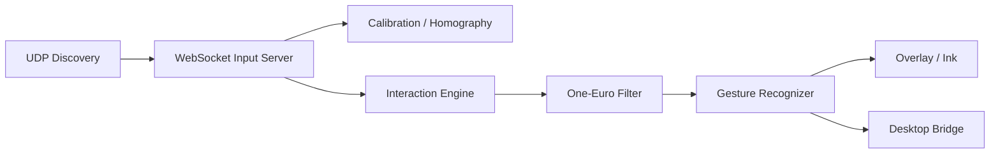

# Screact Desktop アプリ仕様書

> **Version:** 1.0.0 
> **基準コミット:** `4f2d1e5`（2026-08-22） 
> **対象:** THE HACK 2026 Team 35「THE WIN」 / Screact Desktop

## 📑 目次

- [はじめに](#はじめに)
- [システム概要](#システム概要)
- [モジュール構成](#モジュール構成)
- [接続と処理フロー](#接続と処理フロー)
- [操作とオーバーレイ](#操作とオーバーレイ)
- [OS連携](#os連携)
- [検証](#検証)
- [更新履歴](#更新履歴)

## はじめに

### 文書情報

| 項目 | 内容 |
| --- | --- |
| 文書種別 | 現行実装仕様（As-Built Specification） |
| 対象 | Screact Desktop アプリ |
| 実装基準 | `4f2d1e5`（THE HACK 2026 本戦版） |
| 最終更新日 | 2026-08-30 |

Desktop アプリは、Android から受け取った位置合わせ結果と手指ランドマークを、PC画面上のポインター、描画、操作イベントへ変換する処理主体です。Flutter/Dart の共通層に、macOS/Windows のネイティブウィンドウ・入力連携を組み合わせます。

## システム概要

### アーキテクチャ

### 主要機能

| 領域 | 実装内容 |
| --- | --- |
| 接続 | UDP `8766` で接続情報を広告し、WebSocket `8765/ws/v1/input` を待ち受ける。 |
| 認証 | 初回は6桁 `pairingToken`、再接続は `resumeToken` を用いる。詳細は [通信仕様書 v1](./protocol-specification-v1.md)。 |
| 座標処理 | 4点の ArUco 結果から Homography を計算し、手の座標を画面座標へ変換する。 |
| 操作判定 | ポインター、ピンチクリック、ドラッグ、描画、グー消しゴム、グッドサイン・スクロールをイベント化する。 |
| 描画 | 色選択・骨格表示を持つ操作画面と、透明・クリック透過のオーバーレイを提供する。 |

## モジュール構成

| パス | 責務 |
| --- | --- |
| `desktop/lib/net/` | UDP 発見、WebSocket サーバー、接続状態 |
| `desktop/lib/core/` | Homography、平滑化、ジェスチャー、操作状態 |
| `desktop/lib/ui/` | 接続、位置合わせ、オーバーレイ操作、設定画面 |
| `desktop/lib/platform/` | Flutter とネイティブ機能の境界 |
| `desktop/macos/` / `desktop/windows/` | 透過ウィンドウ、OS 固有の実装 |

## 接続と処理フロー

1. Desktop が接続情報と6桁コードを UDP で広告する。
2. Android が WebSocket 接続し、`hello` / `hello_ack` でセッションを確立する。
3. Desktop が配置確認後に ArUco マーカーを表示し、Android の4点結果から変換行列を作る。
4. `hand_frame` を受信し、最新フレームを優先して平滑化・座標変換・ジェスチャー判定を行う。
5. 判定結果をオーバーレイ描画または OS 入力へ反映する。

メッセージのフィールドとエラー契約は、必ず [通信仕様書 v1](./protocol-specification-v1.md) を参照する。

## 操作とオーバーレイ

位置合わせ完了後は透明・最前面・クリック透過のオーバーレイへ移行します。macOS ではメニューバーまたは `⌘⇧O`、Windows では `Ctrl+Shift+O` で解除でき、切断時にも安全に解除します。

| ジェスチャー | Desktop のイベント |
| --- | --- |
| 人差し指移動 | ポインター移動 |
| ピンチ | クリック / 継続時はドラッグ |
| 人差し指・中指の近接 | 描画 |
| グー | 描画消去 |
| グッドサインの上下移動 | 縦スクロール |

## OS連携

| OS | 透明オーバーレイ | ネイティブ OS 入力 |
| --- | --- | --- |
| macOS | 実装済み | Swift / CGEvent で実装済み。アクセシビリティ許可が必要。 |
| Windows | 実装済み | C++ / Win32 `SendInput` で実装済み。特定の Windows + Android 実機で描画、クリック/ドラッグ、消しゴム、スクロールを確認済み。UIPI、対象アプリ、権限によって結果が変わり得る。 |

## 検証

コアの単体・Widget・接続・位置合わせテストは `desktop/test/` にある。実行コマンド、実機確認の範囲、既知の制約は [開発台帳](./work/records/product/Screact_プロダクト・開発台帳_2026-08-30.md) を確認する。

## 📚 更新履歴

| 日付 | Version | 内容 |
| --- | --- | --- |
| 2026-08-30 | 1.0.0 | 基準コミットの Desktop 実装をまとめた初版 |
