# YubiBoard（仮称）デスクトップアプリ（PCアプリ）要件定義書


> [!NOTE]
> 「YubiBoard」は仮称であり、正式名称は未定です。  
> 本文書は、元の要件定義書 Version 0.2 と、デスクトップアプリ担当者が作成した「ADR-0001 Windowsデスクトップアプリの技術スタック選定」を基に再構成しています。

> [!IMPORTANT]
> 本文書では、**Androidアプリからデータを受信した後に満たす機能要件**と、**その機能をどの技術・構成で実装するかという実装方針**を分離します。  
> 機能要件・Androidとの責任境界・通信データは最新の全体要件を優先します。デスクトップ内部の技術スタックはADR-0001を根拠としますが、ADRのStatusは`Proposed`（チーム承認待ち）であり、詳細実装はデスクトップアプリ担当者の実装状況を確認するまで確定事項として扱いません。


## 関連文書

- [全体要件定義書](../system/system-requirements.md)
- [Androidアプリ要件定義書](../android/android-app-requirements.md)
- ADR-0001「Windowsデスクトップアプリの技術スタック選定」（2026-07-14、Status: Proposed）


## 1. 文書の対象

本書は、YubiBoard（仮称）のデスクトップアプリ（PCアプリ）に関する要件を定義する。

### 1.1 根拠資料と優先順位

| 優先度 | 根拠 | 本文書で扱う内容 |
| --- | --- | --- |
| 1 | 全体要件定義書・Androidアプリ要件定義書 | AndroidとPCの責任境界、通信フロー、受信データ、受信後に必要な機能 |
| 2 | ADR-0001「Windowsデスクトップアプリの技術スタック選定」 | Flutter、Dart、C++/Win32など、デスクトップ内部の実装方針候補 |
| 3 | デスクトップアプリの実装コード・担当者判断 | 使用ライブラリ、クラス構成、状態管理、処理配置、ビルド手順などの詳細 |

全体要件とADRの記述が一致しない場合は、現在のAndroid連携フローを含む全体要件を優先する。ADRにのみ記載されている実装方法は、機能要件ではなく提案中の実装方針として扱う。

### 1.2 確定範囲と未確定範囲

**本書で確定要件として扱う範囲**

- Androidアプリから送信されたデータを受信すること
- 受信データの検証、時系列管理、位置合わせ、座標変換、平滑化を行うこと
- ジェスチャー認識、描画、ポインター、クリック、ドラッグ、スクロール、拡大・縮小を実現すること
- 通信切断やトラッキング喪失時に操作を安全に解除すること
- ログ保存、再生、デバッグ表示を行うこと

**現時点で未確定として扱う範囲**

- 各処理をDart側とC++側のどちらへ配置するか
- Flutterの状態管理手法、WebSocketライブラリ、JSON変換方法
- `dart:ffi`とplatform channelのどちらを採用するか
- Windowsネイティブ層のクラス・プラグイン構成
- MouseMux SDKを実際に採用するか
- 透過オーバーレイ、OS入力、複数ポインターの最終実装方式
- macOS版で提供する機能範囲
- ビルド、CI、配布、設定保存、ログ保存の具体的方法

PCアプリは、Androidアプリから受信したArUco検出結果および21点手指骨格データを基に、接続管理、位置合わせ、座標変換、平滑化、ジェスチャー認識、描画、OS入力、ログ保存、デバッグ表示を行う。

PCは、受信した骨格データを実際の操作へ変換する処理主体として扱う。


**図38　最終的な処理責任**

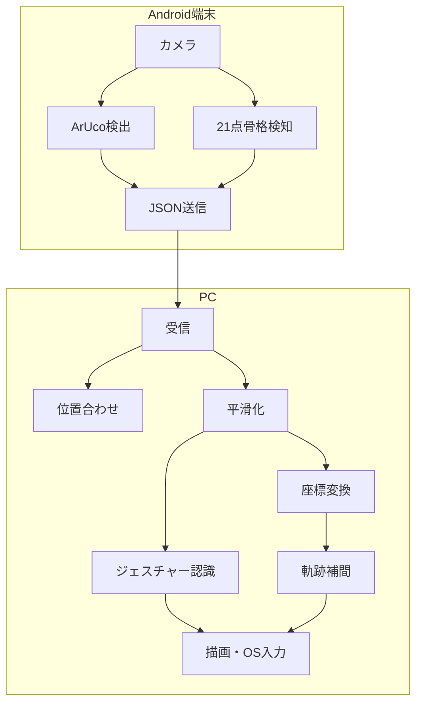
```mermaid
flowchart TB
    subgraph Mobile[Android端末]
        M1[カメラ]
        M2[ArUco検出]
        M3[21点骨格検知]
        M4[JSON送信]
    end
    subgraph Desktop[PC]
        D1[受信]
        D2[位置合わせ]
        D3[平滑化]
        D4[座標変換]
        D5[ジェスチャー認識]
        D6[軌跡補間]
        D7[描画・OS入力]
    end
    M1 --> M2
    M1 --> M3
    M2 --> M4
    M3 --> M4
    M4 --> D1
    D1 --> D2
    D1 --> D3
    D3 --> D4
    D3 --> D5
    D4 --> D6
    D5 --> D7
    D6 --> D7
```

## 2. PC側の責任

- WebSocketサーバーの起動
- Android端末との接続管理
- 初回ペアリングと信頼済み再接続用トークンの発行・検証・失効
- スマホ配置案内とPC上の「配置OK」操作
- 位置合わせモードの開始・終了
- ArUcoオーバーレイ表示
- ArUco検出座標の受信
- ホモグラフィ変換行列の作成
- 変換行列の保存
- 21点骨格座標の受信
- フレーム順序の確認
- 遅延フレーム、重複フレームの破棄
- 骨格座標の平滑化
- 指先の画面座標への変換
- 画面座標の平滑化
- 描画軌跡の補間
- ジェスチャー認識
- 描画処理
- ポインター操作
- クリック・ドラッグ操作
- スクロール操作
- 拡大・縮小操作
- 操作状態の安全な解除
- ログ保存と再生
- デバッグ情報の表示

**図9　Android側とPC側の責任境界**

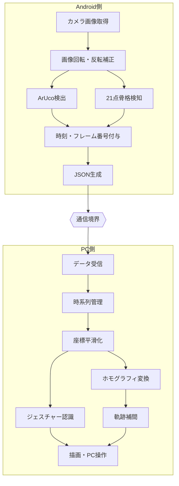
```mermaid
flowchart TB
    subgraph Android[Android側]
        A1[カメラ画像取得]
        A2[画像回転・反転補正]
        A3[ArUco検出]
        A4[21点骨格検知]
        A5[時刻・フレーム番号付与]
        A6[JSON生成]
    end
    Boundary{{通信境界}}
    subgraph PC[PC側]
        P1[データ受信]
        P2[時系列管理]
        P3[座標平滑化]
        P4[ホモグラフィ変換]
        P5[ジェスチャー認識]
        P6[軌跡補間]
        P7[描画・PC操作]
    end
    A1 --> A2
    A2 --> A3
    A2 --> A4
    A3 --> A5
    A4 --> A5
    A5 --> A6
    A6 --> Boundary
    Boundary --> P1
    P1 --> P2
    P2 --> P3
    P3 --> P4
    P3 --> P5
    P4 --> P6
    P5 --> P7
    P6 --> P7
```

## 3. PCアプリ状態


**図10　PCアプリ状態遷移**

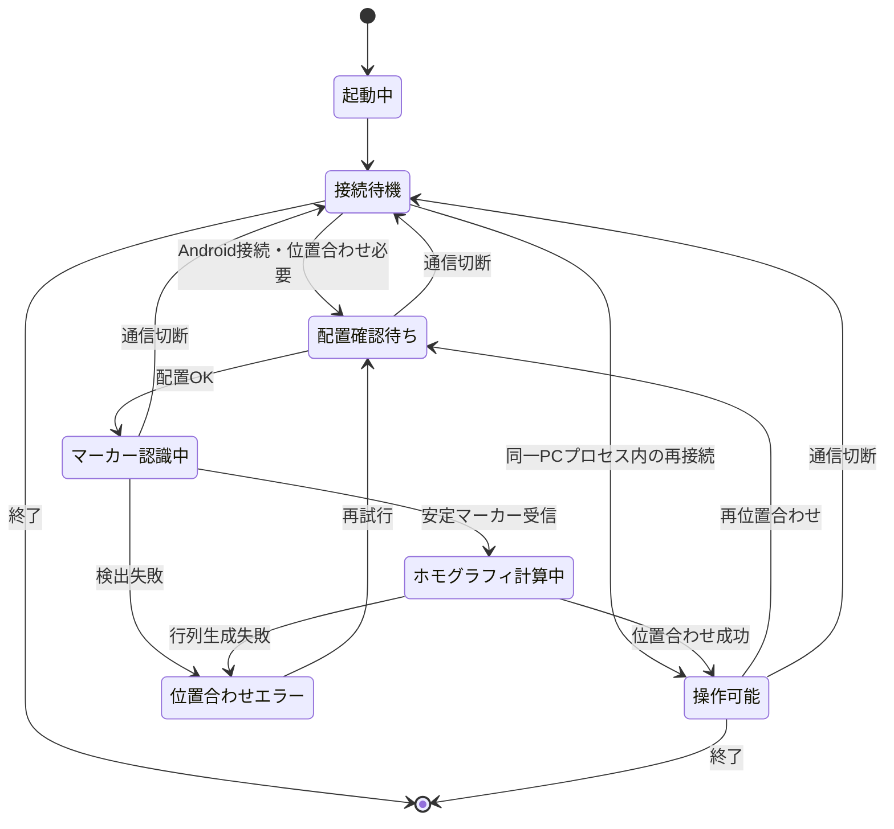
```mermaid
stateDiagram-v2
    [*] --> 起動中
    起動中 --> 接続待機
    接続待機 --> 配置確認待ち: Android接続・位置合わせ必要
    接続待機 --> 操作可能: 同一PCプロセス内の再接続
    配置確認待ち --> マーカー認識中: 配置OK
    マーカー認識中 --> ホモグラフィ計算中: 安定マーカー受信
    ホモグラフィ計算中 --> 操作可能: 位置合わせ成功
    マーカー認識中 --> 位置合わせエラー: 検出失敗
    ホモグラフィ計算中 --> 位置合わせエラー: 行列生成失敗
    位置合わせエラー --> 配置確認待ち: 再試行
    操作可能 --> 配置確認待ち: 再位置合わせ
    操作可能 --> 接続待機: 通信切断
    配置確認待ち --> 接続待機: 通信切断
    マーカー認識中 --> 接続待機: 通信切断
    接続待機 --> [*]: 終了
    操作可能 --> [*]: 終了
```

PCアプリは、起動時にWebSocketサーバーを起動し、Android端末からの接続を待機する。接続後は、配置確認、マーカー認識、ホモグラフィ計算、操作可能、位置合わせエラー、通信切断を個別の状態として管理する。


## 4. 基本シーケンス

### 4.1 起動から操作開始まで


**図13　起動から操作開始までのシーケンス**

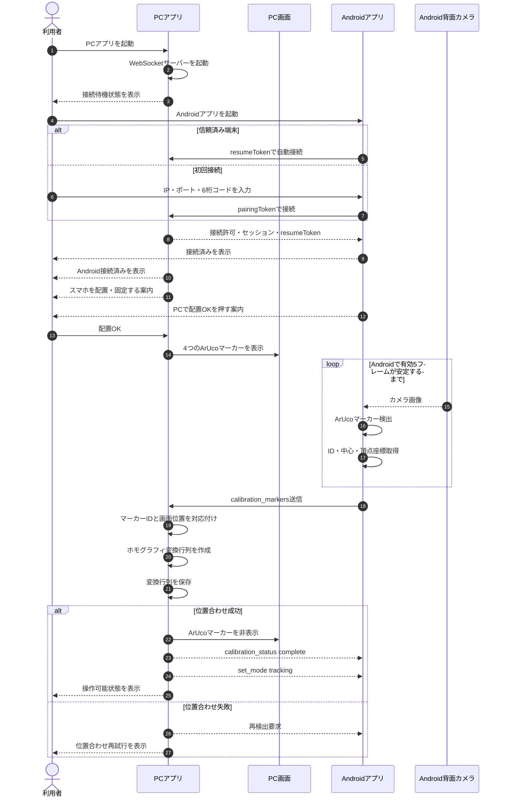
```mermaid
sequenceDiagram
    autonumber
    actor User as 利用者
    participant PC as PCアプリ
    participant Screen as PC画面
    participant Android as Androidアプリ
    participant Camera as Android背面カメラ
    User->>PC: PCアプリを起動
    PC->>PC: WebSocketサーバーを起動
    PC-->>User: 接続待機状態を表示
    User->>Android: Androidアプリを起動
    alt 信頼済み端末
        Android->>PC: resumeTokenで自動接続
    else 初回接続
        User->>Android: IP・ポート・6桁コードを入力
        Android->>PC: pairingTokenで接続
    end
    PC-->>Android: 接続許可・セッション・resumeToken
    Android-->>User: 接続済みを表示
    PC-->>User: Android接続済みを表示
    PC-->>User: スマホを配置・固定する案内
    Android-->>User: PCで配置OKを押す案内
    User->>PC: 配置OK
    PC->>Screen: 4つのArUcoマーカーを表示
    loop Androidで有効5フレームが安定するまで
        Camera-->>Android: カメラ画像
        Android->>Android: ArUcoマーカー検出
        Android->>Android: ID・中心・頂点座標取得
    end
    Android->>PC: calibration_markers送信
    PC->>PC: マーカーIDと画面位置を対応付け
    PC->>PC: ホモグラフィ変換行列を作成
    PC->>PC: 変換行列を保存
    alt 位置合わせ成功
        PC->>Screen: ArUcoマーカーを非表示
        PC-->>Android: calibration_status complete
        PC-->>Android: set_mode tracking
        PC-->>User: 操作可能状態を表示
    else 位置合わせ失敗
        PC-->>Android: 再検出要求
        PC-->>User: 位置合わせ再試行を表示
    end
```

### 4.2 通常操作

**図14　通常操作シーケンス**

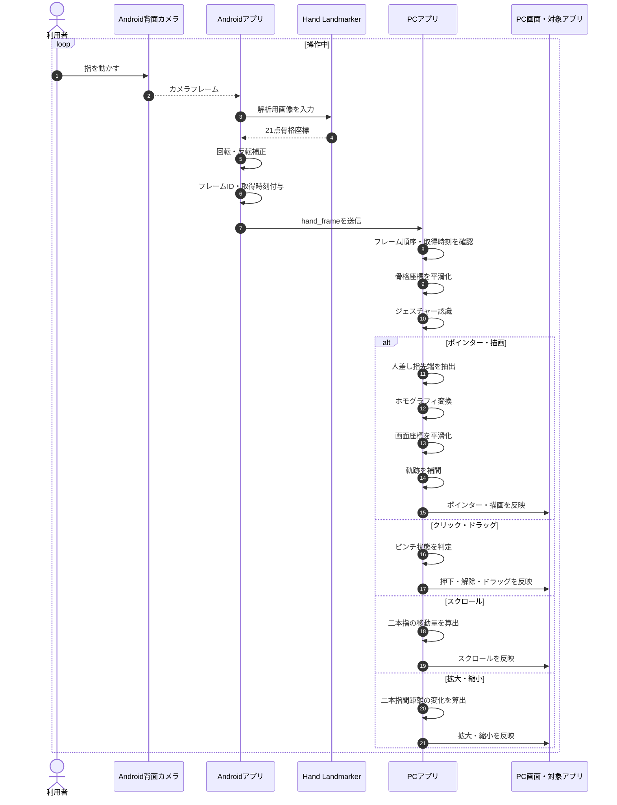
```mermaid
sequenceDiagram
    autonumber
    actor User as 利用者
    participant Camera as Android背面カメラ
    participant Android as Androidアプリ
    participant Hand as Hand Landmarker
    participant PC as PCアプリ
    participant Target as PC画面・対象アプリ
    loop 操作中
        User->>Camera: 指を動かす
        Camera-->>Android: カメラフレーム
        Android->>Hand: 解析用画像を入力
        Hand-->>Android: 21点骨格座標
        Android->>Android: 回転・反転補正
        Android->>Android: フレームID・取得時刻付与
        Android->>PC: hand_frameを送信
        PC->>PC: フレーム順序・取得時刻を確認
        PC->>PC: 骨格座標を平滑化
        PC->>PC: ジェスチャー認識
        alt ポインター・描画
            PC->>PC: 人差し指先端を抽出
            PC->>PC: ホモグラフィ変換
            PC->>PC: 画面座標を平滑化
            PC->>PC: 軌跡を補間
            PC->>Target: ポインター・描画を反映
        else クリック・ドラッグ
            PC->>PC: ピンチ状態を判定
            PC->>Target: 押下・解除・ドラッグを反映
        else スクロール
            PC->>PC: 二本指の移動量を算出
            PC->>Target: スクロールを反映
        else 拡大・縮小
            PC->>PC: 二本指間距離の変化を算出
            PC->>Target: 拡大・縮小を反映
        end
    end
```

### 4.3 トラッキング喪失時

**図15　トラッキング喪失時のシーケンス**

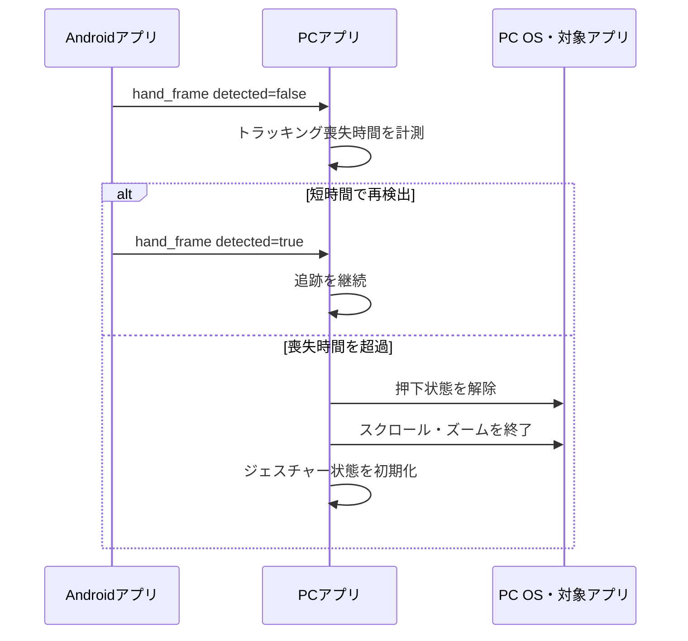
```mermaid
sequenceDiagram
    participant Android as Androidアプリ
    participant PC as PCアプリ
    participant OS as PC OS・対象アプリ
    Android->>PC: hand_frame detected=false
    PC->>PC: トラッキング喪失時間を計測
    alt 短時間で再検出
        Android->>PC: hand_frame detected=true
        PC->>PC: 追跡を継続
    else 喪失時間を超過
        PC->>OS: 押下状態を解除
        PC->>OS: スクロール・ズームを終了
        PC->>PC: ジェスチャー状態を初期化
    end
```

### 4.4 通信切断時

**図16　通信切断時のシーケンス**

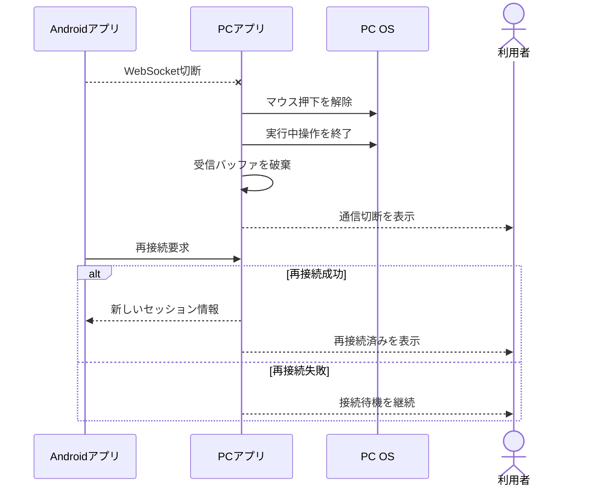
```mermaid
sequenceDiagram
    participant Android as Androidアプリ
    participant PC as PCアプリ
    participant OS as PC OS
    actor User as 利用者
    Android--xPC: WebSocket切断
    PC->>OS: マウス押下を解除
    PC->>OS: 実行中操作を終了
    PC->>PC: 受信バッファを破棄
    PC-->>User: 通信切断を表示
    Android->>PC: 再接続要求
    alt 再接続成功
        PC-->>Android: 新しいセッション情報
        PC-->>User: 再接続済みを表示
    else 再接続失敗
        PC-->>User: 接続待機を継続
    end
```

## 5. 通信サーバー要件

### 5.1 通信方式

PCアプリはWebSocketサーバーを起動し、Androidアプリから継続的にJSONデータを受信する。初期実装では同一LAN内での平文WebSocketを許容する。

接続先のホスト、ポート、パスは実装時に確定する。以下は形式を示す例であり、固定値ではない。

```text
ws://192.168.1.20:8080/ws/v1/input
```


**図23　WebSocket通信構成**

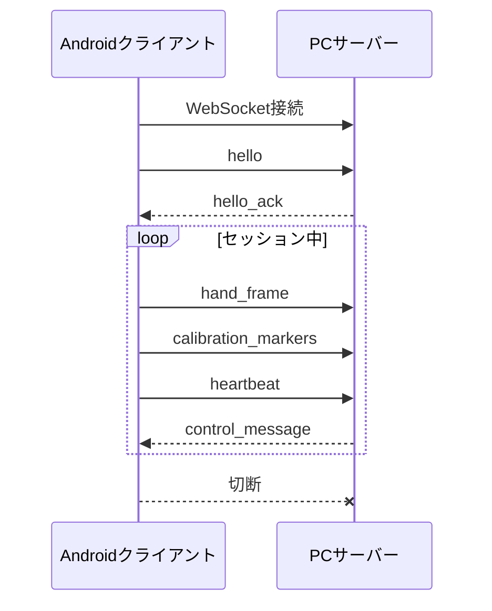
```mermaid
sequenceDiagram
    participant Android as Androidクライアント
    participant PC as PCサーバー
    Android->>PC: WebSocket接続
    Android->>PC: hello
    PC-->>Android: hello_ack
    loop セッション中
        Android->>PC: hand_frame
        Android->>PC: calibration_markers
        Android->>PC: heartbeat
        PC-->>Android: control_message
    end
    Android--xPC: 切断
```

- 認証後はAndroidの5秒heartbeatを監視し、12秒間メッセージが無ければ半開き接続として
  接続枠を解放する。
- 半開き解放時は、クリック、ドラッグ、描画を含む全トラックの入力状態を先に安全解除する。
- 現行接続が生存している間はfirst socket winsを維持し、後着した別端末で置き換えない。

### 5.2 フレーム管理

PCアプリは、過去のフレームをすべて処理することよりも、現在の指位置を低遅延で反映することを優先する。

- フレームIDを利用して受信順序を確認する。
- 同じフレームIDを持つ重複データを破棄する。
- 処理済みフレームより古いデータを破棄する。
- 接続開始、位置合わせ結果、切断通知、エラー通知、操作解除に必要な制御データは破棄しない。


**図24　最新フレーム優先**

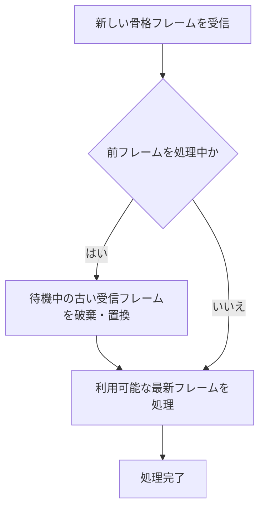
```mermaid
flowchart TD
    NewFrame[新しい骨格フレームを受信]
    Busy{前フレームを処理中か}
    Replace[待機中の古い受信フレームを破棄・置換]
    Process[利用可能な最新フレームを処理]
    Complete[処理完了]
    NewFrame --> Busy
    Busy -->|はい| Replace --> Process
    Busy -->|いいえ| Process
    Process --> Complete
```

### 5.3 接続応答

PCアプリは、接続開始メッセージを検証し、セッションID、対象画面情報、位置合わせの要否を含む接続応答を返す。

初回`hello`は6桁の`pairingToken`、信頼済み再接続は`resumeToken`を含む。両方を同時に受け付けず、いずれか一方を必須とする。初回成功時は端末IDへ紐づけた高エントロピーの`resumeToken`を発行する。詳細なエラーと保存規則は[Android通信プロトコル v1](../android/android-protocol-v1.md)を正本とする。


```json
{
"schemaVersion": 1,
"messageType": "hello",
"deviceId": "android-01",
"client": "yubiboard-android",
"clientVersion": "0.1.0",
"pairingToken": "482731",
"interactionProfile": "single_user_single_active_hand",
"coordinateSpace": "normalized_camera",
"capabilities": ["aruco_calibration", "hand_landmarks_21"]
}
```

```json
{
"schemaVersion": 1,
"messageType": "hello_ack",
"sessionId": "session-fc30f9a1",
"surface": {
"surfaceId": "primary-display",
"widthPx": 1920,
"heightPx": 1080
},
"calibrationRequired": true,
"resumeToken": "opaque-high-entropy-token"
}
```

PCアプリ起動後の最初の認証成功では`calibrationRequired=true`を返す。同一PCプロセス内で位置合わせ完了後に一時切断した端末の再接続だけ`false`を返せる。

## 6. 受信メッセージ仕様

### 6.1 骨格フレーム


```json
{
"schemaVersion": 1,
"messageType": "hand_frame",
"sessionId": "session-fc30f9a1",
"frameId": 1842,
"capturedAtMonotonicMs": 19384521,
"source": {
"width": 960,
"height": 540,
"rotationDegrees": 0,
"rotationCorrected": true,
"mirrorCorrected": true
},
"hand": {
"detected": true,
"handedness": "RIGHT",
"handednessScore": 0.982,
"coordinateSpace": "normalized_camera",
"landmarkFormat": "mediapipe_hand_21",
"landmarks": [
[0.5124, 0.7312, -0.0213],
[0.4761, 0.6824, -0.0182],
[0.4512, 0.6115, -0.0251]
]
}
}
```

PCアプリは、必須項目、ランドマーク数、数値形式、異常値、スキーマバージョン、セッション、フレームIDを検証する。


### 6.2 手を検出できなかった場合

```json
{
"schemaVersion": 1,
"messageType": "hand_frame",
"sessionId": "session-fc30f9a1",
"frameId": 1843,
"capturedAtMonotonicMs": 19384554,
"hand": { "detected": false }
}
```

### 6.3 ArUco検出結果

```json
{
"schemaVersion": 1,
"messageType": "calibration_markers",
"sessionId": "session-fc30f9a1",
"capturedAtMonotonicMs": 19380000,
"source": {
"width": 960,
"height": 540,
"rotationDegrees": 0,
"rotationCorrected": true,
"mirrorCorrected": true
},
"markers": [
{
"id": 10,
"center": [0.103, 0.114],
"corners": [[0.081,0.091],[0.126,0.092],[0.127,0.137],[0.082,0.136]]
}
]
}
```

### 6.4 通信データ構造

**図25　通信データ構造**

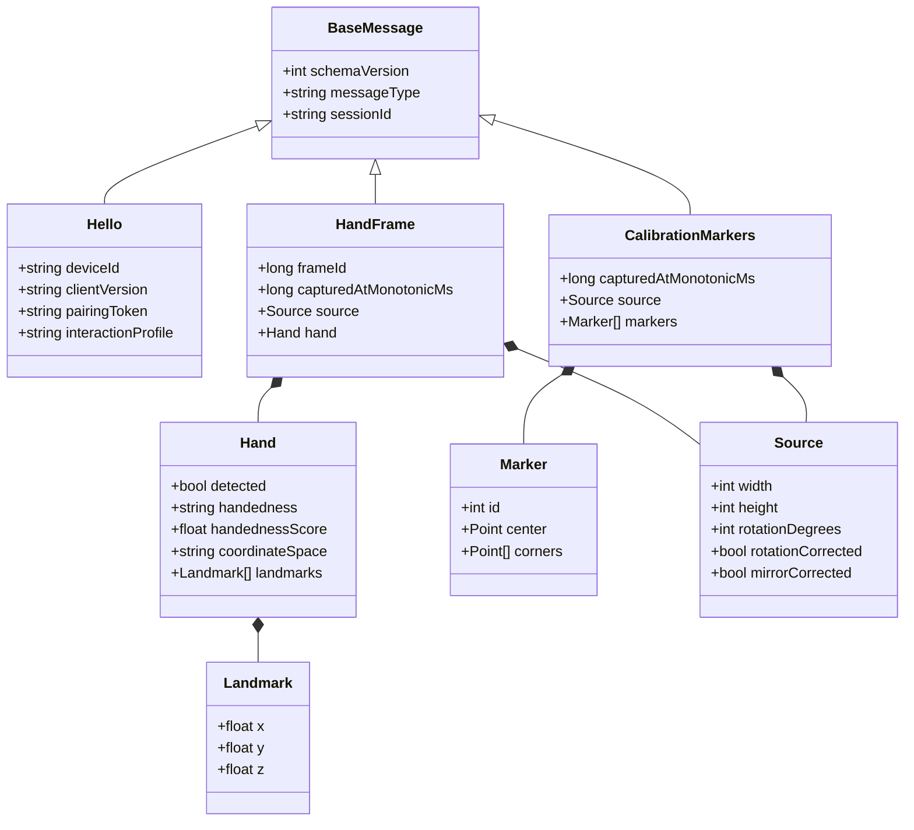
```mermaid
classDiagram
    class BaseMessage {
        +int schemaVersion
        +string messageType
        +string sessionId
    }
    class Hello {
        +string deviceId
        +string clientVersion
        +string pairingToken
        +string interactionProfile
    }
    class HandFrame {
        +long frameId
        +long capturedAtMonotonicMs
        +Source source
        +Hand hand
    }
    class Hand {
        +bool detected
        +string handedness
        +float handednessScore
        +string coordinateSpace
        +Landmark[] landmarks
    }
    class Landmark {
        +float x
        +float y
        +float z
    }
    class CalibrationMarkers {
        +long capturedAtMonotonicMs
        +Source source
        +Marker[] markers
    }
    class Marker {
        +int id
        +Point center
        +Point[] corners
    }
    class Source {
        +int width
        +int height
        +int rotationDegrees
        +bool rotationCorrected
        +bool mirrorCorrected
    }
    BaseMessage <|-- Hello
    BaseMessage <|-- HandFrame
    BaseMessage <|-- CalibrationMarkers
    HandFrame *-- Source
    HandFrame *-- Hand
    Hand *-- Landmark
    CalibrationMarkers *-- Source
    CalibrationMarkers *-- Marker
```

## 7. 画面位置合わせ要件

### 7.1 目的

Androidカメラ上の座標と、対象画面上の座標は一致しない。対象画面がカメラに対して斜めに映る場合も含め、カメラ画像上の指先位置を対象画面上の位置へ変換するため、ホモグラフィ変換を使用する。


**図17　ホモグラフィ変換の役割**

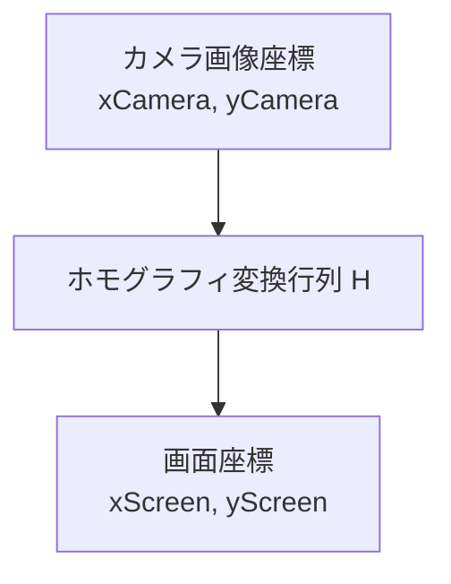
```mermaid
flowchart TB
    CameraPoint["カメラ画像座標<br/>xCamera, yCamera"]
    Matrix[ホモグラフィ変換行列 H]
    ScreenPoint["画面座標<br/>xScreen, yScreen"]
    CameraPoint --> Matrix --> ScreenPoint
```

### 7.2 画面位置合わせフロー

**図18　画面位置合わせフロー**

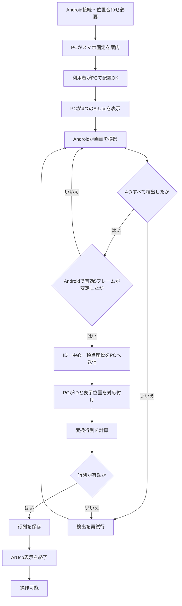
```mermaid
flowchart TD
    Start[Android接続・位置合わせ必要]
    Guide[PCがスマホ固定を案内]
    Confirm[利用者がPCで配置OK]
    Show[PCが4つのArUcoを表示]
    Capture[Androidが画面を撮影]
    Detect{4つすべて検出したか}
    Stable{Androidで有効5フレームが安定したか}
    Send[ID・中心・頂点座標をPCへ送信]
    Match[PCがIDと表示位置を対応付け]
    Calculate[変換行列を計算]
    Valid{行列が有効か}
    Save[行列を保存]
    Hide[ArUco表示を終了]
    Ready[操作可能]
    Retry[検出を再試行]
    Start --> Guide --> Confirm --> Show --> Capture --> Detect
    Detect -->|いいえ| Retry --> Capture
    Detect -->|はい| Stable
    Stable -->|いいえ| Capture
    Stable -->|はい| Send --> Match --> Calculate --> Valid
    Valid -->|いいえ| Retry
    Valid -->|はい| Save --> Hide --> Ready
```

### 7.3 PC側の処理

- 位置合わせモードを開始・終了する。
- Android接続後、マーカーを表示せずスマホの配置・固定を案内する。
- PC上の`配置OK`を受けた後に限り、対象画面上に異なるIDを持つ4つのArUcoマーカーを表示する。
- AndroidからArUco ID、中心座標、4頂点座標、撮影画像サイズ、検出時刻を受信する。
- 各ArUco IDと対象画面上の既知の座標を対応付ける。
- Android側で安定判定済みの`calibration_markers`を受信し、IDと対象画面上の既知位置を検証する。
- ホモグラフィ変換行列を作成し、利用可能か検証する。
- 変換行列を保存する。
- 成功時にマーカーを非表示にし、操作可能状態へ移行する。
- 任意のタイミングで再位置合わせを実行できるようにする。

PCアプリを起動し直した場合は保存済み変換行列を自動採用せず、配置確認から位置合わせをやり直す。同一PCプロセス内で一時的に通信が切れた場合だけ、画面・端末配置が変わっていない前提で確認済み位置合わせを再利用できる。


### 7.4 再位置合わせ条件

- Android端末を移動した
- Android端末の角度を変更した
- 対象画面を移動した
- 画面解像度を変更した
- 対象となるウィンドウまたは表示領域を変更した
- 座標変換誤差が一定値を超えた
- 保存済み変換行列が無効になった

## 8. 座標系

### 8.1 入力となるカメラ正規化座標


| 項目 | 内容 |
| --- | --- |
| 座標原点 | カメラ画像左上 |
| x方向 | 右方向に増加 |
| y方向 | 下方向に増加 |
| x範囲 | 原則0.0～1.0 |
| y範囲 | 原則0.0～1.0 |
| 回転 | 補正済み |
| 左右反転 | 補正済み |
| 座標系名称 | normalized_camera |

### 8.2 画面正規化座標

| 項目 | 内容 |
| --- | --- |
| 座標原点 | 対象画面左上 |
| x方向 | 右方向に増加 |
| y方向 | 下方向に増加 |
| x範囲 | 0.0～1.0 |
| y範囲 | 0.0～1.0 |
| 座標系名称 | surface_normalized |

PCは必要に応じて、画面正規化座標をピクセル座標へ変換する。

```text
pixelX = normalizedX × screenWidth
pixelY = normalizedY × screenHeight
```

### 8.3 画面外座標

ホモグラフィ変換後の座標が0.0～1.0の範囲外である場合、PCは対象画面外として扱う。

- 範囲外座標を0.0または1.0へ丸めてから画面内外を判定してはならない
- 操作可否は、未クリップの人差し指先端をホモグラフィ変換した座標で判定する
- xまたはyが正確に0.0または1.0の場合は画面内として扱い、四辺・四隅を操作可能にする
- 画面外ではポインター、描画、押下、ドラッグ、スクロールを新規開始または更新しない
- 描画中に画面外へ出た場合は最後の有効な画面内座標で描画を終了し、画面端へ点を追加しない
- 押下・ドラッグ中に画面外へ出た場合は最後の有効な画面内座標で押下を解除し、クリックを生成しない
- スクロール中に画面外へ出た場合はアンカーを破棄し、再入場1フレーム目に差分を生成しない
- 画面外遷移はカーソルを非表示にするが、検出中の骨格は保持する。トラック消失・切断時の`release`とは区別する
- 再入場後は連続した画面内フレームを確認してから操作を再開し、押下は一度ピンチ解除を確認するまで再開しない

描画の開始・継続は人差し指と中指の接近で判定し、筆点には人差し指先端を使用する。画面外の筆点を画面端へ丸めない。

骨格表示は未クリップの画面座標を保持し、描画キャンバスを画面矩形でクリップする。画面外の関節を0.0または1.0へ集約しない。

### 8.4 複数手のOS主トラック

OS入力が単一カーソルである間、オーバーレイ表示対象とOS入力対象を分離する。

- 全アクティブトラックの骨格、カーソル、描画はオーバーレイへ反映する
- session内で最初に選ばれた主トラックを、イベントの有無や一時的な画面外状態だけでは変更しない
- 主トラックが画面外の場合はOS入力だけを停止し、所有権を別トラックへ移さない
- 主トラックが消失した場合は、そのトラックの押下・描画解除をOSへ反映してから次候補を選ぶ
- 次候補は画面内かつニュートラルな状態が連続して成立した場合だけ主トラックにする
- 同一フレームで旧主トラックの解除と新主トラックの押下開始をOSへ送らない

## 9. データ処理順序

平滑化とホモグラフィ変換は、目的に応じて処理経路を分ける。

### 9.1 全体処理


**図20　データ処理全体**

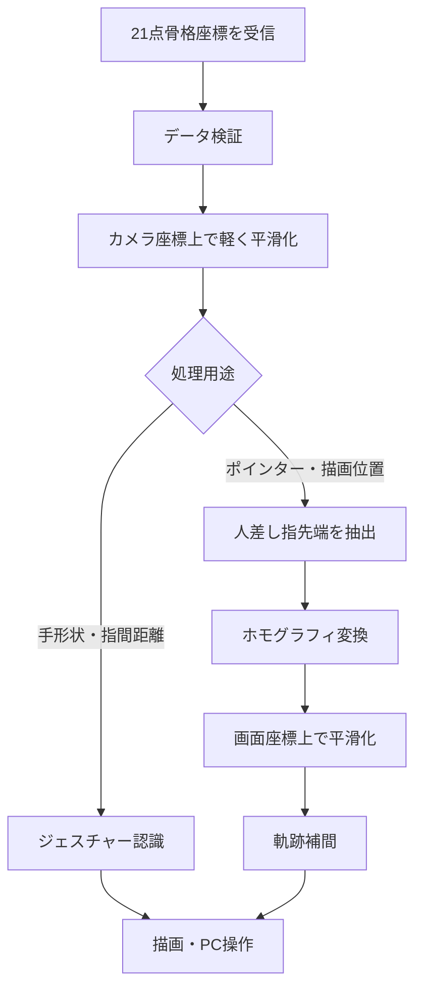
```mermaid
flowchart TD
    Receive[21点骨格座標を受信]
    Validate[データ検証]
    SmoothRaw[カメラ座標上で軽く平滑化]
    Split{処理用途}
    Gesture[ジェスチャー認識]
    Tip[人差し指先端を抽出]
    Homography[ホモグラフィ変換]
    SmoothScreen[画面座標上で平滑化]
    Interpolation[軌跡補間]
    Output[描画・PC操作]
    Receive --> Validate --> SmoothRaw --> Split
    Split -->|手形状・指間距離| Gesture
    Split -->|ポインター・描画位置| Tip --> Homography --> SmoothScreen --> Interpolation
    Gesture --> Output
    Interpolation --> Output
```

### 9.2 ジェスチャー認識経路

**図21　ジェスチャー認識経路**

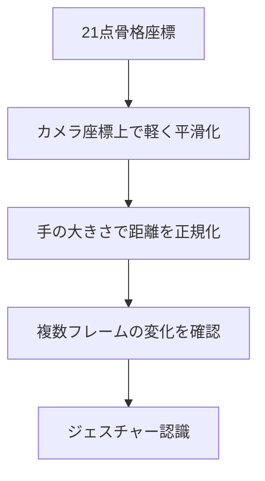
```mermaid
flowchart TB
    Raw[21点骨格座標]
    Smooth[カメラ座標上で軽く平滑化]
    Normalize[手の大きさで距離を正規化]
    Temporal[複数フレームの変化を確認]
    Recognize[ジェスチャー認識]
    Raw --> Smooth --> Normalize --> Temporal --> Recognize
```

ジェスチャー認識では、指同士の相対距離や指の伸展状態を利用する。この処理は、対象画面上の座標へ変換する前でも実行可能である。

### 9.3 ポインター・描画経路

**図22　ポインター・描画経路**

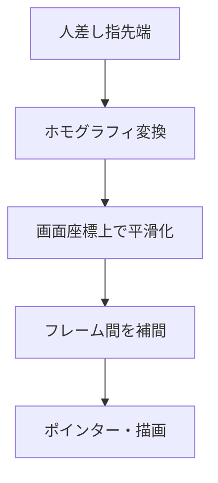
```mermaid
flowchart TB
    Landmark[人差し指先端]
    Transform[ホモグラフィ変換]
    ScreenSmooth[画面座標上で平滑化]
    Interpolate[フレーム間を補間]
    Draw[ポインター・描画]
    Landmark --> Transform --> ScreenSmooth --> Interpolate --> Draw
```

画面座標へ変換した後に平滑化することで、実際に表示される軌跡を基準に揺れを抑える。

### 9.4 平滑化の二重適用

カメラ座標上の平滑化と画面座標上の平滑化を強く適用しすぎると、操作遅延が大きくなる。

- ジェスチャー判定前の平滑化は軽くする
- 描画座標の平滑化は使用感を確認して調整する
- 描画中とポインター移動中で係数を変更できるようにする
- 平滑化パラメータは外部設定可能とする

## 10. ジェスチャー認識要件

### 10.1 ジェスチャー状態


**図26　ジェスチャー状態遷移**

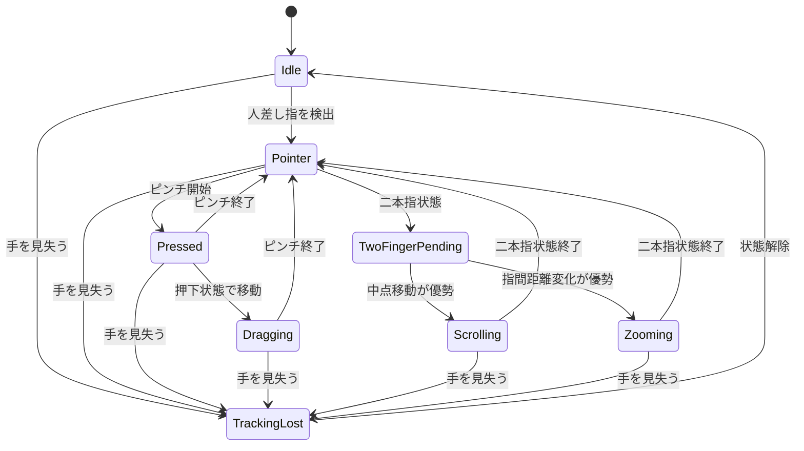
```mermaid
stateDiagram-v2
    [*] --> Idle
    Idle --> Pointer: 人差し指を検出
    Pointer --> Pressed: ピンチ開始
    Pressed --> Dragging: 押下状態で移動
    Pressed --> Pointer: ピンチ終了
    Dragging --> Pointer: ピンチ終了
    Pointer --> TwoFingerPending: 二本指状態
    TwoFingerPending --> Scrolling: 中点移動が優勢
    TwoFingerPending --> Zooming: 指間距離変化が優勢
    Scrolling --> Pointer: 二本指状態終了
    Zooming --> Pointer: 二本指状態終了
    Idle --> TrackingLost: 手を見失う
    Pointer --> TrackingLost: 手を見失う
    Pressed --> TrackingLost: 手を見失う
    Dragging --> TrackingLost: 手を見失う
    Scrolling --> TrackingLost: 手を見失う
    Zooming --> TrackingLost: 手を見失う
    TrackingLost --> Idle: 状態解除
```

### 10.2 ピンチ判定

親指先端と人差し指先端の距離を利用する。カメラからの距離や手の大きさによる影響を減らすため、手の基準長で正規化する。

```text
pinchRatio = 親指先端と人差し指先端の距離 ÷ 手首と中指MCPの距離
```

押下開始と押下終了では異なるしきい値を使用し、境界付近で押下と解除が繰り返される現象を防ぐ。しきい値は実機検証によって決定する。


**図27　ピンチ判定**

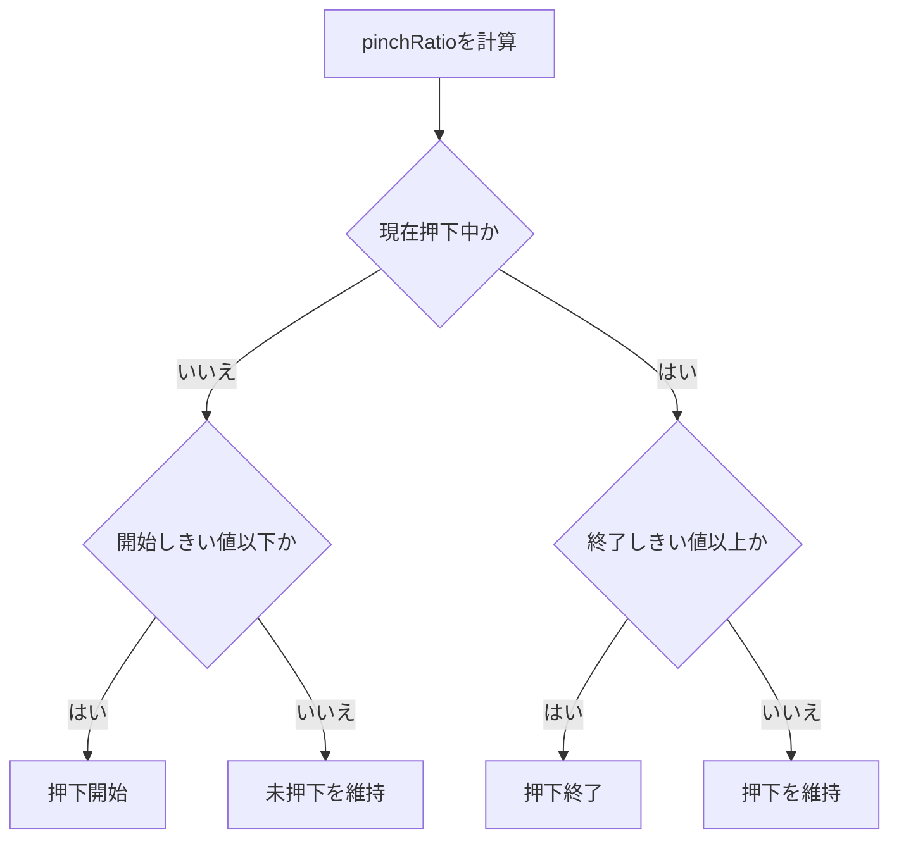
```mermaid
flowchart TD
    Ratio[pinchRatioを計算]
    Pressed{現在押下中か}
    Ratio --> Pressed
    Pressed -->|いいえ| Start{開始しきい値以下か}
    Start -->|はい| Down[押下開始]
    Start -->|いいえ| KeepIdle[未押下を維持]
    Pressed -->|はい| End{終了しきい値以上か}
    End -->|はい| Up[押下終了]
    End -->|いいえ| KeepDown[押下を維持]
```

### 10.3 二本指操作

人差し指先端と中指先端を使用し、二本指状態になった直後に二本指の中点移動量と二本指間距離の変化量を比較する。


**図28　二本指操作の判別**

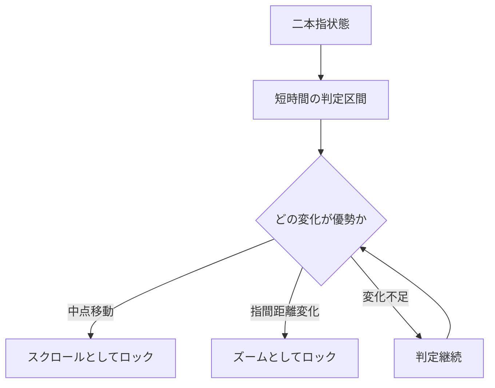
```mermaid
flowchart TD
    Two[二本指状態]
    Window[短時間の判定区間]
    Compare{どの変化が優勢か}
    Scroll[スクロールとしてロック]
    Zoom[ズームとしてロック]
    Wait[判定継続]
    Two --> Window --> Compare
    Compare -->|中点移動| Scroll
    Compare -->|指間距離変化| Zoom
    Compare -->|変化不足| Wait --> Compare
```

### 10.4 操作優先順位

1. 通信切断
2. トラッキング喪失
3. 押下中の処理
4. スクロールまたはズーム
5. ポインター移動
6. 待機

## 11. 描画・投影・OS入力

### 11.1 投影処理の定義

「PC側の投影処理」は、PC上で生成した描画結果やポインターを、対象画面へ表示する処理を意味する。プロジェクターを使用する場合だけでなく、PCディスプレイへ直接表示する場合も含む。

### 11.2 描画処理


**図29　描画処理**

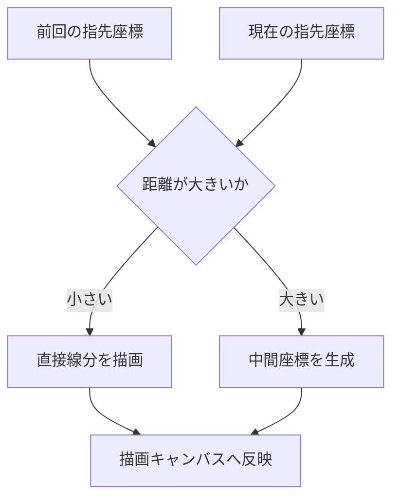
```mermaid
flowchart TB
    Current[現在の指先座標]
    Previous[前回の指先座標]
    Distance{距離が大きいか}
    Direct[直接線分を描画]
    Interpolate[中間座標を生成]
    Draw[描画キャンバスへ反映]
    Previous --> Distance
    Current --> Distance
    Distance -->|小さい| Direct --> Draw
    Distance -->|大きい| Interpolate --> Draw
```

### 11.3 操作反映方式

- YubiBoard（仮称）内の専用キャンバスを操作する
- PC OSのマウス入力へ変換する
- 対象アプリ固有の操作APIへ変換する
- キーボードショートカットとマウス入力の組み合わせへ変換する

拡大・縮小については、専用キャンバスの表示倍率変更、Ctrlキーとマウスホイール、対象アプリ固有のズーム操作から設定可能とする。

## 12. 機能要件

### 12.1 接続機能


| ID | 要件名 | 内容 |
| --- | --- | --- |
| FR-001 | PC通信サーバー起動 | PCアプリは、起動時にAndroid端末との通信用WebSocketサーバーを起動できること。 |
| FR-003 | 接続状態表示 | PCおよびAndroidアプリは、未接続、接続中、接続済み、再接続中、切断、エラーを表示できること。 |
| FR-004 | ペアリング | ペアリングコードまたは同等の認証方法を使用できること。 |
| FR-006 | 切断時解除 | 通信が切断された場合、PCは実行中の入力操作を終了すること。 |
| FR-007 | 信頼済み接続 | 初回認証成功時に端末IDへ紐づく高エントロピーの`resumeToken`を発行し、以後の接続で検証できること。 |
| FR-008 | トークン失効 | 接続先削除や管理操作により保存済み`resumeToken`を失効できること。 |

### 12.2 画面位置合わせ機能

| ID | 要件名 | 内容 |
| --- | --- | --- |
| FR-010 | 配置確認 | Android接続後にスマホ固定を案内し、PC上で利用者が`配置OK`を押せること。 |
| FR-011 | ArUco表示 | `配置OK`の後に限り、異なるIDを持つ4つのArUcoマーカーを表示できること。 |
| FR-016 | 対応付け | PCはマーカーIDと対象画面上の既知位置を対応付けられること。 |
| FR-017 | 変換行列作成 | ホモグラフィ変換行列を作成できること。 |
| FR-018 | 変換行列検証 | 変換行列が正常に利用可能かを検証できること。 |
| FR-019 | 位置合わせ終了 | 成功時にマーカーを非表示にし、操作可能状態へ移行すること。 |

### 12.3 骨格データ受信機能

| ID | 要件名 | 内容 |
| --- | --- | --- |
| FR-040 | 継続受信 | PCは骨格フレームを継続して受信できること。 |
| FR-041 | フレーム順序確認 | フレームIDを利用して受信順序を確認できること。 |
| FR-042 | 重複破棄 | 同じフレームIDを持つ重複データを破棄できること。 |
| FR-043 | 古いフレーム破棄 | 処理済みフレームより古いデータを破棄できること。 |
| FR-044 | データ検証 | 必須項目、ランドマーク数、数値形式、異常値、スキーマ、セッション、フレームIDを検証すること。 |

### 12.4 平滑化・補間機能

| ID | 要件名 | 内容 |
| --- | --- | --- |
| FR-050 | 骨格平滑化 | ジェスチャー認識前に21点骨格座標を時間方向に平滑化できること。 |
| FR-051 | 画面座標平滑化 | ホモグラフィ変換後の指先座標を平滑化できること。 |
| FR-052 | 軌跡補間 | 前回座標と現在座標の間を補間できること。 |
| FR-053 | パラメータ調整 | 平滑化方式、係数、補間方法、補間点数、移動量、外れ値しきい値を変更できること。 |
| FR-054 | 原データ保持 | ログ保存時には平滑化前の骨格座標を保存できること。 |

### 12.5 ジェスチャー認識機能

| ID | 要件名 | 内容 |
| --- | --- | --- |
| FR-060 | ポインター移動 | 人差し指先端の移動をポインター移動として認識できること。 |
| FR-061 | 押下開始 | 親指と人差し指を近づける動作を押下開始として認識できること。 |
| FR-062 | 押下終了 | 親指と人差し指を離す動作を押下終了として認識できること。 |
| FR-063 | クリック | 短時間の押下開始と終了をクリックとして扱えること。 |
| FR-064 | ドラッグ | 押下状態でのポインター移動をドラッグとして扱えること。 |
| FR-065 | 描画 | 描画モード中の押下状態での移動を描画として扱えること。 |
| FR-066 | スクロール | 人差し指と中指の移動をスクロールとして認識できること。 |
| FR-067 | 拡大・縮小 | 人差し指と中指の間隔変化を拡大・縮小として認識できること。 |
| FR-068 | ジェスチャーロック | ジェスチャー開始後、終了するまで不用意に別操作へ切り替えないこと。 |
| FR-069 | 喪失時解除 | 手を一定時間見失った場合、実行中のジェスチャー状態を解除すること。 |
| FR-070 | 消しゴム | 全指を折り畳んだグーを消去操作として認識し、カーソル近傍のインクだけを消去できること。 |
| FR-071 | 描画表示設定 | 透明オーバーレイへ入る前に描画色と骨格表示のON/OFFを選択できること。 |

## 13. ログ・デバッグ要件

### 13.1 ログ保存対象

- セッション開始・終了時刻
- Android端末情報
- 受信した生の骨格座標
- フレームID
- 取得時刻
- 受信時刻
- ArUco検出結果
- ホモグラフィ変換行列
- 平滑化後座標
- 認識したジェスチャー
- 操作開始・終了
- 通信エラー
- フレーム欠落数

### 13.2 ログ再生

保存した骨格データを、実際のAndroid端末を接続せずにPC上で再生できること。


**図30　ログ再生によるアルゴリズム検証**

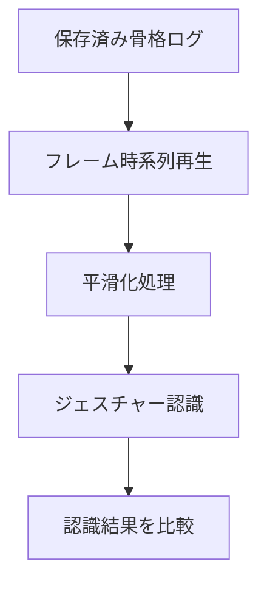
```mermaid
flowchart TB
    Log[保存済み骨格ログ]
    Replay[フレーム時系列再生]
    Smooth[平滑化処理]
    Gesture[ジェスチャー認識]
    Compare[認識結果を比較]
    Log --> Replay --> Smooth --> Gesture --> Compare
```

同じ入力データに対して、異なる平滑化方式、ピンチしきい値、スクロール判定、ズーム判定、ジェスチャー状態遷移を比較できるようにする。

### 13.3 デバッグ表示

- 21点骨格
- 手の左右分類
- 人差し指先端位置
- ホモグラフィ変換後位置
- ピンチ比率
- 現在のジェスチャー状態
- 送信fps
- 受信fps
- フレーム欠落数
- 推定通信遅延
- 位置合わせ状態

## 14. 非機能要件

### 14.1 性能要件


| ID | 要件 |
| --- | --- |
| NFR-002 | 送信レートはPC側の補間で文字や線の形状を維持できる最低値以上とする。 |
| NFR-003 | カメラ画像取得からPC反映まで100 ms未満を目標とし、初期試作では150 ms未満を暫定許容とする。 |
| NFR-004 | 遅延時は全フレームの順次処理より最新状態を優先する。 |
| NFR-005 | 10分以上の連続動作で著しい性能低下や操作不能が発生しないこと。 |

**図31　全体遅延の内訳**

```mermaid
flowchart TB
    Capture[カメラ取得]
    Detect[骨格検知]
    Serialize[JSON生成]
    Network[通信]
    Process[PC処理]
    Render[表示]
    Capture --> Detect --> Serialize --> Network --> Process --> Render
```

### 14.2 操作性要件

| ID | 要件 |
| --- | --- |
| NFR-010 | 利用者は案内に従い接続と位置合わせを完了できること。 |
| NFR-011 | 接続、位置合わせ、手の検出、操作可否、エラー状態を明示すること。 |
| NFR-012 | 手を見失った場合、押下やドラッグが継続しないこと。 |
| NFR-013 | アプリを再起動せず位置合わせをやり直せること。 |

### 14.3 保守性要件

| ID | 要件 |
| --- | --- |
| NFR-020 | Android側の骨格検知処理とPC側のジェスチャー認識処理を分離すること。 |
| NFR-021 | PC側のアルゴリズムを変更してもAndroid側を変更せず動作できること。 |
| NFR-022 | 検知信頼度、解析解像度、送信レート、平滑化、各しきい値、喪失時間、補間、スクロール方向、ズーム方式を外部設定可能とすること。 |
| NFR-023 | 通信メッセージにスキーマバージョンを含めること。 |

### 14.4 信頼性要件

| ID | 要件 |
| --- | --- |
| NFR-030 | 異常な座標や不完全なJSONを受信してもアプリ全体が停止しないこと。 |
| NFR-031 | 通信切断、長時間未検出、アプリ終了、例外、セッション変更、位置合わせ移行時に実行中操作を解除すること。 |
| NFR-032 | 利用者が対応可能な形式でエラー内容を表示すること。 |

### 14.5 セキュリティ要件

| ID | 要件 |
| --- | --- |
| NFR-040 | Androidアプリは利用者が指定したPCへ接続すること。 |
| NFR-041 | ペアリングコードなどにより意図しない端末の接続を防止できること。 |
| NFR-042 | WebSocketサーバーを必要のない外部ネットワークへ公開しないこと。 |
| NFR-043 | `resumeToken`は十分なエントロピーを持たせ、PC側では平文保存せず端末IDと関連付けること。 |
| NFR-044 | 不正または失効済み`resumeToken`を受信した場合は接続を許可せず、Androidが初回ペアリングへ戻れるエラーを返すこと。 |

## 15. エラー処理


| エラー | 対応 |
| --- | --- |
| PCへ接続できない | IPアドレス、ポート、ネットワークを確認し再接続 |
| 4つのArUcoを検出できない | カメラ位置、画面全体、照明を確認 |
| 変換行列を作れない | マーカー位置を再取得 |
| 手を検出できない | 未検出通知を送り、PC操作を解除 |
| JSON形式が不正 | 対象フレームを破棄しログへ記録 |
| フレームが古い | 対象フレームを破棄 |
| 通信が切断された | 全入力を解除し再接続を試行 |
| PCアプリが終了した | Android側を接続待機状態へ戻す |

**図32　エラー分類と復旧処理**

```mermaid
flowchart TD
    Error[エラー発生]
    Type{エラー種別}
    Type --> Connection[通信エラー]
    Type --> Camera[カメラエラー]
    Type --> Detection[検出エラー]
    Type --> Calibration[位置合わせエラー]
    Type --> Data[データ形式エラー]
    Type --> Output[PC操作反映エラー]
    Connection --> Recover1[再接続・操作解除]
    Camera --> Recover2[カメラ再起動]
    Detection --> Recover3[未検出状態へ移行]
    Calibration --> Recover4[再位置合わせ]
    Data --> Recover5[対象フレーム破棄]
    Output --> Recover6[入力解除・利用者へ通知]
```

通信切断、長時間未検出、アプリ終了、例外、セッション変更、位置合わせ移行時には、押下・ドラッグ・スクロール・ズームなど実行中の操作を安全に解除する。


## 16. 受入条件


| ID | 受入条件 |
| --- | --- |
| AC-001 | PCアプリが起動し、Android端末からの接続待機状態になること。 |
| AC-002 | AndroidアプリとPCアプリが接続され、双方で接続済み状態を確認できること。 |
| AC-003 | PC上に異なるIDの4つのArUcoマーカーを表示できること。 |
| AC-005 | PCがホモグラフィ変換行列を作成できること。 |
| AC-006 | 画面四隅付近の指先がPC上の対応する四隅付近へ変換されること。 |
| AC-008 | PCが21点骨格データを継続して受信できること。 |
| AC-009 | Android側で手を見失った場合、PCが未検出状態を認識できること。 |
| AC-010 | 人差し指の移動に応じてPC上のポインターが追従すること。 |
| AC-011 | 通常の記述速度で線を描画でき、大きな途切れが発生しないこと。 |
| AC-012 | 定義したピンチ動作によってクリックを実行できること。 |
| AC-013 | ピンチ状態を維持したまま指を移動し、ドラッグを実行できること。 |
| AC-014 | 二本指の移動によって縦または横スクロールを実行できること。 |
| AC-015 | 二本指間距離の変化によって拡大・縮小を実行できること。 |
| AC-016 | 押下中に手を見失った場合、押下状態が自動解除されること。 |
| AC-017 | 通信切断時にすべての操作状態が解除されること。 |
| AC-018 | 受信した21点骨格データを時系列で保存できること。 |
| AC-019 | 保存した骨格データを再生し、ジェスチャー認識を再実行できること。 |
| AC-020 | 10分以上連続して利用してもシステムが停止しないこと。 |
| AC-021 | PCの`配置OK`前はマーカーを表示せず、押下後に4マーカーを全画面表示すること。 |
| AC-022 | 初回ペアリング後、Androidアプリ再起動時に6桁コードなしで認証できること。 |
| AC-023 | PCアプリ再起動後は位置合わせを要求し、同一PCプロセス内の一時切断では確認済み結果を再利用できること。 |
| AC-024 | 受信骨格を検証・時系列化し、カメラ座標平滑化、指形状認識、ホモグラフィ、画面座標処理、描画の順で処理できること。 |

## 17. 未確定事項

Android MVPで確定したArUco ID・表示位置・安定フレーム数・中心移動許容値はAndroid側の契約として本文へ反映し、未確定事項から除外した。


| ID | 未確定事項 |
| --- | --- |
| TBD-001 | システムの正式名称 |
| TBD-006 | PCへの最低送信フレームレート |
| TBD-007 | 許容可能な全体遅延 |
| TBD-008 | 使用する平滑化アルゴリズム |
| TBD-009 | 平滑化係数 |
| TBD-010 | 外れ値の判定方法 |
| TBD-011 | 描画軌跡の補間方法 |
| TBD-012 | ピンチ開始・終了しきい値 |
| TBD-013 | クリックとして扱う最大押下時間 |
| TBD-014 | スクロールとズームの判別時間 |
| TBD-015 | トラッキング喪失と判断する時間 |
| TBD-017 | ArUcoマーカーのサイズ |
| TBD-023 | WindowsなどのOS入力へ直接変換する範囲 |
| TBD-024 | 専用描画キャンバスの実装範囲 |
| TBD-025 | ズーム操作の実装方式 |
| TBD-026 | ログ保存形式 |
| TBD-027 | JSONからバイナリ通信へ変更する判断基準 |
| TBD-D01 | Flutter + ネイティブC++方針のチーム承認状況 |
| TBD-D02 | 既存デスクトップアプリの実装構成と進捗 |
| TBD-D03 | DartとC++の処理分担 |
| TBD-D04 | `dart:ffi`とplatform channelの選択 |
| TBD-D05 | Flutterの状態管理・WebSocket・JSONライブラリ |
| TBD-D06 | 透過オーバーレイ窓の具体的な実装方法 |
| TBD-D07 | MouseMux SDKの採否、ライセンス、実行時依存 |
| TBD-D08 | 複数ポインターを初期バージョンへ含めるか |
| TBD-D09 | macOS版で提供する機能とスタブ範囲 |
| TBD-D10 | Windowsビルド、CI、配布方法 |

## 18. 実機・統合検証項目

### 18.1 性能検証

- PC側の受信fps
- カメラ撮影からPC表示までの遅延
- フレーム欠落率
- JSONシリアライズ時間
- 10分以上の継続動作
- 通信帯域

### 18.2 精度検証

- 対象画面四隅の座標誤差
- 画面中央の座標誤差
- カメラに近い位置と遠い位置での誤差
- 人差し指先端の揺れ
- ピンチ判定の成功率
- クリック誤認識率
- スクロール誤認識率
- ズーム誤認識率
- 手を見失った場合の解除時間

### 18.3 描画検証

- 直線を描いた場合の追従性
- 円を描いた場合の滑らかさ
- 小さい文字を書いた場合の可読性
- 素早く文字を書いた場合の欠落
- 折れ曲がり部分の形状保持
- フレームレートごとの描画品質
- 平滑化の強さと遅延の関係
- 補間方式ごとの描画品質

**図34　実機検証の分類**

```mermaid
flowchart TD
    Test[実機検証]
    Performance[性能]
    Accuracy[座標精度]
    Gesture[ジェスチャー精度]
    Drawing[描画品質]
    Stability[継続安定性]
    Test --> Performance
    Test --> Accuracy
    Test --> Gesture
    Test --> Drawing
    Test --> Stability
    Performance --> Decision[設定値を決定]
    Accuracy --> Decision
    Gesture --> Decision
    Drawing --> Decision
    Stability --> Decision
```

## 19. 実装方針（ADR-0001に基づく提案）

### 19.1 ADRの状態

ADR-0001は、2026年7月14日時点で`Proposed`（チーム承認待ち）である。したがって、本節の内容はデスクトップアプリの**実装要件候補**として記載し、既存コードおよび担当者の判断を確認するまで確定済みの内部構成とはみなさない。

### 19.2 提案されている技術スタック

| 領域 | ADRで提案されている技術 | 想定する役割 | 確定度 |
| --- | --- | --- | --- |
| 共通アプリ層 | Flutter / Dart | 共通UI、状態管理、スマートフォン座標の受信 | 提案中 |
| 描画 | Flutter Canvas / Skia | ポインター、ペン、デバッグ表示などの描画 | 提案中 |
| Windows固有層 | C++ / Win32 | OS入力注入、透過・クリックスルーのオーバーレイ窓 | 提案中 |
| Dart・ネイティブ間接続 | `dart:ffi` または platform channel | DartからWindowsネイティブ処理を呼び出す | 方式未決定 |
| 複数ポインター | MouseMux SDKを第一候補、またはRaw Inputと自前カーソル描画 | 複数カーソル・入力の実現 | 採否未決定 |
| Windowsビルド | Windows実機またはCI | Windows runnerおよびC++部分のビルド・検証 | 必要 |
| macOS開発 | FlutterのmacOSビルド | 共通UIなどWindows非依存部分の開発・動作確認 | 提案中 |

### 19.3 提案アーキテクチャ

```mermaid
flowchart LR
    Android[Androidアプリ] -->|WebSocket / JSON| Flutter[Flutter・Dart 共通層]
    Flutter --> UI[UI・状態表示]
    Flutter --> Receive[座標受信・データ検証]
    Receive --> Processing["位置合わせ・平滑化・ジェスチャー等<br/>配置先は未確定"]
    Processing --> Draw[Flutter Canvas / Skiaによる描画候補]
    Processing --> Interface[プラットフォームインターフェース]
    Interface -->|Windows| Win32[C++ / Win32ネイティブ層]
    Win32 --> Overlay[透過・クリックスルーオーバーレイ]
    Win32 --> Input[OS入力注入]
    Interface -->|macOS| Stub[macOSスタブまたは代替実装]
```

この図は責任の候補を示すものであり、ホモグラフィ変換、平滑化、ジェスチャー認識、ログ処理をDartとC++のどちらに実装するかまでは確定しない。

### 19.4 OS別コードの分離方針

ADRでは、単一のFlutterコードベースを使用し、OS固有処理をFlutterプロジェクト内の`windows/`と`macos/`へ分離する方針が示されている。

- Windowsビルドでは、Windows runnerとWindows向けC++実装を使用する
- macOSビルドでは、Windows固有処理を含めず、macOS側のスタブまたは代替実装を使用する
- Dart側はプラットフォームインターフェースを介してOS固有処理を呼び出す
- Windows専用機能を共通UI・通信処理から分離する

`InputInjector`、`OverlayWindow`という名称はADRに記載されたモジュール分離案であり、実際のクラス名・ファイル名を拘束しない。

### 19.5 透過オーバーレイとOS入力

ADRでは、透過・クリックスルーのオーバーレイ窓をC++/Win32のレイヤードウィンドウで実装する案が示されている。候補となるWindows拡張スタイルは以下である。

- `WS_EX_LAYERED`
- `WS_EX_TRANSPARENT`

また、通常の`SendInput`で扱えるOSカーソルは1本であるため、真の複数入力を行う場合はMouseMuxなど別の仕組みが必要になる。初期MVPについてADRでは、「描画は同時、OS入力注入は直列」とする案が示されている。

### 19.6 現在のAndroid要件との整合

現在の初期システム要件は、1人・1アクティブハンドを前提としている。一方、ADR-0001は複数ポインターを重要な検討対象としている。

このため、初期統合では以下のように扱う。

- Androidアプリから受信する操作対象は、原則として1アクティブハンドとする
- 1入力ストリームで、ポインター、描画、クリック、ドラッグ、スクロール、拡大・縮小を成立させる
- MouseMuxなどの複数ポインター機構は、既存デスクトップ実装で必要な場合、または将来の複数端末対応に備える場合の候補として保持する
- 初期バージョンに複数ポインターを必須とするかは、デスクトップ担当者へ確認して決定する

### 19.7 実装上のリスク・確認事項

- Flutter Windowsは、透過窓の標準サポートが弱く、runnerのカスタマイズが必要になる可能性がある
- Windowsネイティブ層の範囲は、OS入力注入だけでなくオーバーレイ窓まで広がる
- MouseMux SDKを使用する場合、本体常駐、ライセンス、配布条件を確認する必要がある
- Windowsターゲットのビルドと最終検証には、Windows実機またはWindows CIが必要である
- macOS上で確認できるのは、原則として共通UI・通信などWindows非依存部分である
- 既存実装の構成がADRと異なる場合、機能要件を維持した上で本文書の実装方針を更新する

## 20. 統合の進行順序

以下は、機能を段階的に接続して確認するための順序であり、デスクトップアプリ内部のクラス構成や担当モジュールを指定するものではない。

1. WebSocketサーバー、初回6桁認証、`resumeToken`認証を実装する
2. 接続待機、配置確認待ち、`配置OK`、四隅マーカー表示を一本道で実装する
3. `calibration_markers`を受信し、ホモグラフィ作成・検証・完了通知まで実装する
4. `hand_frame`を受信検証・時系列化し、21点をデバッグ表示・ログ保存する
5. カメラ座標上の軽い平滑化と指形状・ジェスチャー認識の入力を実装する
6. 人差し指先端をホモグラフィ変換し、画面座標の平滑化とポインター追従を実装する
7. 描画と軌跡補間を実装して、起動から線を描くまでのデモ経路を完成させる
8. ピンチ、クリック、ドラッグを実装する
9. スクロールと拡大・縮小を実装する
10. Windowsネイティブのオーバーレイ・OS入力と接続する
11. 切断・手喪失時の解除、ログ再生、パラメータ調整を実装する
12. 初回接続、自動接続、PC再起動、一時通信断、位置合わせ再試行をWindows実機で統合テストする

```mermaid
flowchart TB
    Step1[1. 初回認証・自動接続]
    Step2[2. 配置確認・マーカー表示]
    Step3[3. ArUco位置合わせ]
    Step4[4. 21点受信・表示・ログ]
    Step5[5. 平滑化・指形状認識]
    Step6[6. ホモグラフィ・ポインター]
    Step7[7. 描画・補間]
    Step8[8. ピンチ・ドラッグ]
    Step9[9. スクロール・ズーム]
    Step10[10. Windowsネイティブ層]
    Step11[11. 障害復旧・ログ再生]
    Step12[12. 正常系・再接続統合テスト]
    Step1 --> Step2 --> Step3 --> Step4 --> Step5 --> Step6 --> Step7 --> Step8 --> Step9 --> Step10 --> Step11 --> Step12
```

実際の実装順序は、現在のデスクトップアプリの進捗と担当者の判断を確認した上で調整する。

## 21. 最終的な処理責任

**図37　システム処理概要**

```mermaid
flowchart TD
    Start[PCアプリ起動]
    Connect[Androidが自動接続または初回ペアリング]
    Placement[スマホを配置・固定]
    PlacementOk[PCで配置OK]
    CalibrationMode[画面位置合わせモード]
    ShowArUco[PCが4つのArUcoを表示]
    DetectArUco[Androidが4 IDを検出]
    SendArUco[検出座標をPCへ送信]
    Matrix[PCが変換行列を作成]
    Ready[操作可能状態]
    Capture[Android背面カメラ画像]
    HandLandmarks[21点手指骨格検知]
    SendHand[骨格データをPCへ送信]
    Smooth[PCで座標平滑化]
    Gesture[ジェスチャー認識]
    Transform[ホモグラフィ変換]
    Interpolate[描画軌跡補間]
    Output[描画・クリック・スクロール・ズーム]
    Screen[対象画面へ反映]
    Start --> Connect --> Placement --> PlacementOk --> CalibrationMode --> ShowArUco --> DetectArUco --> SendArUco --> Matrix --> Ready --> Capture --> HandLandmarks --> SendHand --> Smooth
    Smooth --> Gesture
    Smooth --> Transform --> Interpolate
    Gesture --> Output
    Interpolate --> Output --> Screen --> Capture
```

PCは、受信、時系列管理、平滑化、ホモグラフィ変換、軌跡補間、ジェスチャー認識、描画、OS入力を担当する。Android側の実装を変更せず、PC側でアルゴリズムを繰り返し変更・検証できる構成とする。
