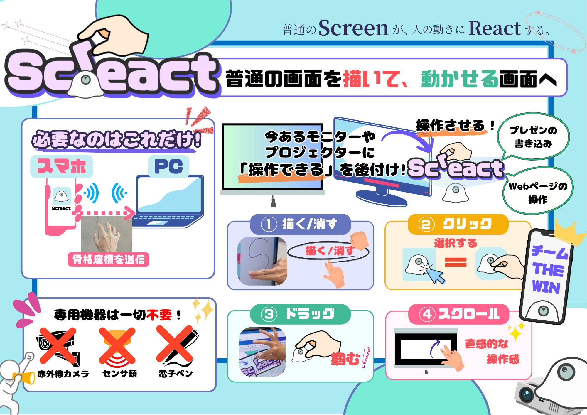
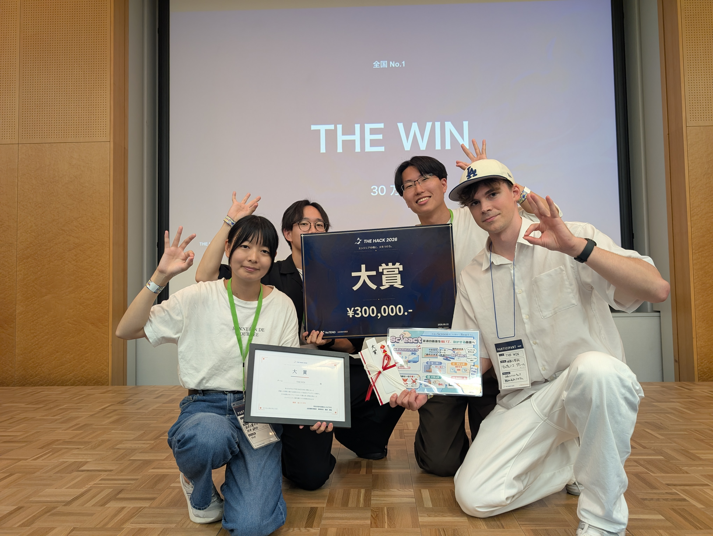
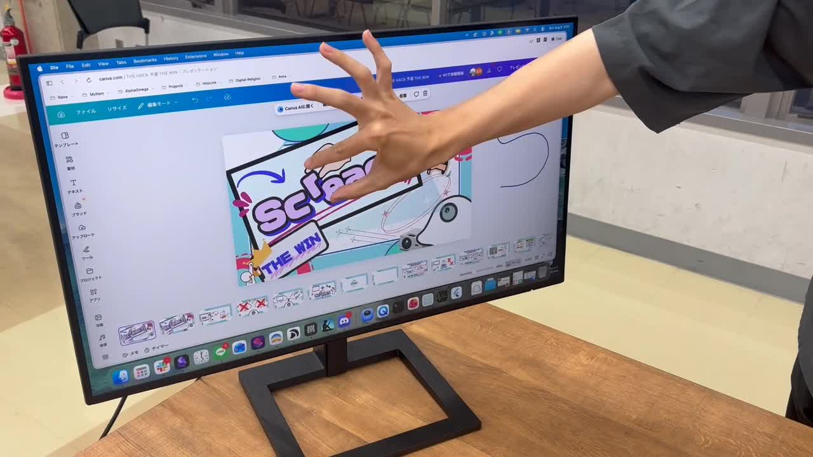
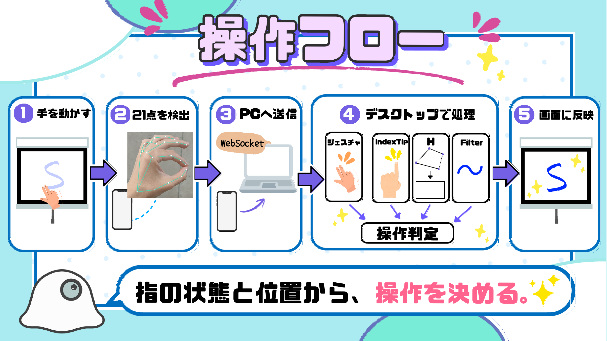
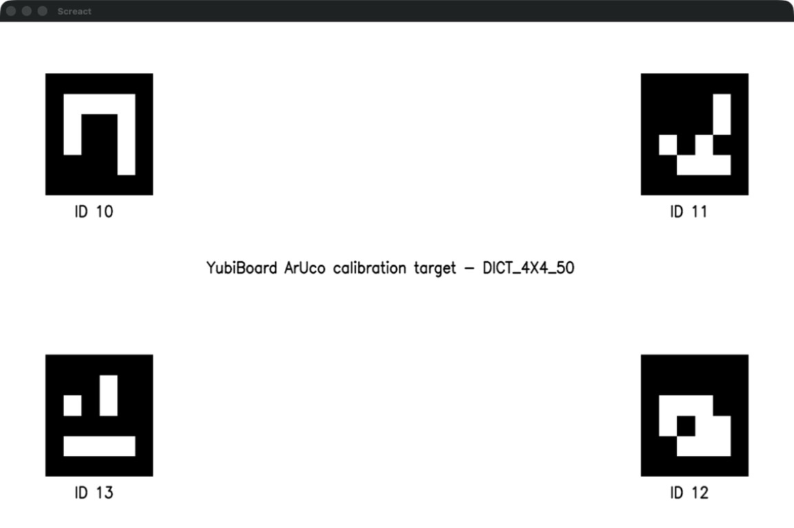
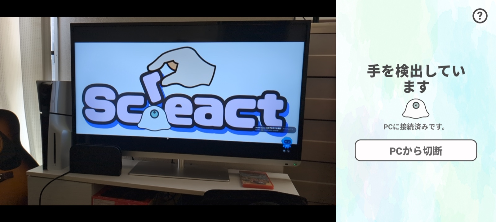

# Screact ギャラリー

**ただの画面を、描いて動かせる画面へ**。THE HACK 2026 本戦版の作品ビジュアル、実演、画面・処理の流れをまとめています。チーム Google Drive で共有されたチラシ、発表PDF、デモ動画から、READMEに適した素材を取り込みました。

## 作品ビジュアル

  

## 受賞

  
  
THE HACK 2026 本戦で大賞を受賞した THE WIN。

## Live Demo

  
  
<strong><a href="https://drive.google.com/file/d/14SZvVKVLxcpKkB3tEl41TTzPK-4H_XEj/view?usp=sharing">▶ Screactのデモを見る（Google Drive）</a></strong> 予選発表時に収録した約33秒のデモ。

## 処理の流れ

  
  
ただの画面を、描いて動かせる画面へ

## 実装画面

  
  

## 関連資料

- [システム仕様書](./README.md)
- [Android アプリ仕様書](./android-specification-v1.md)
- [Desktop アプリ仕様書](./desktop-specification-v1.md)
