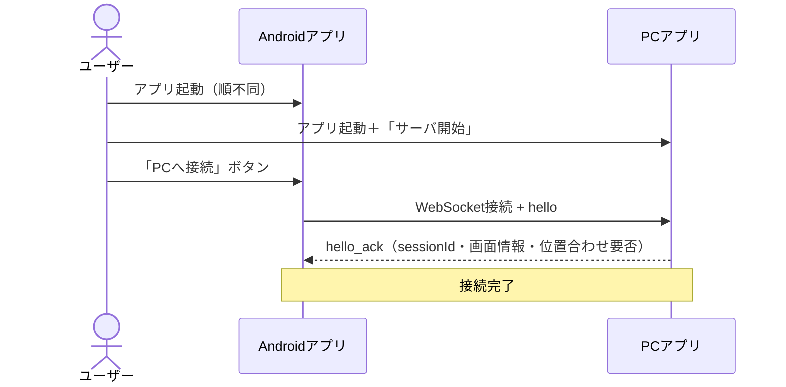
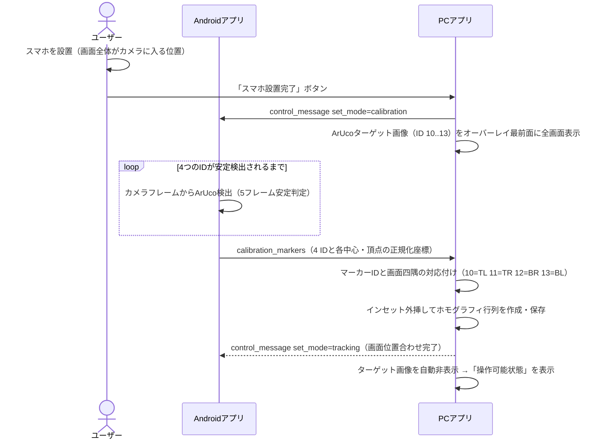
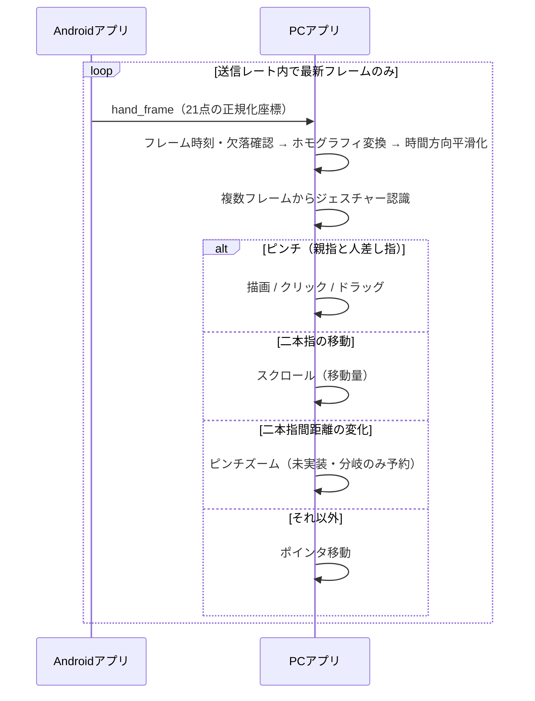

# アプリ全体フロー シーケンス図（チーム確定版）

起動と接続 → スマホの設置とキャリブレーション（画面位置合わせ） → 通常操作、の全体シーケンス。プロトコルの詳細は `android-protocol-v1.md`。

## 1. 起動と接続

```mermaid
sequenceDiagram
    actor U as ユーザー
    participant A as Androidアプリ
    participant P as PCアプリ

    U->>A: アプリ起動（順不同）
    U->>P: アプリ起動＋「サーバ開始」
    U->>A: 「PCへ接続」ボタン
    A->>P: WebSocket接続 + hello
    P-->>A: hello_ack（sessionId・画面情報・位置合わせ要否）
    Note over A,P: 接続完了
```

## 2. スマホの設置とキャリブレーション（画面位置合わせモード）

```mermaid
sequenceDiagram
    actor U as ユーザー
    participant A as Androidアプリ
    participant P as PCアプリ

    U->>U: スマホを設置（画面全体がカメラに入る位置）
    U->>P: 「スマホ設置完了」ボタン
    P->>A: control_message set_mode=calibration
    P->>P: ArUcoターゲット画像（ID 10..13）をオーバーレイ最前面に全画面表示
    loop 4つのIDが安定検出されるまで
        A->>A: カメラフレームからArUco検出（5フレーム安定判定）
    end
    A->>P: calibration_markers（4 IDと各中心・頂点の正規化座標）
    P->>P: マーカーIDと画面四隅の対応付け（10=TL 11=TR 12=BR 13=BL）
    P->>P: インセット外挿してホモグラフィ行列を作成・保存
    P-->>A: control_message set_mode=tracking（画面位置合わせ完了）
    P->>P: ターゲット画像を自動非表示 →「操作可能状態」を表示
```

## 3. 通常操作（トラッキング → ジェスチャー）

```mermaid
sequenceDiagram
    participant A as Androidアプリ
    participant P as PCアプリ

    loop 送信レート内で最新フレームのみ
        A->>P: hand_frame（21点の正規化座標）
        P->>P: フレーム時刻・欠落確認 → ホモグラフィ変換 → 時間方向平滑化
        P->>P: 複数フレームからジェスチャー認識
        alt ピンチ（親指と人差し指）
            P->>P: 描画 / クリック / ドラッグ
        else 二本指の移動
            P->>P: スクロール（移動量）
        else 二本指間距離の変化
            P->>P: ピンチズーム（未実装・分岐のみ予約）
        else それ以外
            P->>P: ポインタ移動
        end
    end
```
