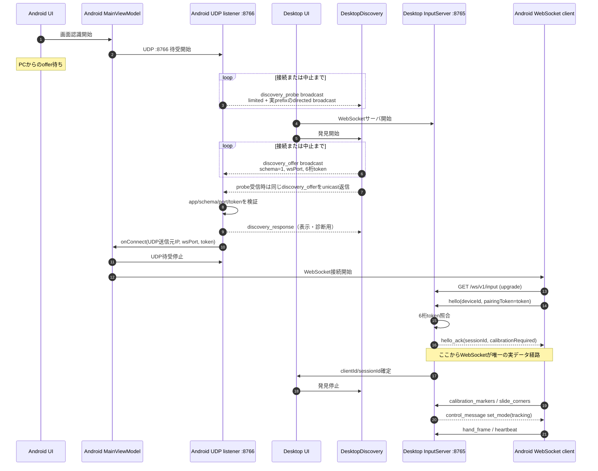

# ゼロコンフィグ・ペアリング シーケンス（実装準拠）

この文書は、Screact の現行ペアリング実装を説明する正本です。

対象コード:

- Desktop: `desktop/lib/net/discovery.dart` / `desktop/lib/net/input_server.dart` / `desktop/lib/ui/pairing_controller.dart` / `desktop/lib/ui/home_page.dart`
- Android: `network/DesktopDiscoveryListener.kt` / `network/DiscoveryProtocol.kt` / `network/YubiBoardWebSocketClient.kt` / `MainViewModel.kt`

## 通信経路と役割

| 経路 | 既定値 | 役割 |
|---|---:|---|
| UDP | `:8766` | PCの所在と接続情報をAndroidへ知らせる発見専用 |
| WebSocket over TCP | `:8765/ws/v1/input` | 認証、セッション確立、位置合わせ、手指骨格、制御メッセージ |

UDPで手指骨格や操作データは送りません。実データはすべて既存のWebSocket経路を使います。

### 現行UDPメッセージ

| messageType | 方向 | 用途 |
|---|---|---|
| `discovery_probe` | Android → UDP broadcast | Desktopへ既存形式のofferをユニキャスト返信するよう要求する |
| `discovery_offer` | Desktop → UDP broadcast / unicast | `wsPort`と6桁`token`を広告する |
| `discovery_response` | Android → Desktop unicast | 端末情報をPCのログ・発見表示へ返す。接続成立には必須でない |
| `discovery_select` | Desktop → Android | legacy互換。現行フローでは接続トリガに使わない |
| `discovery_select_ack` | Android → Desktop | legacy互換。現行フローでは接続成立条件に使わない |

すべてUTF-8 JSONで、`app: "screact"`、`schemaVersion: 1`、
既知の`messageType`を必要とします。`discovery_offer`とlegacy
`discovery_select`の`wsPort`は1〜65535、`token`は6桁のASCII数字だけを
受理します。Androidは接続先ホストとしてoffer本文の`ip`よりUDP送信元IPを優先します。

## 正常系



`discovery_response`が失われても、Androidは有効なofferを受信済みならWebSocket接続を
開始します。PC側の完了条件はresponseやselect ACKではなく、有効な`hello`を受けて
`sessionId`を確立したことです。

## 複数端末と first socket wins

同じLANで複数のAndroidが待受中の場合、全端末が同じofferを受け取り、PCのWebSocketへ
接続を試みる可能性があります。現行`InputServer`は単一端末用です。

1. 最初に到着したWebSocketが接続枠を確保する。
2. 後着WebSocketは既存接続を置き換えない。
3. 後着側へ`hello_error`（`code: "server_busy"`、
   `retryable: true`）を返して切断する。
4. 拒否側や古いソケットの遅延`onDone`は、現在のsocket/sessionを消さない。
5. 現行ソケットが閉じるかサーバを停止すると、client/session状態を消去して枠を解放する。

このため、AirDrop風の複数端末選択UIは現行の接続保証ではありません。接続端末を
確実に決めたい場合は、接続させる1台だけでAndroidの「画面認識開始」を押してください。

## 画面状態とタイムアウト

### Android

| 状態 | トリガ |
|---|---|
| 接続開始待ち | 初期状態 |
| PC検出待ち | 「画面認識開始」でUDP :8766をbind |
| 接続中 | 有効なofferを受信し、AndroidからWebSocketを開始 |
| 位置合わせ | `hello_ack.calibrationRequired == true` |
| 操作可能 | PCから`set_mode(tracking)`を受信 |
| 再接続 | 確立済みWebSocketが切断し、クライアントの再試行状態機械が作動 |

### Desktop

| 状態 | トリガ |
|---|---|
| 待機 | サーバ・発見の開始前 |
| 検索中 | WebSocket待受とUDP offer送信を開始 |
| 接続済み | 有効なWebSocket `hello`を受理 |
| タイムアウト | 規定時間内に接続が成立しない |
| 操作可能 | 位置合わせ完了後にtrackingへ移行 |

検索中はキャンセルできます。タイムアウトした場合は次を順に確認します。

1. PCとAndroidが同じWi-Fi/LANにいる。
2. Android側で先に「画面認識開始」を押し、UDP待受状態にしている。
3. macOSのローカルネットワーク許可、OSファイアウォール、AP isolationを確認する。
4. 再試行しても発見できない場合は、PCのIP・WebSocketポート（既定8765）・6桁コードを
   Androidへ入力する手動接続へ切り替える。

手動接続もAndroidからPCのWebSocketへ接続するため、UDP発見そのものは不要です。

## macOSローカルネットワーク権限

現行フローはPCからAndroidへの`discovery_select`ユニキャストを必須経路から外しました。
ただし、自動発見にはPCからの`discovery_offer`またはAndroidからの`discovery_probe`の
少なくとも一方向のbroadcast到達が必要です。したがって
「接続方向を変えたのでmacOSのローカルネットワーク権限に完全非依存」という説明は
正しくありません。

- offer broadcastが許可・到達する環境では、Androidは自分からWebSocketを張れるため
  select到達問題を回避できます。
- macOSがoffer broadcastを抑止してもprobeが届けばユニキャストofferで補完できます。
  LAN向け送受信全体が抑止される場合は自動発見できません。
- アプリは`NSLocalNetworkUsageDescription`を宣言し、「始める」で実際にofferを
  送る時にmacOSの許可導線を出しますが、許可状態やAP設定は実行環境に依存します。
- UDP自動発見が利用できない場合は手動接続を使用します。

過去の調査では環境ごとに「broadcastは届くがunicast selectは届かない」と
「LAN向け送信全体が制限される」という異なる観測がありました。現行仕様は特定の
TCC挙動を保証として扱わず、offer失敗時にタイムアウトと手動フォールバックを提供します。

## WindowsとiPhoneテザリング

WindowsではiPhoneのWi-FiテザリングとApple Mobile Device Ethernetが同じ
`172.20.10.0/28`へ同時接続されることがあります。Desktopはoffer送信用UDP socketを
画面に表示したWi-Fi IPv4へbindし、limited broadcastがUSB側へ誤配送されることを
避けます。Wi-Fi IPv4へbindできない場合だけ`0.0.0.0`へフォールバックします。

この対策は送信インターフェースの選択と補助broadcast宛先だけを限定的に変えます。
iPhoneテザリングの`172.20.10.0/28`ではdirected broadcast `172.20.10.15`も併送します。
UDPメッセージ、ポート、認証、WebSocket経路は変更しません。

Android側のprobeは特定のiPhoneアドレスをハードコードせず、接続中ネットワークの
IPv4アドレスとprefix lengthからdirected broadcastを算出します。これにより通常の
`/24` LAN、`/20`等の異なる構成、iPhoneテザリングの`/28`を同じ経路で扱い、limited
broadcastと従来のDesktop発offerも残して後方互換を保ちます。

## legacy select / ACK

`discovery_select`、`discovery_select_ack`、select再送APIとその回帰テストは、
旧Androidとのプロトコル互換のためコードに残しています。現行Androidはoffer受信時に
接続を開始し、通常は直後にUDP listenerを停止します。そのため、次の機能を現行UXの
接続保証として扱ってはいけません。

- responseを2秒集約してAirDrop風UIで1台を選ぶ
- selectを受信した端末だけがWebSocketへ接続する
- select ACKを受信するまで接続成立を待つ
- select再送失敗を現行接続失敗の判定にする

新規実装・テストでは、`offer → Android発WebSocket → hello → hello_ack`を正規経路とし、
legacy select/ACKは互換試験に限定します。

## 既知の制約

- UDP broadcastはルータ、企業Wi-Fi、ゲストネットワーク、VPN、OS権限で遮断され得る。
- Desktop発offerの旧補助宛先はiPhoneテザリング以外では`/24`を仮定するが、Android発
  probeは実prefixからdirected broadcastを求める。
- 6桁tokenは同一LANへbroadcastされるため、高機密な認証方式ではない。
- PCは単一WebSocket端末のみを受理し、AirDrop風の事前選択は行わない。
- 自動発見失敗時は手動接続が必要。

## iPhoneテザリング実機の反復結果（2026-08-22）

WindowsとXiaomi 25118PC98GをiPhoneテザリングへ接続し、debug専用の無操作ハーネスで
Android先行5回、Desktop先行5回を実行した。双方向UDP探索の導入前は6/10成功だったが、
導入後は10/10成功し、offer受信から`hello_ack`までは135〜610ms、
`hello_ack_timeout`は0回だった。初回の自動発見はこの環境の反復合格とする。

Desktopが認証後12秒間メッセージを受信しない半開き接続を安全解除する変更後、Wi-Fi無効化・
再有効化からの無操作復帰は3/3成功した。既定ネットワーク復帰から`hello_ack`までは
11.167〜16.244秒だった。各試行で旧枠解放前の接続試行に`hello_ack_timeout`が1回、
WebSocket失敗が2〜3回あったが、Androidの再試行で30秒以内に復帰した。同じbuildで行った
初回接続の短縮回帰はAndroid先行2回・Desktop先行2回の4/4成功、offer受信から
`hello_ack`は160〜257msだった。デモ時のフォールバックは引き続き手動IP・ポート・6桁コード入力とする。

## 回帰テスト

- Desktop codec: probe、app/schema、port、6桁token、legacy select/ACK
- Desktop UDP: probe→unicast offer、offer/response、重複排除、start/stop世代競合、legacy select再送/ACK
- Desktop WebSocket: pairing token、first socket wins、server_busy、socket identity guard、heartbeat timeoutと次接続受理
- Desktop E2E: `offer → Android自発WS → hello_ack`
- Android codec/listener: 実prefix broadcast計算、probe→offer往復、offer受信、response返信、offer駆動`onConnect`、legacy select ACK

実行例:

```bash
cd desktop
flutter test test/discovery_test.dart test/connection_info_test.dart test/pairing_e2e_test.dart
```
