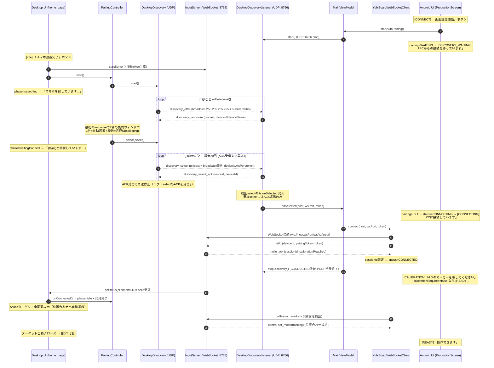

# ゼロコンフィグ・ペアリング シーケンス（実装準拠）

対象コード:

- Desktop: `desktop/lib/net/discovery.dart` / `desktop/lib/ui/pairing_controller.dart` / `desktop/lib/ui/home_page.dart` / `desktop/lib/net/input_server.dart`
- Android: `android/.../network/DesktopDiscoveryListener.kt` / `network/DiscoveryProtocol.kt` / `network/YubiBoardWebSocketClient.kt` / `MainViewModel.kt` / `ui/ProductionModels.kt`

## 目次

- [全体シーケンス](#全体シーケンス)
- [画面遷移のトリガ一覧](#画面遷移のトリガ一覧)
- [実機で起きた不具合と対策（select ACK）](#実機で起きた不具合と対策select-ack)

## 全体シーケンス

## 画面遷移のトリガ一覧

### Desktop（`PairingPhase` × `_step`）

| 画面 | 遷移するトリガ |
|---|---|
| idle「スマホを設置したら…」 | 初期状態 |
| searching「スマホを探しています…」 | 「スマホ設置完了」押下（`_startAutoPairing` → `PairingController.start`） |
| selecting（AirDrop風選択UI） | 集約ウィンドウ(2秒)終了時に応答が2台以上 |
| waitingConnect「(名前)と接続しています…」 | `selectDevice`（1台なら自動選択） |
| ArUco表示（位置合わせ） | **hello受領**（`ServerStatus.clientId` が null→非null、`_onServerStatus`） |
| 操作可能 | 位置合わせ成功＋trackingモード（`_step == 4`） |
| timeout「見つかりませんでした」 | 15秒間 応答ゼロ |

### Android（`ProductionStage`）

| 画面 | 遷移するトリガ |
|---|---|
| CONNECT「画面認識をはじめましょう」 | 初期状態（DISCONNECTED × pairing=IDLE） |
| DISCOVERY_WAITING「PCからの接続を待っています」 | 「画面認識開始」押下（pairing=WAITING） |
| CONNECTING「PCに接続しています」 | **discovery_select受信**（`onSelected` → `connect` → status=CONNECTING/AWAITING_ACK） |
| CALIBRATION「4つのマーカーを映して…」 | **hello_ack受信**（status=CONNECTED × calibrationRequired=true → CaptureMode.CALIBRATION） |
| READY「操作できます」 | set_mode(tracking) 受信（位置合わせ完了）または calibrationRequired=false |
| RECONNECTING | WS切断/接続失敗（status=RECONNECTING） |

## 実機で起きた不具合と対策（select ACK）

### 事象（2026-08 実機テスト）

- PC側はAndroidを認識（discovery_response 受信・「接続しています…」表示）
- Android側は「PCからの接続を待っています」のまま進まない

### 原因

両者の「認識」条件が非対称で、Android側の遷移が **discovery_select の到達だけ** に依存していた。

- PCの認識 = response 受信。offer は毎秒ブロードキャストされ続けるため、応答経路はロストしてもすぐ回復する。
- Androidの遷移 = select 受信。旧実装では select を **240msの間に3回だけ** ユニキャスト送信して打ち切り（到達確認なし・再送なし）。さらに select 送信と同時に offer も停止するため、この3パケットがWi-Fi上で失われると **PC→Android方向のUDPは二度と流れず**、Androidは待受のまま・PCは接続待ちのまま双方永久に停止する。

### 対策1（ACK＋再送: 2026-08-08 第1修正）

1. `discovery_select_ack`（Android→PC ユニキャスト）を追加。
2. PCは **ACKを受信するまで select を300ms間隔で最大20回（約6秒）再送**。ACK受信・打ち切りは接続ログに出る。
3. Androidは select を受けるたび（再送の重複分にも）ACKを返す。自動接続の開始は初回のみ。
4. Androidの待受は select 受信では止めず、WSが決着（CONNECTED/DISCONNECTED/ERROR）した時点で終了する（初回ACKロスト時も再送selectにACKを返せる）。
5. 診断ログ: Android は logcat タグ `YubiBoardDiag` に `select_ack_sent` / `selected` イベント、PCは接続ログに「select送信(n回目)」「selectのACKを受信」を出す。

### 実ログでの真因確定（2026-08-08 再テスト）

ACK＋再送でも同症状のため実機ログを採取した結果:

- Macログ: 「スマホ発見: 25118PC98G (192.168.17.211)」→「select送信 (1〜20回目) → 192.168.17.211:8766」→「selectのACKなし（20回送信）」。offer（ブロードキャスト）とresponse（電話→Macユニキャスト）は毎回成立、**Mac→電話のユニキャストだけが20回全滅**。
- Mac→電話は ping(ICMP) 成功・ARP解決済み（経路は正常）。一方、ターミナルからの UDP LAN ユニキャストは `errno 65 (No route to host)`。
- `/Library/Preferences/com.apple.networkextension.plist` の `com.nxtend.thewin.thehackOverlay` エントリが `DenyMulticast=true / MulticastPreferenceSet=false` = **macOS「ローカルネットワーク」権限が未許可**。

**真因: macOSのローカルネットワーク権限が未許可のため、アプリの LAN 宛てユニキャスト送信（select）だけがOSに落とされる**（現行macOSの挙動ではブロードキャストは通るため offer は届き、発見だけ成功する非対称が生じる）。

### 対策2（select のブロードキャスト併送: 2026-08-08 第2修正）

1. PCは select を「応答送信元へのユニキャスト」に加えて **offerと同じブロードキャスト宛にも毎回併送**する。ユニキャストが権限/APに落とされる環境でもoffer が届く経路で select も届く。deviceId 照合により選択した1台しか反応せず、token は元々 offer で全端末に届く情報のため露出は増えない。
2. ACK不達で打ち切った場合は、PCの接続待ち画面に **「システム設定 > プライバシーとセキュリティ > ローカルネットワークで Screact を許可」** の対処案内を表示する（恒久対処は権限の許可）。
