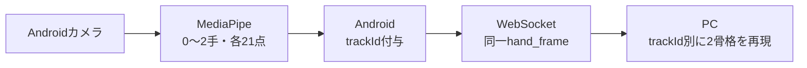

# 2人同時操作・最大2手連携 共有シート

> Android担当とPC担当はこの1枚を共有する。通信の正本は[Android通信プロトコル v1](./android/android-protocol-v1.md)。

## 完成形と担当



| Android | PC |
| --- | --- |
| `numHands=2`、21点検証 | `hands`を0〜2件として検証 |
| 手のひら中心距離で`trackId`付与 | `(sessionId, trackId)`ごとに状態保持 |
| x/yクランプ、最大20fps、最新フレーム優先 | Homography、平滑化、ジェスチャー、表示 |
| 欠落した手をそのフレームから即時除外 | 消えたIDだけ押下・描画状態を解除 |

`trackId`はAndroidで付ける。ネットワーク間引き前の検出結果を使えるため、PCで再推定するより安定する。処理量は最大2手の全組合せだけで、MediaPipe推論に比べて無視できる。人物IDや左右IDではない。

## 接続時

```json
{
  "schemaVersion": 1,
  "messageType": "hello",
  "deviceId": "android-a1b2c3d4",
  "client": "yubiboard-android",
  "clientVersion": "0.1.0",
  "pairingToken": "123456",
  "interactionProfile": "two_users_two_active_hands",
  "maxHands": 2,
  "coordinateSpace": "normalized_camera",
  "capabilities": [
    "aruco_calibration", "hand_landmarks_21", "multi_hand_landmarks_21",
    "stable_hand_track_id", "calibration_status", "hello_error", "trusted_reconnect"
  ]
}
```

2手対応PCは`hello_ack.acceptedInteractionProfile="two_users_two_active_hands"`を返す。フィールドがない旧PCでも接続を継続し、Androidは「PCは1手互換モード」と表示する。

## 通常フレーム

```json
{
  "schemaVersion": 1,
  "messageType": "hand_frame",
  "sessionId": "session-01",
  "frameId": 1842,
  "capturedAtMonotonicMs": 19384521,
  "source": {"width": 960, "height": 540, "rotationDegrees": 0, "rotationCorrected": true, "mirrorCorrected": true},
  "hands": [
    {
      "trackId": 7,
      "handedness": "LEFT",
      "handednessScore": 0.97,
      "coordinateSpace": "normalized_camera",
      "landmarkFormat": "mediapipe_hand_21",
      "landmarks": [
        [0.20,0.70,-0.01],[0.19,0.64,-0.01],[0.18,0.58,-0.02],[0.17,0.52,-0.02],[0.16,0.46,-0.03],
        [0.24,0.55,-0.01],[0.25,0.47,-0.02],[0.26,0.39,-0.03],[0.27,0.31,-0.04],
        [0.30,0.54,-0.01],[0.31,0.45,-0.02],[0.32,0.36,-0.03],[0.33,0.27,-0.04],
        [0.36,0.56,-0.01],[0.37,0.48,-0.02],[0.38,0.40,-0.03],[0.39,0.32,-0.04],
        [0.42,0.60,-0.01],[0.43,0.53,-0.02],[0.44,0.46,-0.03],[0.45,0.39,-0.04]
      ]
    },
    {
      "trackId": 12,
      "handedness": "RIGHT",
      "handednessScore": 0.95,
      "coordinateSpace": "normalized_camera",
      "landmarkFormat": "mediapipe_hand_21",
      "landmarks": [
        [0.80,0.70,-0.01],[0.81,0.64,-0.01],[0.82,0.58,-0.02],[0.83,0.52,-0.02],[0.84,0.46,-0.03],
        [0.76,0.55,-0.01],[0.75,0.47,-0.02],[0.74,0.39,-0.03],[0.73,0.31,-0.04],
        [0.70,0.54,-0.01],[0.69,0.45,-0.02],[0.68,0.36,-0.03],[0.67,0.27,-0.04],
        [0.64,0.56,-0.01],[0.63,0.48,-0.02],[0.62,0.40,-0.03],[0.61,0.32,-0.04],
        [0.58,0.60,-0.01],[0.57,0.53,-0.02],[0.56,0.46,-0.03],[0.55,0.39,-0.04]
      ]
    }
  ],
  "hand": {
    "detected": true,
    "handedness": "LEFT",
    "handednessScore": 0.97,
    "coordinateSpace": "normalized_camera",
    "landmarkFormat": "mediapipe_hand_21",
    "landmarks": [
      [0.20,0.70,-0.01],[0.19,0.64,-0.01],[0.18,0.58,-0.02],[0.17,0.52,-0.02],[0.16,0.46,-0.03],
      [0.24,0.55,-0.01],[0.25,0.47,-0.02],[0.26,0.39,-0.03],[0.27,0.31,-0.04],
      [0.30,0.54,-0.01],[0.31,0.45,-0.02],[0.32,0.36,-0.03],[0.33,0.27,-0.04],
      [0.36,0.56,-0.01],[0.37,0.48,-0.02],[0.38,0.40,-0.03],[0.39,0.32,-0.04],
      [0.42,0.60,-0.01],[0.43,0.53,-0.02],[0.44,0.46,-0.03],[0.45,0.39,-0.04]
    ]
  }
}
```

`hands`が正本で、旧PC用`hand`は最小`trackId`の完全コピー。0手では`hands: []`かつ`hand: {"detected": false}`となる。

## 確定ルールと完了条件

- 各手は正の一意な`trackId`、MediaPipe順の21個の`[x,y,z]`。x/yは0〜1、全値有限。
- Androidは`trackId`昇順で送るが、PCは配列順に意味を持たせない。
- 通常移動と300ms以内の欠落ではIDを維持。終了済みIDは同一アプリプロセスで再利用しない。
- フレーム内の一部だけが不正でも、PCとモックサーバーはフレーム全体を破棄する。
- 2手は同じ時刻・source・frameIdを共有し、手ごとに別送しない。
- Android完了はモックで2手各21点を連続10件以上、異なるID、検証エラー0、2色骨格MP4生成。最終統合は実Androidで同条件を確認する。

「2人」は利用シナリオであり、人物識別、1人の両手複合ジェスチャー、2本のOSカーソルは今回の対象外。
