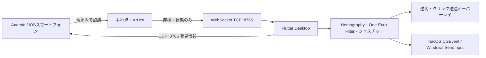

# Screact プロダクト・開発台帳

**基準日:** 2026-08-30 
**対象:** THE HACK 2026 Team 35「THE WIN」の作品 Screact（旧称 YubiBoard） 
**コード基準:** [移行前リポジトリ `NxTEND-THE-HACK/2026-Team-35`](https://github.com/NxTEND-THE-HACK/2026-Team-35) の最終取り込みコミット `4f2d1e5`（2026-08-22 04:49 JST） 
**現行リポジトリ:** `KIT-DevelopersHub/screact` のローカル `main`。本台帳更新時点の `HEAD` は `4f2d1e5`。 
**目的:** プロダクトの背景・意思決定・開発経緯・検証事実・現在の到達点を、将来の開発者が実装状況と混同せず参照できるように残す。

---

## 1. この台帳の読み方

本書は実装仕様の唯一の正本ではない。通信の厳密な JSON 契約は [通信仕様書 v1](../../../protocol-specification-v1.md)、補助的な接続シーケンスは [ゼロコンフィグ・ペアリング](../../architecture/pairing.md)、2手の契約は [2人同時操作・最大2手連携シート](../../architecture/two-person-two-hand-integration-sheet.md)、コードの現状は各ソースとテストを優先する。

本書では、根拠の強さを次の4段階に分ける。

| 表記 | 意味 |
| --- | --- |
| **実装済み（コード確認）** | 基準コミットのソースとテストに存在する。実機での動作までは意味しない。 |
| **実機確認済み** | Codex 作業履歴またはリポジトリ内の検証記録に、環境・結果が残る。環境依存の再現性を保証しない。 |
| **設計済み・未実装** | 設計書・コーデック・UI 部品などはあるが、端から端までの利用経路は存在しない。 |
| **将来課題** | 価値仮説または改善案。実装済みとして扱わない。 |

特に、次の混同を禁止する。

- QR ペイロードを作れることと、Android/iOS が QR を読み取って接続できること。
- iOS のソースが存在することと、iPhone 実機でデモ済みであること。
- 2手の骨格・オーバーレイ処理と、2人が独立した OS カーソルを操作できること。
- テスト成功と、照明・設置・Wi-Fi が異なる会場での動作保証。
- THE HACK 本戦時に動いたデモと、後から `main` に入った機能。

### 調査範囲と限界

更新時に確認した一次資料は、現行ローカル Git の全172コミット、残るマージコミット、現行ソースとテスト、リポジトリ内の実機記録、Screact 作業ディレクトリを対象とする Codex 履歴41セッション、及び認証済み `gh` による旧privateリポジトリの全PR一覧・主要PR本文・差分情報である。通常のWeb取得では旧 GitHub URL が 404 となるが、`gh` では `NxTEND-THE-HACK/2026-Team-35` をprivateリポジトリとして参照できる。PRの事実はGitHub APIの結果を優先し、ローカルのmerge commitと照合した。

Codex 履歴には、計画段階の案や一時的な評価も含まれる。本台帳は、最終的に基準コミットへ入った内容、または明示的な実機結果だけを事実として採用した。性能値は記録された特定環境の観測値であり、一般的な性能主張には使わない。

---

## 2. 作品の基本情報

| 項目 | 内容 |
| --- | --- |
| 作品名 | Screact |
| 旧称・内部識別子 | YubiBoard。package ID、MethodChannel、ソースパス等に `yubiboard` が残る。表示名だけを一括置換してはいない。 |
| 名称の意味 | `Screen + React`。通常は表示するだけの Screen が人の動きに React する、という表現で説明した。 |
| チーム | THE WIN |
| THE HACK 2026 チーム番号 | 35 |
| メンバー | 久米蒼輝、マルチェンコ・ダニール、高岡己太朗、松本絆那 |
| 開発人数 | 4名 |
| 予選 | 2026-08-09、オンラインブロック第1位通過 |
| 本戦 | 2026-08-22、大阪産業創造館 |
| 本戦結果 | 大賞（賞金30万円） |

チーム結成は、高岡から久米への参加の誘いを起点に、勝てる4人で大賞を狙う意図でメンバーを集めたものと記録されている。チーム名「THE WIN」もこの意思を表す。

---

## 3. プロダクトの核

### 3.1 一文での説明

> **今ある画面に、指で「操作できる」を後付けする。**

本戦で用いた中心表現は「画面を、買い替えない。『操作できる』を、後付けする。」である。Screact は新しいタッチディスプレイや専用センサーを売る製品ではなく、既存の PC・表示装置・スマートフォンを使い、説明者が画面の前に立ったまま操作できる体験を作る試作である。

### 3.2 解きたい課題

授業・発表では、説明する位置はスクリーンの前、操作する位置は PC の前に分かれやすい。スライド送り、ブラウザ操作、書き込みのたびに PC へ戻ることが、説明とコミュニケーションの流れを途切れさせる。アイデアの出発点は「プレゼン中に画面の前でそのまま操作できたらよい」であった。

価値の中心は「非接触」「AI」「手認識」自体ではない。手の21点を認識するだけでは、画面座標への対応、揺れの抑制、操作意思の判定、OS・オーバーレイへの反映、接続、復旧を解かなければ使える操作にならない。Screact の技術的な価値は、これらを一つの利用経路へ統合した点にある。

### 3.3 設計思想

1. **既存設備を活用する。** 特殊カメラ、赤外線センサー、電子ペンを必須にしない。
2. **スマートフォンは「目」、PC は操作の頭脳。** 端末側で画面・手を認識し、PC 側で座標変換、ジェスチャー、描画、OS入力を扱う。カメラ映像をPCへ常時送らない。
3. **物理接触の推定を無理にしない。** 単眼カメラで画面接触を安定判定する代わりに、ピンチ等の意図的ジェスチャーを操作へ割り当てる。
4. **設置自由度を優先する。** スマートフォンを正面中央に固定する前提ではなく、ArUco と Homography で斜めから見た画面を対応付ける。
5. **操作感を実装対象にする。** One-Euro Filter、状態機械、最新フレーム優先、手喪失時の解除を、見栄えではなく安全性と操作感のために扱う。
6. **設定の面倒さも本体機能として扱う。** IP手入力、複数画面、複雑な位置合わせが毎回必要なら日常では使われないため、自動発見・自動接続・状態案内・手動フォールバックを重視した。

### 3.4 発表設計との区別

プロダクトは実利用を想定して設計し、発表は THE HACK の短時間審査とブース展示に最適化した。接続を簡単にした理由は発表時間を短縮するためだけではなく、普段使いで設定が摩擦になるためである。一方、キャッチコピー、5分内の説明順、動画デモ、名前の回収はプレゼン設計である。この二つを因果関係として取り違えない。

---

## 4. 基準コミット時点のシステム

### 4.1 責任分担

| 領域 | 実装済みの責務 |
| --- | --- |
| Android | CameraX で背面カメラを取得し、MediaPipe Hand Landmarker と OpenCV ArUco で検出。最大2手・各21点、画面位置合わせ用マーカーを WebSocket へ送る。 |
| iOS | SwiftUI/AVFoundation、Bonjour、WebSocketクライアントのコードがある。手・ArUco検出のロジックも移植されているが、基準コミットではMediaPipe/OpenCV依存が未リンクのため検出経路は有効でない。 |
| Desktop 共通層 | Flutter/Dart。WebSocket サーバ、UDP discovery、座標変換、平滑化、手ごとのジェスチャー状態、描画モデル、UI を担当。 |
| macOS | Swift ネイティブ層で透明・最前面・クリック透過オーバーレイ、CGEvent による OS 入力、Bonjour 広告を担当。 |
| Windows | Win32/C++ 層で透明・最前面・クリック透過オーバーレイ、`SendInput` による OS 入力を担当。 |

### 4.2 位置合わせと座標処理

- ディスプレイ四隅に `DICT_4X4_50` の ArUco ID 10, 11, 12, 13 を表示する。
- Android/iOS がマーカーを検出し、安定した結果を送る。
- PC が対応点から Homography を生成し、カメラ正規化座標を表示面座標へ写像する。
- One-Euro Filter で静止時の細かな揺れを抑えつつ、速い手の動きへの追従遅延を抑える。
- カメラやスマートフォンが動けば補正は崩れる。再位置合わせは用意されているが、任意の移動を自動追従する機能ではない。

### 4.3 データ量と最新フレーム優先

映像ではなく座標と状態だけを送る。Androidは最大20fpsで最新結果を優先し、PCも古いフレームを操作に使わない。これは帯域削減だけでなく、古い操作があとから反映されることを避ける設計である。認識・通信・描画のどれかが詰まったときに全フレームを必ず処理する方式ではない。

---

## 5. 接続・認証・フォールバックの現状

### 5.1 正規経路（実装済み・実機確認あり）

1. Androidで「画面認識開始」を押すと UDP `:8766` を待ち受け、probeも送る。
2. Desktopで「始める」を押すと WebSocket `:8765/ws/v1/input` を待ち受け、`discovery_offer` を広告する。
3. Androidは有効な offer を受信すると、offerの送信元IPを優先して Desktop へ WebSocket を張る。
4. Androidは `hello(deviceId, pairingToken)` を送る。Desktopが6桁コードを照合し、`hello_ack(sessionId, calibrationRequired)` を返す。
5. 位置合わせ完了後に Desktop が `set_mode(tracking)` を送り、手フレーム送信を開始する。

UDPは発見専用であり、手フレームや操作データを流さない。現行の成立条件は `offer → Android発WebSocket → hello → hello_ack` である。旧 `discovery_select` / `discovery_select_ack` は互換のため残っているが、現行UXの接続保証ではない。

### 5.2 認証と再接続

- 初回は Desktop が表示する6桁 `pairingToken` を `hello` で照合する。
- 信頼済み端末の再接続では `resumeToken` を用いる実装がある。Android は Keystore を使い、iOS は Keychain を使う構成である。
- Desktop は同時に1つの WebSocket だけを受理する。複数端末が待機している場合は先着が接続し、後着は `server_busy` で拒否される。
- 切断、手喪失、古いフレーム、無効なセッション時は、押下・ドラッグ・描画を安全に解除する。

6桁コードと LAN 内 WebSocket は、信頼できるローカルネットワークでの試作利用を前提とする。高機密な認証・暗号化・インターネット越しの接続を提供するものではない。

### 5.3 手動接続（実装済み）

UDPが使えないとき、Androidは Desktop に表示されたIP、ポート（既定8765）、6桁コードを手入力して WebSocket 接続できる。AP isolation、ゲストWi-Fi、VPN、OSファイアウォール、macOSのローカルネットワーク権限などにより UDP broadcast が届かない場合の、現時点で利用可能なフォールバックはこの手動接続である。

### 5.4 QR とリレーの正確な状態

| 項目 | 状態 | 正しい説明 |
| --- | --- | --- |
| `screact://pair?...` URI codec | **実装済み** | DesktopはLAN host/port/tokenを持つペイロードを生成・検証できる。`relay`/`room`フィールドを表現できる。 |
| Desktop QR表示 | **実装済み** | UDP発見タイムアウト時に、LAN接続情報のQRを表示するUIがある。 |
| Android/iOS のQR読取・URIからの接続 | **未実装** | 基準コミットにはQRスキャナ／ペイロード読取から接続までの経路がない。Androidの実装候補PR #38はopenだが、ビルド・単体テスト・実機E2Eが未実施のまま未マージである。QR表示だけで自動フォールバックが完結するわけではない。 |
| LAN非依存リレー | **未実装** | [接続・認証ロードマップ](../../planning/connection-auth-roadmap.md) と payload の受け皿はあるが、Cloudflare Workers等のリレー、room作成、モバイル接続は存在しない。 |

### 5.5 iPhoneテザリング対策と記録済み結果

PR #46で、Windows+iPhoneテザリングの `172.20.10.0/28` と USB Ethernet が競合しやすい問題に対処した。DesktopはWi-Fi IPv4へのbindを優先し、`172.20.10.15` のdirected broadcastも併送する。Androidのprobeは接続中ネットワークのprefixからdirected broadcastを計算する。

2026-08-22の記録では、WindowsとXiaomi 25118PC98GをiPhoneテザリングへ接続し、双方向 UDP探索導入前は初回自動接続6/10、導入後は10/10成功した。導入後のoffer受信から`hello_ack`までは135〜610ms、`hello_ack_timeout`は0回だった。同じビルドでWi-Fi無効化・再有効化後の無操作復帰は3/3成功し、通常Wi-Fi `/24` でもAndroid先行・Desktop先行の初回接続2/2成功（241〜309ms）を記録した。これは当該端末・ネットワークでの反復結果であり、あらゆるネットワークでの保証ではない。

---

## 6. 操作機能の現状

### 6.1 ジェスチャーと出力

| 入力 | Desktopでの処理 | 状態 |
| --- | --- | --- |
| 人差し指の移動 | ポインター移動 | 実装済み |
| 親指＋人差し指のピンチ | クリック。継続移動でドラッグ | 実装済み |
| 人差し指＋中指の描画形状 | 透明オーバーレイへの描画 | 実装済み |
| グー | カーソル近傍のインクを消去 | 実装済み。PR #35は一度revertされたが、PR #50で実装が再導入された。 |
| グッドサイン | スクロール。方向に応じ縦・横へ変換 | 実装済み（PR #49） |
| 色選択 | 4色のパレットで新規ストローク色を選択 | 実装済み（PR #50） |
| 骨格表示 | 表示ON/OFFを設定として保持 | 実装済み、既定OFF |
| 拡大・縮小 | 未実装 | 予約分岐や説明が残っていても機能として扱わない。 |

PR #49で、従来の二本指スクロールはグッドサインスクロールへ置き換えられた。ジェスチャーは相互排他で、グー、スクロール、描画、押下などが同時に副作用を出さないよう状態機械で扱う。PR #49では、消しゴム・スクロールの個別有効/無効設定、グッドサインのスクロール、競合防止のテストが追加された。

### 6.2 オーバーレイとOS入力

- 校正後、macOS/Windowsでは透明・最前面・クリック透過のオーバーレイへ入る。
- 背後のブラウザ、PDF、スライド等に描画を重ねる。専用キャンバスだけを操作する方式ではない。
- macOSはCGEvent、Windowsは`SendInput`を使うネイティブ入力経路をコードに持つ。
- 主OS入力は1本の主トラックに限られる。最大2手の表示・描画状態と、2本の独立したOSカーソルは別機能である。
- オーバーレイ解除はmacOSではメニューバーまたは `⌘⇧O`、Windowsでは `Ctrl+Shift+O`。切断・停止時にも解除する。

Windows実入力はかつて未実装だったが、PR #28で`SendInput`実装が `main` へ取り込まれた。さらに2026-08-21のWindows＋Android実機では、描画、クリック/ドラッグ、消しゴム、スクロールを確認済みと記録されている。ただし、この結果は特定のWindows環境での確認であり、署名・権限・アプリ種別・対象OSの全組合せを保証するものではない。

### 6.3 最大2手・複数人

**実装済み（コード確認）**

- Androidは1手/2手モードを切り替えられ、既定はデモ安定性を優先する1手モード。
- 2手モードでは最大2手・各21点を同じ `hand_frame.hands` で送る。Androidが `trackId` を付与する。
- Desktopは `(sessionId, trackId)` ごとに平滑化、ジェスチャー、描画、解除状態を分離する。
- `hands` が正本で、旧クライアント互換の `hand` は最小`trackId`のコピーである。
- 手が消えた場合、そのトラックだけの描画・押下状態を解除する。

**正しく限定すべき点**

- 「2人」は利用シナリオであり、人物識別ではない。
- 1人の両手を組み合わせた複合ジェスチャーは対象外。
- 同時に2本のOSカーソルを動かす機能は対象外。OS入力は主トラック1本である。
- 2手モードは実装されているが、デモの信頼性基準は1手モードに置かれた。2手の認識欠損、trackId安定性、描画の滑らかさは追加検証課題として残る。

---

## 7. プラットフォーム別の到達点

| プラットフォーム | 実装状況 | 検証の根拠・留意点 |
| --- | --- | --- |
| Android | 本番UI、背面カメラ、MediaPipe、ArUco、UDP発見、手動接続、WebSocket、1/2手、再接続を実装。 | 2026-08-22に最新main相当のrelease APKを実機へ導入・起動。Windows＋Androidの操作実機確認記録あり。 |
| Windows Desktop | Flutter UI、UDP/WebSocket、透明オーバーレイ、`SendInput`経路を実装。 | 2026-08-21にdebug build、全208 Desktopテスト、実機操作が成功と記録。 |
| macOS Desktop | Flutter UI、透明オーバーレイ、CGEvent、Bonjour広告を実装。 | ソース・テストはある。ローカルネットワーク許可、アクセシビリティ許可、ネイティブフルスクリーン制約に注意。基準日更新時には同等の最新実機一式を再実施していない。 |
| iOS | SwiftUI、AVFoundation、Keychain、Bonjour discovery、WebSocket、手/ArUco処理の移植コードがある。deployment targetはiOS 15。 | PR #47でURLSession WebSocketを`NWConnection`上のRFC6455実装へ置換し、iPhone 16 / iOS 26からmacOS Desktopへの`hello`→`hello_ack`と24秒の接続安定を実機確認した。一方、基準コミットはOpenCV/MediaPipe依存が未リンクで手・ArUco検出が常に無効。依存を有効化するPR #51はopen・未マージで、カメラ実機E2Eも未実施である。したがってiOSを操作可能な対応版として扱わない。 |

Android/iOS はともに背面カメラを使う。前面カメラ切替はAndroidにあり、PR #45で前面カメラ時のランドマーク/ペン座標の鏡像補正と再校正要求を追加した。スマートフォンのカメラ向きや座標系は、デモ前に実機で必ず確認する。

---

## 8. 実機・性能に関する確定記録

### 8.1 成立した縦切り

2026-08-16のWindows debug buildとXiaomi 25118PC98G（Android 16、1080×2392）の確認では、Android debug APK導入、Desktop Windows debug build、UDP自動発見、TCP 8765 WebSocket認証、4マーカー位置合わせ、単一手の画面境界、手喪失・再入場を確認した。PR #26の範囲ではブロッカーなしと判断された。

2026-08-21の最終デモ寄り確認では、Windows＋Androidで描画、クリック/ドラッグ、消しゴム、スクロールの動作を確認した。これは「すべての端末・展示条件で安定」を意味しないが、少なくともAndroid→Windowsの主要デモ経路が基準コミット系で確認されたことを示す。

### 8.2 距離と環境の制約

大型プロジェクター環境の実機デバッグでは、MediaPipeの手骨格検知はカメラ本体と手の距離がおよそ2m程度までが限度として観測された。投影光が手に当たる条件も影響し得る。この数値は端末、光量、背景、カメラ解像度、手の大きさ、姿勢に依存するため、Screact全般の仕様値ではない。

「解像度を上げれば必ず遠距離まで改善する」とは結論づけていない。高解像度は細部情報を増やし得る一方、推論・変換・メモリ負荷を増やす。距離、解析解像度、fps、認識率、遅延を同一条件で再測定する必要がある。

### 8.3 2手時の負荷観測

2026-08-16の5分観測では、Androidアプリ平均CPU約193%、カメラプロバイダー平均約152%、アプリPSS最大約309MB、RSS最大約476MB、Native Heap一時約145MB、503秒でGC22回が記録された。1280×720、15〜30fpsのカメラで、直近5秒に最大177msのフレーム間隔も観測された。温度状態は0、Android UIのJank率は0.01%だった。

これはボトルネックを特定した測定ではない。カメラ画像変換、最大2手MediaPipe推論、Bitmap生成/回収、送信、Desktop描画が寄与し得る。2手描画はこの時点でカクつきが体感され、安定デモ経路としては扱わなかった。性能改善には、単一手と2手を同一設置・照明・ジェスチャーで比較し、推論fps、送信置換、受信間隔、trackId欠落、CPU、メモリ、GC、Desktop描画時間を同一時刻軸で測る必要がある。

---

## 9. 開発の流れ（Git / PR復元）

以下は基準コミットへ到達する主要な統合履歴である。旧GitHubのPRページは消失しているため、番号・タイトル・統合状態はローカルのmerge commitを根拠にする。

| 時期 | PR / コミット | 内容と現在への意味 |
| --- | --- | --- |
| 8/4 | `a4756b1` | 要件文書を追加。初期の責任境界とデモ縦切りを明文化。 |
| 8/5 | PR #1, #3 | Android MVPとDesktop基盤を開始。 |
| 8/6 | PR #2, #4, #5, #7 | Desktopアプリ、スライド四隅描画、位置合わせ、Windows透明オーバーレイを統合。 |
| 8/8–9 | PR #8、#13–17相当 | Screactへの改名、本番UI、UDPペアリング、macOS OS入力、README/画面資産を統合。 |
| 8/13–15 | PR #21, #22, #24, #25, #26, #27 | Android最大2手、動的ArUco、本番UI統合、1ボタン導線、画面境界の安全解除、1/2手切替を統合。 |
| 8/16 | PR #28 | Windows `SendInput`による実マウス入力経路を統合。 |
| 8/19 | PR #29, #30 | `screact://pair` codecとDesktop QR表示を追加。モバイル読取は入っていない。 |
| 8/19 | PR #35 → revert | 消しゴム・パレットを一度mainへ入れた後、レビュー手順のためrevert。最終状態は後述PR #50が正しい。 |
| 8/21 | PR #31 | 完了ストロークPathキャッシュとインク履歴上限で2手描画を軽量化。 |
| 8/21 | PR #37, #39 | 接続・QRまわり、Androidデバッグログの改善を統合。 |
| 8/21 | PR #45, #46 | 前面カメラの鏡像補正と再校正、iPhoneテザリングを含むUDP discoveryを強化。 |
| 8/22 | PR #47 | iOSクライアントとmacOS Bonjour、iOS WebSocket送信の改善を統合。 |
| 8/22 | PR #48 | DesktopアプリアイコンをAndroidと整合。 |
| 8/22 | PR #50 | 消しゴム、4色パレット、ポインター/ジェスチャー統合を再導入。 |
| 8/22 | PR #49 / `4f2d1e5` | グッドサインスクロール、ジェスチャー個別設定を追加。旧リポジトリで確認できる最終コミット。 |
| 8/25 | リポジトリ移行 | ローカル唯一の作業コピーを `C:\Users\kumes\Documents\screact` とし、`KIT-DevelopersHub/screact` をoriginに設定。 |

### PR整理で確定したこと

- PR #9、#12、#18、#19は、後続の統合PRへ内容が取り込まれた、または未使用資産のみであったため個別マージ対象ではないと整理された。
- PR #35は「消しゴム・パレットが最終mainにない」ことの根拠にしてはいけない。revert後、PR #50で必要な実装が取り込まれている。
- PR #49は通常のmerge commitではなくsquashされた最終単一コミット `4f2d1e5` である。

### 基準コミットに入っていない主なPR

| PR | 状態 | 台帳上の扱い |
| --- | --- | --- |
| #51 `fix(ios): 手/マーカー検出をAndroid同等に有効化` | open | OpenCV 4.9をSwift Packageで、MediaPipeをCocoaPodsで解決する修正。OpenCV有効のシミュレータビルドは成功したが、MediaPipe workspaceビルド・iPhone実機カメラ検証は未完。基準コミットへは未反映。 |
| #38 `feat(android): QRコードでPCに接続` | open | ML Kit QR読取、payloadパース、既存の認証経路への接続を追加する候補。JDK互換性の問題でビルド/単体テスト/実機確認が未実施のまま。基準コミットへは未反映。 |
| #34 `perf(android): 推論投入の間引き` | open | 推論前のフレームを間引く設定候補。既定は現状維持で、実機比較前のため未反映。 |
| #33 `perf(desktop): 通知合体` | open | 2手時の再描画通知を合体させる候補。自動テストはあるが、実機効果未測定のため未反映。 |

未マージPRは、ソースが存在しても現行機能ではない。採用する場合は、基準コミットを更新し、ビルド・テスト・対象実機経路の結果を本台帳へ追記する。

---

## 10. 本戦の見せ方と学び

### 10.1 表現の軸

- 「普通のScreenが、人の動きにReactする」
- 「画面を、買い替えない。『操作できる』を、後付けする」
- スマートフォンは画面と手を見る「目」
- 「認識するだけでは操作にならない」

技術名は、MediaPipe、ArUco、Homography、One-Euro Filterを列挙するのではなく、それぞれが何の利用上の問題を解くかとセットで説明した。たとえばArUcoは画面の基準点を安定して得るため、Homographyは斜め置きでも対応付けるため、One-Euro Filterは揺れと遅れのトレードオフを整えるために使う。

### 10.2 デモの考え方

ステージ上では、実演だけでなく動画デモも使った。これは価値を下げる判断ではなく、ネットワーク・照明・設置の偶発的失敗で核となる体験が伝わらなくなることを避けるためである。ブースでは実際に触ってもらうことを重視し、設定、位置合わせ、操作、復旧までを体験価値として扱った。

### 10.3 社会的価値の扱い

既存の大型モニターやプロジェクターを活用し、専用タッチディスプレイへの買い替えを必須にしないことは、教育設備の格差を小さくできる可能性として外部評価でも言及された。ただし、Screactが当初から「教育格差解決」だけを目的に企画されたわけではない。出発点は発表・授業で説明と操作が分かれる問題であり、設備格差はその設計から見出される社会的価値として表現する。

---

## 11. 現在の制約と未完了事項

### 11.1 技術・利用上の制約

1. **カメラ条件に依存する。** 逆光、投影光、背景、距離、手の向き、手ぶれ、画面の写り方で手・ArUcoの認識が変わる。
2. **平面表示面が前提。** Homographyは平面への写像であり、曲面や大きく歪んだ面を正確に扱うものではない。
3. **スマートフォンの位置固定が必要。** 校正後に動かすと対応が崩れるため、再位置合わせが必要になる。
4. **画面接触を検出しない。** ピンチ等を操作意思として使う。実際に触れたことを判定してはいない。
5. **UDPはLAN環境に依存する。** 自動発見が不可能なネットワークでは手動接続が必要。
6. **複数端末の事前選択はない。** first socket winsであり、接続したい1台だけを待受状態にする必要がある。
7. **OS入力は1主トラック。** 2手・2人の描画表示と2本のOSカーソルを混同しない。
8. **一般向け配布・セキュリティ設計は未完。** LAN内6桁コードと平文WSはハッカソン試作の範囲である。

### 11.2 実装済みと誤認しやすい未完了事項

| 項目 | 状態 | 次に必要なこと |
| --- | --- | --- |
| Android/iOS QR接続 | 未実装 | QR読取、URI検証、LAN直結試行、UI、失敗時の手動導線を実装・実機検証する。 |
| LAN非依存リレー | 未実装 | リレー運用、短命room、認証、遅延・費用・障害時の設計と実装が必要。 |
| iOSの検出有効化とデモ完走 | 未完 | 基準コミットではOpenCV/MediaPipe未リンクで検出が無効。まずPR #51相当の依存修正をビルド・テストし、iPhoneで手/ArUco検出、校正、操作、切断時解除を通す。 |
| 2手の安定デモ | 未完 | 解像度・fps・trackId・描画負荷を計測し、1手と比較して基準を決める。 |
| 距離・遅延・精度の製品値 | 未確定 | 条件を固定した再現可能な計測を行う。 |
| 再位置合わせの発見性 | 改善余地 | 操作画面からいつでも分かりやすく開始できる導線と、文言同期を確認する。 |
| 市販品質の対応OS・アプリ互換性 | 未確定 | OS別の実機マトリクス、権限、入力先アプリ別の検証が必要。 |

---

## 12. 今後の優先順位

ハッカソン後に継続する場合も、機能数を増やす前にデモの一本道と根拠を強くする。

1. **セットアップ摩擦を下げる。** 自動発見の失敗理由、手動接続、再位置合わせ、状態表示を実利用者が理解できる形に整える。
2. **1手の操作感を測って改善する。** 誤クリック、認識漏れ、ドラッグ途中解除、描画の揺れ・途切れを同一条件で計測する。
3. **失敗から安全に戻れることを強化する。** 切断、手喪失、画面外、校正失敗、OS権限不足で押下を残さず、次の行動を示す。
4. **iOSを実機で完走させる。** ソースの存在ではなく、接続→位置合わせ→操作→解除の実証を完了条件にする。
5. **QRとリレーは別の完成単位として扱う。** codecや設計文書だけで「フォールバック実装済み」としない。
6. **2手は計測後に昇格させる。** 1手の信頼性を損なわず、独立した操作価値が確認できた場合だけ主要機能として扱う。

改善の判断基準は、単に認識率を上げることではない。利用者が「今何が起きているか」「次に何をすればよいか」「失敗しても安全に戻れるか」を理解でき、画面の前で説明と操作を続けられることを優先する。

---

## 13. 説明時の表現ガイド

### 使える表現

- 「Androidスマホを画面の目として使い、既存PC画面に操作体験を重ねる試作です。」
- 「手の認識だけでなく、位置合わせ、揺れの抑制、ジェスチャー、OS入力、接続までを統合しています。」
- 「画面の前に立ったまま、指し示す、描く、動かす操作を目指しています。」
- 「同一LANでは自動発見を試み、通らない場合は手動接続を使います。」
- 「最大2手の処理は実装していますが、デモの安定性は1手を基準にしています。」

### 避ける表現

- 「スマホだけでどんな画面もタッチ化する」
- 「画面への接触を検出している」
- 「AIが操作を全部判断する」
- 「どのネットワークでも自動接続する」
- 「QRフォールバックは完成している」
- 「iPhone対応済み」だけで実機デモ済みの含意を持たせる
- 「電子黒板の完全代替」「世界初」
- 実測根拠なしに距離、fps、遅延、認識率を一般値として示す

### 10秒版

> Screactは、スマホで手と画面を見て、既存のPC画面を画面の前から操作・書き込みできるようにする試作です。

### 30秒版

> 授業や発表では、説明する人は画面の前にいるのに、操作のたびにPCへ戻る必要があります。Screactはスマホを画面の目にして、手の21点と画面四隅を認識し、PC側で位置合わせ・揺れの抑制・ジェスチャー判定を行います。専用センサーを増やさず、今ある画面に「操作できる」を後付けすることを目指しています。

---

## 14. 参照先

- [システム仕様書](../../../README.md)
- [通信仕様書 v1](../../../protocol-specification-v1.md)
- [ゼロコンフィグ・ペアリング シーケンス](../../architecture/pairing.md)
- [位置合わせフロー](../../architecture/calibration.md)
- [2人同時操作・最大2手連携シート](../../architecture/two-person-two-hand-integration-sheet.md)
- [接続・認証の将来設計（未実装項目を含む）](../../planning/connection-auth-roadmap.md)
- [手座標・ジェスチャー精度レビュー](../../reviews/quality/hand-coordinate-and-gesture-precision-review.md)
- [作品資料の採用根拠](./source-register-2026-08-30.md)
- [2026-08-30 文書構造移行](../migration/2026-08-30-documentation-restructure.md)
- [実装仕様書優先の再編](../migration/2026-08-30-implementation-first.md)
- ルート [README](../../../../README.md)：作品紹介・画面例。ただし、対応状況は本台帳とソースを優先する。

---

## 15. 更新時のルール

次回更新では、必ず以下を記す。

1. 基準コミットまたはリリースタグ。
2. 実装済み、実機確認済み、設計のみ、将来課題の区別。
3. 実機結果の端末、OS、ネットワーク、日時、成功/試行回数。
4. 既存の未実装項目を実装済みへ昇格させる根拠（ソース、テスト、実機経路）。
5. 仕様と実装が食い違う文書があれば、どちらを更新すべきか。

この台帳が残すべきものは、機能一覧だけではない。Screactらしい判断、すなわち「既存設備を活かす」「認識だけでなく操作体験にする」「設定と復旧も機能に含める」「確かめていないことは完成と言わない」を、将来の実装変更の判断材料として残す。
